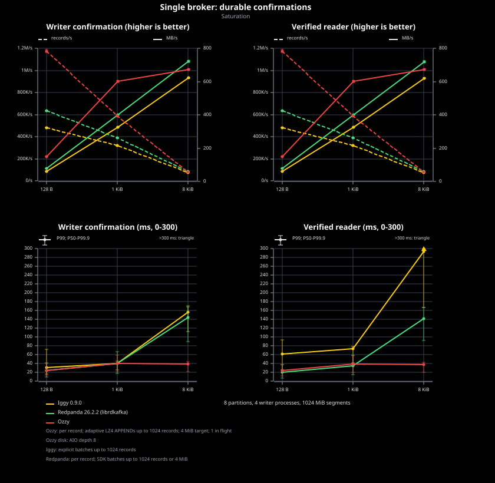
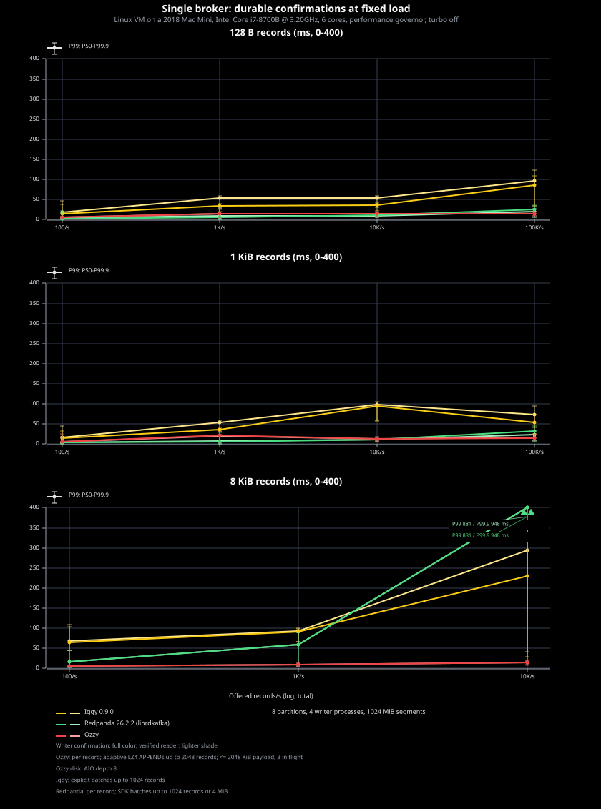
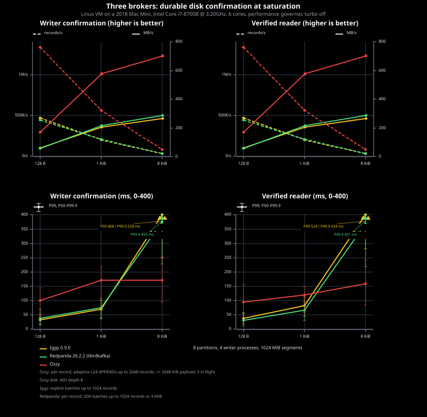
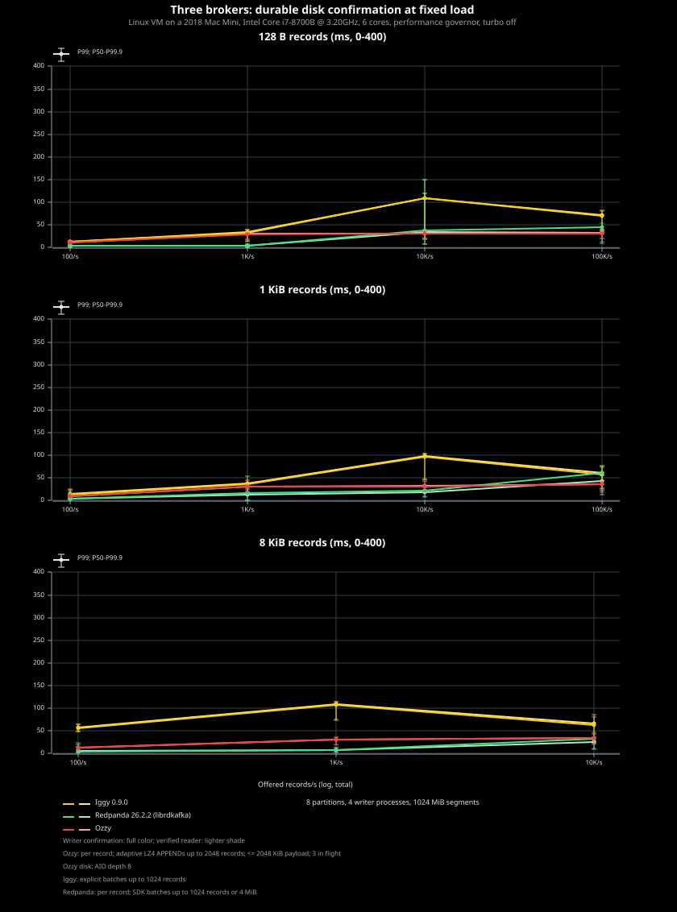
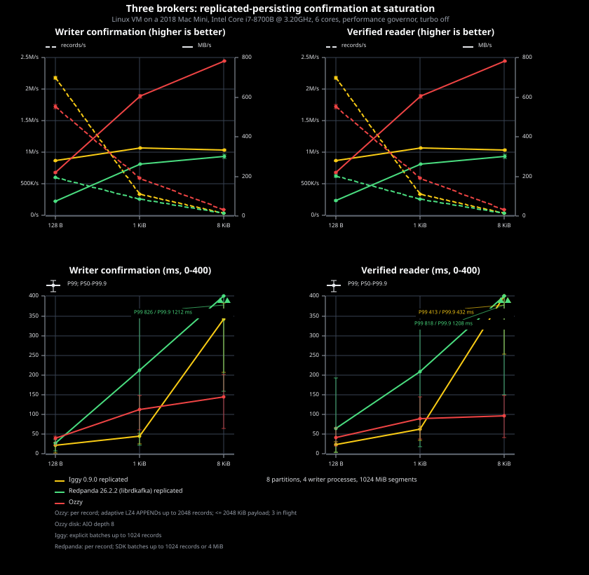
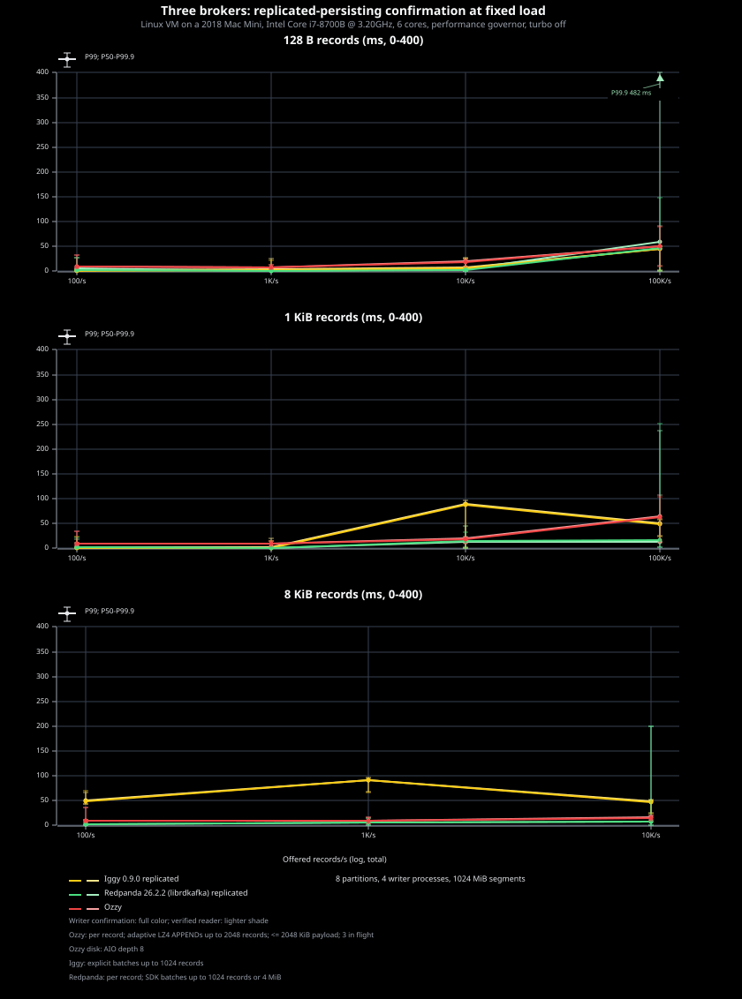

# Benchmarks

Ozzy, Iggy, and Redpanda: eight partitions, four producers, eight verified
consumers, 1 GiB segments, and the same SSD. Single-broker runs use two broker
cores; cluster runs use one per broker. Clients use separate cores. Run serially
on an idle machine. Hardware appears below each chart title.

Records are 128 B, 1 KiB, or 8 KiB. Each has an 8-byte clock followed by varying
JSON event text cut to the record size; the last event may be partial. Shared
keys compress, but bodies differ within APPENDs and LZ4 windows. LZ4 retains
about 26% of raw bytes. Every adapter receives the same bytes; consumers verify
them all. Chart captions show batching, compression, and outstanding requests.

Saturation: 2 s warmup, 8 s measurement, two repetitions. Fixed load: two Ozzy
repetitions (cached comparisons: one or two) after 2 s warmup; 100/s for 30 s,
then 1k/s, 10k/s, and 100k/s for 8 s each. Fixed-load charts stop at 100k/s for
128 B and 1 KiB, and 10k/s for 8 KiB. Latency starts at the scheduled arrival
and includes waiting. Rates count records and raw payload bytes. Failed loads
and latency above the 400 ms axis are labeled.

[Runner commands and measurement rules](ozzy-bench/README.md).

## Single broker: durable

## Three brokers: disk quorum

## Three brokers: replicated-persisting

