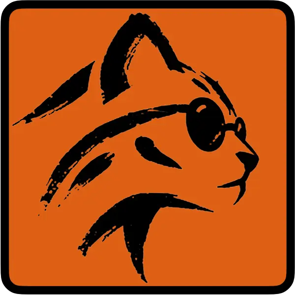

  

# Ozzy

Durable message streaming over OMQ.

Build and start a broker with the [getting started guide](GETTING_STARTED.md).
It covers provisioning, containers, and three-broker deployments. Rust 1.93+
is required.

Applications use the [native Rust producer and consumer SDK](ozzy/README.md).

## Start here

- [Getting started](GETTING_STARTED.md)
- [Rust API and example](ozzy/README.md)
- [Technical overview](doc/OVERVIEW.md)
- [Producer record flow](doc/OVERVIEW.md#producer-to-broker)
- [Consumer record flow](doc/OVERVIEW.md#broker-to-consumer)
- [Architecture and reference docs](DESIGN.md)
- [Build, test, and contribute](DEVELOPMENT.md) (Rust 1.93+)
- [Benchmark commands and measurement boundaries](ozzy-bench/README.md)
- [Benchmark charts](BENCHMARKS.md)
