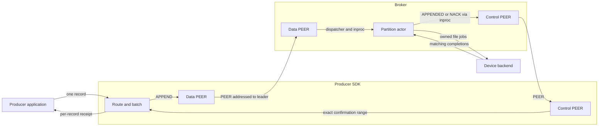
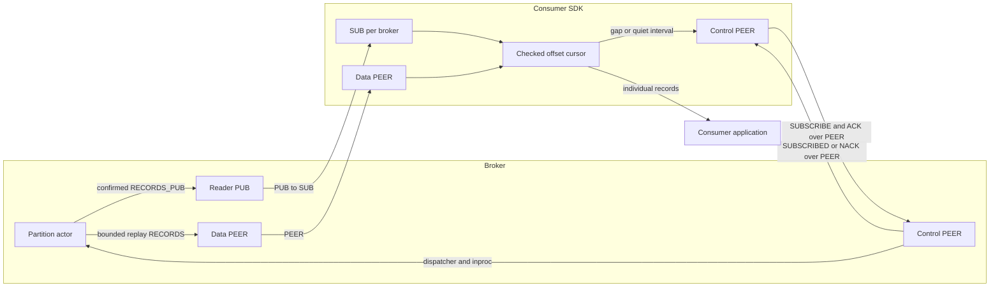

# Overview

Ozzy is a broker-owned, partitioned record log over OMQ. Brokers own storage,
replication, and confirmation; producer and consumer SDKs own client state.
OMQ provides routing, framing, reconnects, fairness, and transport backpressure.

## Terms

| Term | Contract |
| --- | --- |
| Topic | Immutable partition set, incarnation, partitioner, and policy; no total order across partitions |
| Partition | Shared ordered log with one actor and journal per broker |
| Offset | Partition-global record position, starting at zero |
| Producer sequence | Per-producer, per-partition retry position; independent of offsets |
| Retry identity | Partition, producer ID, epoch, sequence, and exact record identity/bytes |
| APPEND | Consecutive records from one producer/epoch/partition; no transaction guarantee |
| Canonical operation | Validated history entry with partition-local operation number and digest |
| Physical write group | Aligned segment write containing one or more canonical operations |
| Authority | Group, configuration, view, partition, and owner fences |
| Session / generation | Link-attempt / subscription fences; neither replaces durable authority |
| Accepted / written | Validated contiguous history / completed physical writes |
| Durable | History protected by required barriers and restart evidence |
| Committed / applied | Policy-confirmed history / confirmed state installed for readers |
| Producer receipt | Exact confirmed sequence, original partition offset, and achieved policy |
| Replica receipt / vote | Retained-prefix report / policy-specific confirmation evidence |
| Retained backing | Complete allocation held by messages or aliases; dequeue releases only queue slots |
| Retention floor | Earliest readable offset; older reads fail explicitly |
| Retry floor | Earliest producer sequence with an exact retained result |
| Consumer checkpoint | Application-saved next offset per partition |
| Storage checkpoint | Canonical state and original chain anchor; payloads remain in segments |

## Writers and readers

Topics default to 16 partitions. Keyed routing is
`XXH3-64(key, topic_seed) % partition_count`; keyless routing is sticky within
SDK batching. Routing precedes sequencing. Retries retain their partition.

Each SDK link owner uses two PEER sockets across all configured brokers:
control and data. Live consumers add one SUB per broker, shared across topics.
Partition count adds no client sockets or threads.

### Producer to broker

`send` means local admission. `confirmed` and `flush` observe the configured
broker policy. A timeout leaves the outcome unknown; retry the same identity
and bytes. Resume restores producer epochs/sequences; takeover fences the old
producer. Neither supplies an application outbox.

### Broker to consumer

Readers expose confirmed, applied records in partition order. PUB loss is
repaired over PEER from the next undelivered offset. Slow consumers do not gate
producer confirmation or extend retention. Applications persist processing
checkpoints and tolerate replay; exactly-once processing is not provided.

## Partition ownership and leader placement

Every replicated broker stores every partition. Each partition elects its own
leader using persisted broker order and `brokers[view % 3]`. Local shard counts
may differ. Routing hints do not establish authority.

## Inside one broker

| Owner | Responsibility |
| --- | --- |
| Dispatcher | Public sockets, sessions, routing, source pressure |
| Application shard | One thread/current-thread runtime hosting partition actors |
| Partition actor | Replication, journal state, readers; direct same-thread journal calls |
| OMQ I/O worker | Network framing and socket I/O |
| Storage backend | File handles, physical jobs, fixed device workers |

Shards are symmetric. Separate bounded control/data lanes prevent bulk traffic
from consuming progress capacity. Full PEER intake pauses its source; PUB drops.

## What a successful write means

| Mode | Confirmation boundary | Availability |
| --- | --- | --- |
| Single-broker durable | Applied local durable prefix | No failover |
| Disk quorum | Applied matching durable prefix on leader and one follower | Two of three required |
| Replicated-persisting | Applied matching retained bytes on leader and one follower | Two of three required; persistence continues asynchronously |

Transport receipt and buffered write completion do not establish disk durability.
RP can lose an unpersisted tail if every volatile copy is lost. A failed cluster
never becomes a single-broker deployment.

## Segment files and disk reads

Each partition lives under
`<broker-root>/topics/<topic>/partitions/<partition>/`.

| Files | Purpose |
| --- | --- |
| `CONFIGURATION`, identity, lock | Authority, store binding, exclusive ownership |
| `CURRENT`, `MANIFEST.*` | Select exact segment/checkpoint incarnations |
| `segments/` | Canonical operations and record payloads |
| `indexes/` | Rebuildable lookup data |
| `checkpoints/` | Canonical state and chain anchors |
| `DURABLE`, `MEMORY_VOTING` | Durable-prefix / RP restart evidence |
| `staging/` | Unselected replacement work |

Reads use bounded recent caches and indexed cold segments. Captured reads pin
exact files through physical reclamation; subscriptions do not pin retention.

## Reference

- [Protocol](PROTOCOL.md): frames, commands, sessions, errors.
- [Runtime](RUNTIME.md): owners, scheduling, SDKs, pressure.
- [Storage](STORAGE.md): formats, barriers, retention, recovery.
- [Replication](REPLICATION.md): voting, elections, repair.
