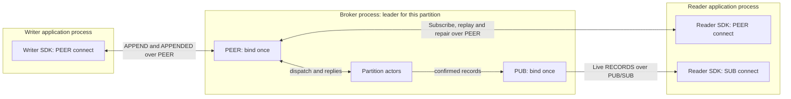
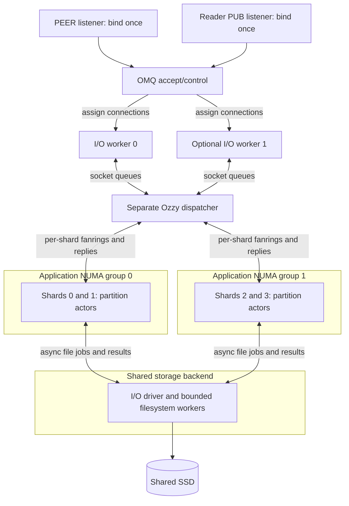
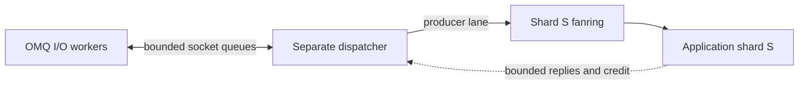
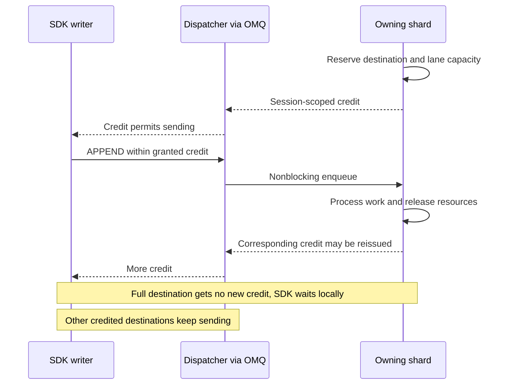
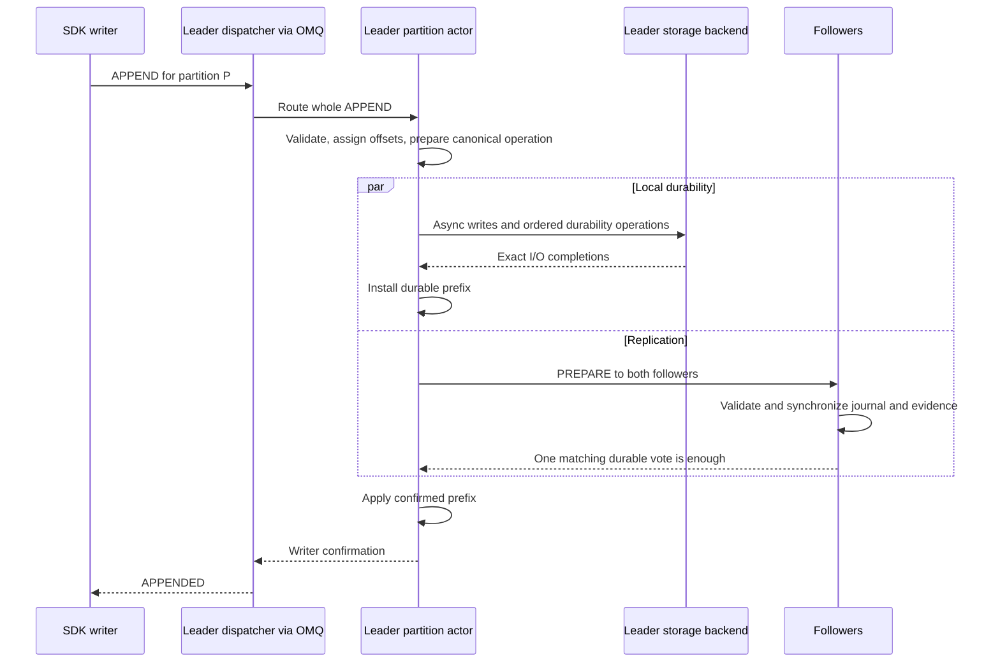
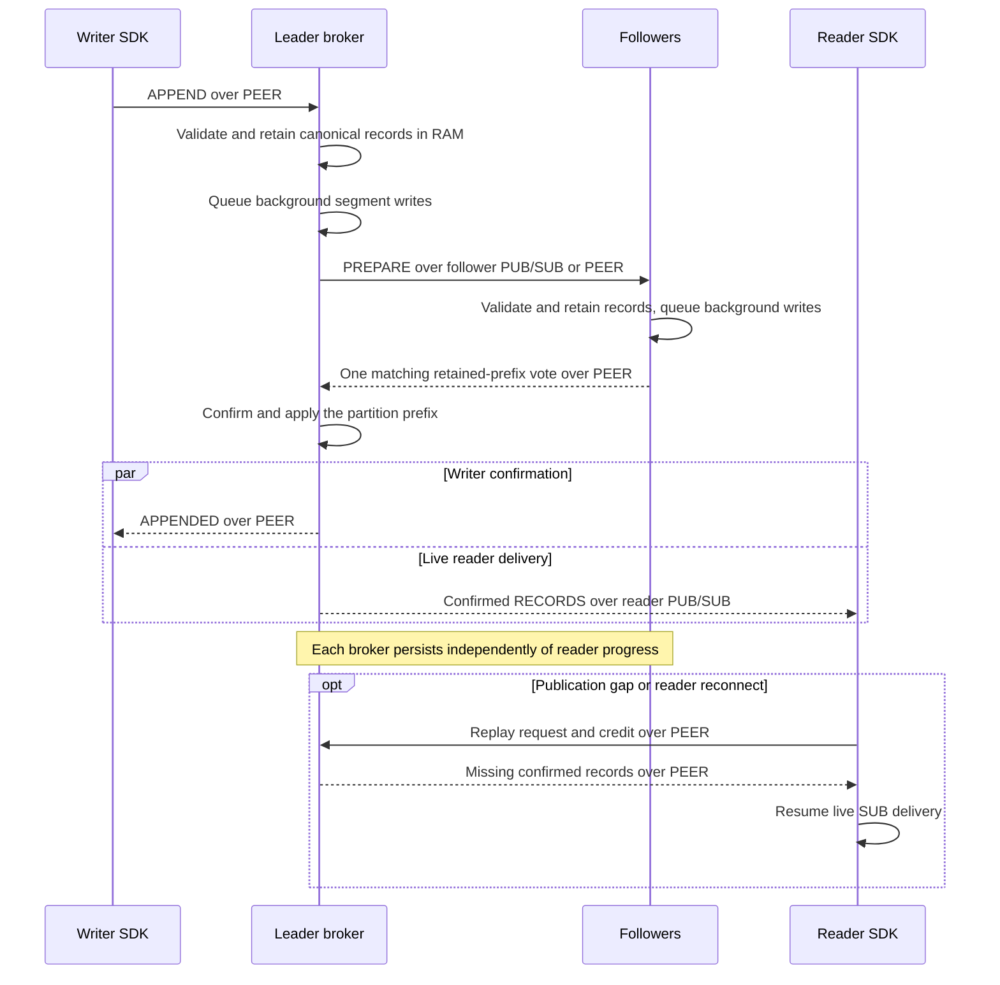

# Ozzy in plain language



Ozzy adds a record log, retry, replay, and application confirmations above OMQ.
OMQ moves messages. Ozzy decides what accepted, stored, and processed mean.
The product is a broker with SDK writers and readers. Brokers own segment
journals. Applications do not own logs or bind broker sockets.

Development uses one broker container on the laptop, the same SDK protocol, and
the same segment engine. Production currently targets three brokers. A
single-broker configuration offers local durability, not replication or failover.
It is an explicit deployment choice, never a fallback when a group loses brokers.

## Terms

The architecture below is the selected target. Existing single-group actors and
journals are building blocks, not a completed multi-partition broker frontend.

| Term | Meaning |
| --- | --- |
| Broker | One server process. Each broker stores every topic and partition. Development uses one, the current replicated target uses three. |
| NUMA group | CPUs and their nearby memory within one machine. Access to another group's memory costs more. |
| Application shard, or shard | One application thread and runtime inside a broker. Executes several partition actors. Not a partition or a broker. |
| Topic | Named collection of partitions. No topic-wide leader or record order. |
| Partition | Shared record log within a topic, with its own offset order. Many writers may append to it. |
| Replication group | The three copies of one partition, with one leader and two followers running their own VSR instance. |
| Partition actor | Exclusive owner of one partition's replication and journal state on one application shard. An actor is a task, not a thread. |
| Leader / follower | A partition actor's current role. One shard can lead some partitions and follow others. |
| OMQ I/O worker | Network thread/runtime. Owns assigned connections, framing and socket I/O. |
| Dispatcher | Separate broker thread routing bounded messages between sockets and application shards. Owns no partition state. |
| Journal owner | The partition actor owning its segment-chain state and durability evidence on the application shard. Not another thread. |
| Storage backend | Executes file operations asynchronously behind a common interface. Owns I/O machinery, not partition state. |
| Device executor | Shared execution resources and admission limits for storage work on one disk controller. |
| Writer credit | Permission to send bounded APPENDs, records, and bytes, reserved from the destination shard and dispatch lane. Not a confirmation. |

Say **replication group**, **SDK batch**, or **storage write group** when the
distinction matters. An SDK batch is one partition-pure APPEND, not a transaction.
Say "Broker A leads orders/0", not "Broker A leads orders" or "shard 0 is
the leader". Avoid "topic group": the replication unit is one partition.

## Writers and readers

A writer sends opaque multipart records. A partition gives records one offset
order. Writer identity, epoch, and sequence identify retries. Record IDs alone
do not deduplicate. Readers subscribe and replay from offsets. Their progress
is separate from writer confirmation.

A topic writer gives callers one handle. Callers supply records and optional
keys. The SDK selects partitions, batches, and compresses. An explicit partition
override remains available. Once admitted, that destination stays fixed for
retries. Today the immutable partition set is preprovisioned. Topic discovery
and online partition expansion are not implemented.

Default topic size: **16 partitions**, configurable at creation. Keyed routing
uses a 64-bit hash modulo that topic's partition count. Hash algorithm, seed,
partition count, and partition order stay fixed for the topic's lifetime under
the initial contract. Adding broker CPUs only changes local shard placement.
Choose more partitions upfront for a topic expected to need more parallelism.
More partitions also mean more journals and smaller per-partition SDK batches.

The selected partition model is shared: several writers can append to the same
topic partition. Each has its own retry sequence. All share one partition-offset
order. The current producer-owned storage model still needs that correction.

Callers submit individual records. The SDK batches ready records for one
partition into an APPEND and compresses their payloads together. Within a
partition, storage and replication may collect several APPENDs without merging
their retry identity.
Callers never build batches.

The selected transport is PEER for SDK APPENDs, control, and confirmations.
SDKs do not use PUSH. Live reading keeps broker PUB and SDK SUB sockets, with
PEER for replay and repair. See [protocol implementation status](PROTOCOL.md).

## Partition ownership and leader placement

Every partition has its own VSR state, leader, journal, and recovery. All three
brokers store every partition. Each broker independently assigns partition actors
to local shards. Shard counts and numbers need not match:

| Partition | Broker A | Broker B | Broker C |
| --- | --- | --- | --- |
| orders/0 | Shard 0: leader | Shard 3: follower | Shard 1: follower |
| orders/1 | Shard 0: follower | Shard 1: leader | Shard 0: follower |
| orders/2 | Shard 1: follower | Shard 3: follower | Shard 0: leader |

Initial leaders are spread by persisting a different broker order per partition:
`[A,B,C]`, `[B,C,A]`, `[C,A,B]`. The election rule selects `brokers[view % 3]`.
Only completed election establishes authority. Restart never reshuffles that
order. Failover is per partition, not automatic load balancing.

More partitions allow one topic to use more shards and leader brokers. They
also cost independent state, timers, active files, and replication work: not
one thread or connection per partition. The SDK follows each partition's leader
using a bounded connection pool per broker, never a remote shard address.

## Inside one broker

Bind the PEER endpoint once and each PUB endpoint once. OMQ accepts a connection
and assigns it to an I/O worker without needing to know its future partitions.
Keep that connection there. Route each message to its partition's local shard.



Default target: one I/O worker and one dispatcher per broker. The diagram shows
optional application placement across two NUMA groups. OMQ worker placement and
dispatch inside I/O workers are future extensions, not initial requirements. Every
application shard is symmetric. Shard 0 has no extra duties. Reader publication
from any shard uses the one PUB socket. Follower publication, when enabled, has
its own endpoint, also bound once. No listener copies per shard or NUMA group.

Each partition actor owns both replication and journal state. File operations
return futures backed by separate storage execution, including reads, metadata,
repair, and shutdown. Waiting for one operation leaves other actors and timers
runnable. The shard knows neither raw file descriptors nor AIO completion queues.
Linux AIO, a blocking pool, and a possible future opt-in io_uring backend share
one contract. Dedicated journal-owner runtimes have been removed.

NUMA placement means CPU affinity and local allocation, not just naming threads.
Keep partition state local to its shard. A connection can target any shard, so
cross-NUMA transfers are allowed. Batching queue operations cannot make
remote memory access free. Pass owned encoded buffers without payload copies,
bound their lifetimes, and provide bounded return/reclaim paths.

This borrows Seastar's [exclusive ownership](https://github.com/scylladb/seastar/blob/master/doc/tutorial.md)
and [explicit cross-core messages](https://seastar.io/message-passing/), not its
entire execution model. Seastar also supports
[dedicated network cores](https://www.scylladb.com/2026/07/22/asymmetric-io_uring-backend-seastar/)
through a different backend. None of this requires Ozzy to adopt io_uring.

NIC-aware connection assignment is a possible OMQ extension, not a requirement
for the default. Prefer a worker near the receiving NIC or RX queue when that
information is available. Assignment cannot predict a connection's partitions,
so it does not eliminate cross-NUMA dispatch.

## Dispatch and backpressure

One fanring receiver per application shard, initially one dispatcher producer:



Clients share the destination lane. OMQ provides receive fairness. Ozzy
must still bound each writer's admission and each partition's execution turns.
Queue count initially scales with shards, not clients. Future per-I/O dispatch
adds producer lanes without multiplying shard credit.

The shard owns the budget. Its leader actors grant credit backed by capacity
in both the destination and the correct lane. Dispatch checks and consumes it.
Adding I/O workers does not duplicate the budget. Reserve APPEND slots, resident
bytes, and admitted record/byte limits, including unused grants and in-flight work.



Never await a full shard queue in shared dispatch. Valid granted traffic already
has room. Excess traffic gets bounded rejection. Reserve control/reply capacity
separately, and skip credit-starved writers in SDK scheduling. Reconnect fences
old grants. Queue-slot release and retained-byte release are different events.
TCP still has wire-order delays. A shared SSD still has shared throughput.

Ordinary PEER delivery feeds the separate dispatcher. Future dispatch inside
I/O workers needs local delivery and placement hooks. Neither design requires
OMQ to understand partitions or provide application-shard receive lanes. See
[integration details](RUNTIME.md#placement-and-transport-bounds).

## One disk-quorum write



Local writing and follower transmission overlap. Each broker reaches its own
partition actor through its own dispatch path. Shard numbers need not match.
Replicated-persisting uses retained validated RAM at the two brokers instead
of waiting for these disk barriers. Readers never gate writer confirmation.

## Replicated-persisting and live readers

Established writer and live reader, for one partition. Both leader and one
follower must retain validated bytes before confirmation. Background disk writes
can finish before or after the writer reply and reader delivery.



Only confirmed records enter reader publication. Writer reply and live delivery
have no required order relative to each other. A slow reader cannot delay
confirmation. PUB may drop data under pressure, so readers repair gaps over PEER.
Losing every RAM copy before persistence can still lose confirmed records.

## What a successful write means

| Policy | Writer confirmation requires | What can still lose it |
| --- | --- | --- |
| Single-broker local durable | Local data barrier completes | Permanent local store loss, no failover |
| Replicated and persisting | Leader and one follower retain records while disk writes continue independently | Loss of every volatile copy before persistence |
| Disk quorum | Leader and one follower synchronize matching history | Loss of the required durable copies |

These are the selected broker policies. Existing volatile/buffered local-owner
APIs are not additional product modes. These policies cover different failures.
Local durability and group copying are separate guarantees. Socket delivery
proves neither. A timeout leaves
the outcome unknown. It does not prove rejection.

Reader receipt means bytes entered its bounded queue. Processing means the
application declared progress. Neither automatically proves a durable inbox or
that an external side effect happened exactly once. Replay can repeat effects.

## Retry and leader changes

Retry the same frozen request after an uncertain result. Changing its bytes,
multipart boundaries, epoch, sequence, or requested policy makes it a different
request. The leader must return the original confirmed result for an exact
retained retry, even after reconnect or leader change.

When the leader fails, brokers select a history that preserves confirmed work.
They install and confirm it before accepting new writes. A broker that
confirmed records from RAM may lose them in an unclean stop, so it cannot vote
again until recovery completes. An empty disk store also needs recovery.
Two brokers on one machine still share one machine failure domain.

## Segment files and disk reads

A partition journal stores one ordered log in **segment files**. Layout on each
broker:

```text
<broker-root>/
`-- topics/
    `-- orders/                    topic
        `-- partitions/
            |-- 0/                 partition 0: one journal / VSR group
            |   |-- identity       group and local store identity
            |   |-- CONFIGURATION  the three brokers and confirmation policy
            |   |-- CURRENT        selects a manifest
            |   |-- MANIFEST.7     selected segment chain and recorded state
            |   |-- DURABLE        partition-local durability evidence
            |   |-- segments/
            |   |   |-- 1.log      sealed
            |   |   `-- 2.log      active
            |   `-- indexes/       sealed-segment indexes
            |-- 1/                 independent files and evidence
            `-- 2/                 independent files and evidence
```

No topic-wide journal or durability frontier. Repairing `orders/0` cannot
truncate `orders/1`. `DURABLE` describes a partition prefix, not a separate
promise for each file. Locks, checkpoints, and staging also live inside the
partition directory. [Storage](STORAGE.md#partition-directory-layout) owns details.
All partitions can share one executor and SSD without sharing history. This
isolates recovery, not device failure or bandwidth. Separate files still need
their own required durability barriers.

New records go into the **active segment**. A **sealed segment** no longer
accepts records. Indexes map
offsets or IDs to file locations. They contain no record payloads. Sealed
indexes live in separate files. Recent and selected older indexes stay cached.

After a power loss, recovery keeps the recorded durable prefix. If an active
segment has a damaged group after that prefix, recovery discards that group
and all later bytes. Damage at or before the recorded durable position still
stops recovery.

Local native subscriptions also use a **fresh-record cache**. Appends copy
records into fixed reusable blocks, so readers can receive confirmed records
without a file read. The blocks retain no incoming network buffers. Older
records and cache misses use indexed reads and a bounded cache of validated
file contents. These caches do not extend retention or block confirmation.
See [storage](STORAGE.md) for their bounds.

Disk groups can publish confirmed records once for several live readers.
Readers first replay over a request socket, then follow the publication socket.
A gap or leader change sends them back to replay. Slow readers never delay
writer confirmation. Reader publication needs its own endpoint.

The **segment-metadata list** describes each sealed file's identity, log range,
and integrity information. The partition actor and prepared reads share this
immutable list inside one broker. Reuse avoids copying file descriptions and
rechecking unchanged index metadata. Record integrity checks still run.

Internal code calls it a **source snapshot**: metadata captured for the files
an index refers to. It contains no payloads and is not a backup. New reads
use a new list after metadata changes. Prepared reads finish with the old one.

A prepared read holds **temporary deletion protection** for its files while
queued or running. Internal code calls this a file **pin** or **lease**. It has
no timer and is unrelated to CPU pinning. Reads sharing a list use one counter.
The last read releases protection. A cached list or idle subscription does not
protect files. Protection delays physical deletion, not policy expiration or
writer confirmation.

## Bounds and slow clients

Queues, batches, outstanding requests, history, and transfer buffers have
separate limits. Running out applies backpressure or rejects admission. It must
not silently drop confirmed records. Transport clones keep buffers alive until
their last release. A slow follower must not pin every writer buffer forever.

Native readers subscribe at an offset and receive confirmed records within
record and byte credit. Expired offsets return a gap and the earliest available
offset. At the confirmed end, readers wait for new records without polling.

Replicated-and-persisting groups bound their backlog and release RAM after
persistence and application. Older records remain readable from disk. Durable
reader progress, consumer groups, discovery, and a standalone daemon remain
planned. Preserve the reusable broker core for tests. The current
replication core supports fixed three-broker groups, including leader change,
restart, and sealed-file repair. A standalone broker/container and explicit
single-broker deployment still need integration.

Fast integration tests can host three isolated logical brokers and SDKs in one
process over OMQ inproc sockets. That is the broker architecture in a test
harness, not producer-owned storage. Deterministic fault scheduling and a small
TCP/process-crash layer remain separate. See [Validation](VALIDATION.md#test-placement).

A future six-broker deployment across three sites is a design direction, not a
current quorum mode. See [Replication](REPLICATION.md#future-six-broker-groups).

## Where to look

- [Protocol](PROTOCOL.md): bytes, command schemas, sessions, compatibility.
- [Storage](STORAGE.md): journals, integrity, recovery, checkpoints, retention.
- [Replication](REPLICATION.md): confirmation, leader change, lost-state recovery.
- [Runtime](RUNTIME.md): ownership, queues, retries, placement, control-plane scope.
- [Validation](VALIDATION.md): checks, fault tests, measurement rules.
- [Design](../DESIGN.md): architectural rules and crate boundaries.

Detailed byte layouts live with their codecs and golden tests. Benchmark
commands live in [ozzy-bench](../ozzy-bench/README.md). Run histories do not
belong in these references.
