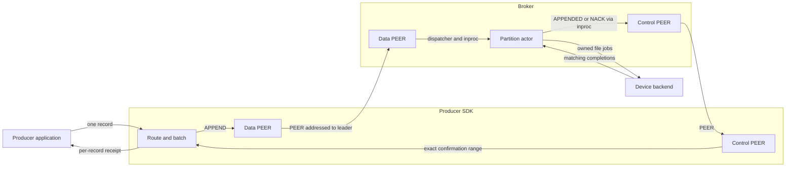
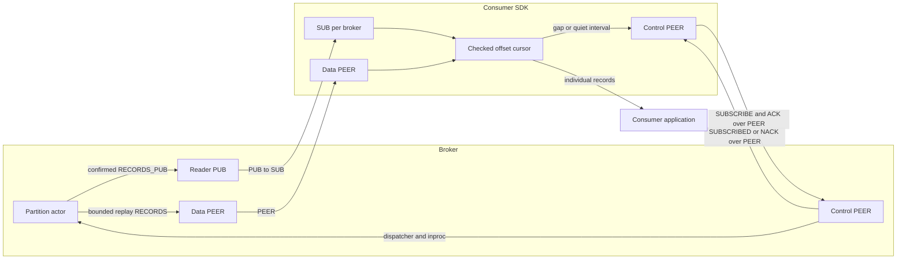

# Ozzy in plain language

Ozzy is a broker-owned record log above OMQ. OMQ moves messages and handles
routing, reconnects, fairness, and transport pressure. Ozzy owns record order,
retry, replication, persistence, and replay. Applications use separate producer
and consumer SDK roles; brokers own the journals.

## Terms

### Records and positions

| Term | Meaning |
| --- | --- |
| Record / payload / part | One application record contains opaque bytes in one or more parts. Empty parts still count. |
| Producer SDK / writer | Client code that routes and submits records, retries them, and observes broker confirmation. |
| Consumer SDK / reader | Client code that reads records by offset, checks live delivery, and repairs gaps. |
| Topic | Named collection of partitions. It has no single leader or total record order. |
| Partition | One shared ordered log. Many producers can append to it. |
| Offset | Broker-assigned position in a partition, starting at zero. |
| Producer sequence | Per-producer, per-partition retry position. It is not a partition offset. |
| Retry identity | Partition, producer ID, producer epoch, and sequence. A retry must also match IDs, parts, and bytes. |
| Message ID | Application record identifier. Reusing it alone does not deduplicate writes. |
| APPEND / SDK batch | One request containing consecutive records from one producer, epoch, and partition. It is not a transaction. |
| Canonical operation / operation number | A validated APPEND or control history entry, numbered within one partition's replication log. |
| Physical write group | Several canonical operations encoded into one aligned segment write. Separate from an APPEND or network batch. |
| Coalescing / natural batching | Combine work already ready to run. Sparse traffic sends promptly; load creates larger batches. |

### Authority and confirmation

| Term | Meaning |
| --- | --- |
| Replication group | Copies of one partition on three brokers. Two eligible copies are required to confirm. |
| Leader / primary; follower / backup | The actor ordering one partition, and actors keeping its other copies. |
| Quorum / eligible copy | Two copies meeting the selected confirmation policy. A transport receipt is not an eligible copy. |
| VSR | Viewstamped Replication: the fixed-group protocol ordering operations and selecting a new leader. |
| Prefix / tail | Contiguous history through a position / its end. Record offsets and operation numbers count different things. |
| View | Election number for one partition. A leader hint alone does not establish authority. |
| Incarnation / epoch / generation | A fence rejecting work from an older identity or state. Topic, producer, session, subscription, and file fences have different scopes. |
| Producer epoch / owner epoch | Producer-session fence / partition-owner fence. Both differ from the election view. |
| Subscription / Source | One generated read cursor / the authority and partition identity attached to delivered records. |
| APPENDED / NACK / ACK | Producer confirmation range / typed error / volatile reader progress observation. ACK grants no capacity. |
| Session / request ID | One negotiated broker link and one correlated attempt. Record retry identity survives their replacement. |
| Accepted prefix | Contiguous operations validated and admitted by one broker; not necessarily confirmed. |
| Written / durable prefix | Completed file writes / history protected by the required barriers and restart evidence. |
| Committed / applied prefix | History selected by the policy / committed history installed into readable state. |
| Producer receipt | Exact confirmed sequence, partition offset, identity, and policy returned to the producer. |
| Replica receipt / vote | A receipt reports retained contiguous bytes. A vote supplies the policy's quorum evidence. A receipt is not a vote. |
| Unknown outcome | A timeout or canceled wait leaves admission and confirmation uncertain. Retry the same identity and bytes. |

### Owners, queues, and storage

| Term | Meaning |
| --- | --- |
| Broker | One server process. All three replicated brokers store every configured partition. |
| Application shard | One broker thread and current-thread runtime, hosting several partition actors. |
| Partition actor / journal owner | Task owning one partition's replication and journal state on its shard. Not another thread. |
| Dispatcher | Broker thread routing between sockets and shards. Owns no partition history. |
| OMQ I/O worker | Thread/runtime handling network framing and socket I/O. Separate from application shards. |
| PEER / PUB / SUB | Addressed bidirectional messages / live broadcasts / subscribed live input. |
| DEALER / ROUTER | Routed OMQ endpoints used between broker transport and shards; OMQ handles connection fairness. |
| Inproc | OMQ transport between owners in one process; no TCP or ZMTP encoding. |
| Backpressure / HWM | A full bounded queue slows its source. HWM is the socket's queue limit. |
| Drain budget | Maximum records/messages and bytes handled in one scheduling turn. |
| Retained backing / lease | The complete allocation held by a message or read. Dequeue frees a slot; only final release frees its bytes. |
| Storage backend / device workers | Owners of file handles and physical jobs. One AIO thread plus fixed helpers per device, or a fixed blocking pool. |
| Barrier | Required file or directory synchronization. Submission or buffered write completion is not a barrier. |
| Active / sealed segment | Current append file / completed immutable log file. |
| Index / record selector | Metadata locating files or records within encoded backing; contains no payload copy. |
| Read cache / read handle cache | Recent encoded history / up to four reusable file-handle leases for exact indexed sources. |
| Source snapshot / file pin | Immutable file metadata for a captured read / temporary deletion protection while that read runs. Not a backup or CPU affinity. |
| Replay / gap repair | Read retained history from an offset / recover missing live records or replica operations. |
| Retention floor | Earliest readable offset. Older requests fail explicitly instead of silently skipping records. |
| Consumer checkpoint | Next received offset per partition. The application saves it after processing; the broker does not persist it. |
| Storage checkpoint | Persisted canonical state and retained history. Different from a consumer checkpoint; checkpoint transfer is not implemented. |

## Writers and readers

Topics default to 16 partitions. Keyed placement uses fixed XXH3-64 hash/seed
modulo partition count; keyless placement is sticky within SDK batching.
Routing happens before sequencing and batching. Retries keep the selected
partition. Topic lookup over known brokers is implemented; online topic
creation, partition expansion, and broker discovery are not.

Producer and consumer roles reuse `BrokerLinks` session/transport code. Each
link owner has **two PEER sockets**, connecting every configured broker:
data and control. Live consumers add **one SUB socket per broker**, shared
across their topics. Partition count creates neither sockets nor threads.

### Producer to broker



Control also carries HELLO/WELCOME, topic lookup, producer opening, and route
hints. Normal follower replication uses a separate broker PUB/SUB path;
[replication sequences](REPLICATION.md#normal-operation-and-confirmation) show
which evidence permits APPENDED.

### Broker to consumer



Only confirmed, applied records are readable. Live PUB may drop; consumers
repair from the next undelivered offset over PEER. A slow consumer does not
gate producer confirmation. [Runtime](RUNTIME.md#live-reader-publication)
explains replay/live handoff and processing observations.

## Partition ownership and leader placement

Each partition has one actor and journal on each broker. Broker-local shard
counts and placements may differ. One shard can lead some partitions and follow
others. Initial persisted broker order spreads leaders; later views choose
`brokers[view % 3]` and require election completion. Restart never reshuffles it.

Several producers share partition offsets but keep independent retry sequences.
A topic has no common leader. Adding CPUs changes local actor placement, not
key routing or partition identities.

## Inside one broker

Each broker binds control PEER, data PEER, reader PUB, and, in replicated modes,
follower PUB once. A dispatcher routes to symmetric shards; shard 0 has no
extra transport duties. OMQ I/O workers handle network work separately.

Four bounded OMQ inproc DEALER/ROUTER inputs separate client control, broker
control, producer data, and broker data. Shards visit control first, then data,
in count/byte batches. Full PEER intake pauses its exact connection; full PUB
intake drops the attempt. Other sources and control continue. Connections
multiplex partitions, so pressure is not independent per partition on a link.

The partition actor calls its journal directly. Storage waits yield the shard;
backends retain jobs, buffers, and handles until physical completion. There is
no separate journal thread and no file syscall or AIO reaping on the shard.
[Runtime](RUNTIME.md#omq-ownership-and-scheduling) owns the thread and queue map.

## What a successful write means

| Mode | Producer confirmation requires | Failure boundary |
| --- | --- | --- |
| Single-broker durable | Local synchronized history and restart evidence | No failover; permanent store loss can lose history |
| Disk quorum (DQ) | Leader plus one follower hold matching durable history | Requires two eligible copies; never falls back to one broker |
| Replicated-persisting (RP) | Leader plus one follower retain validated history; disk writes continue independently | Losing all volatile copies before persistence can lose the tail |

All three modes apply confirmed history before replying. Socket receipt proves
none of these boundaries. Consumer receipt or processing likewise does not
make an external side effect exactly once.

## Retry and leader changes

A retry preserves producer/partition identity, epoch, sequence, message IDs,
parts, and bytes. Request IDs and APPEND boundaries may change. Exact retained
retries return original offsets; expired evidence and conflicts are errors.

A new leader must preserve quorum-held history even if the old leader's COMMIT
announcement was lost. RP unclean restart stays nonvoting until authorized
recovery. An empty store is never fresh bootstrap. All replicas on one machine
still share that machine's failure domain.

## Segment files and disk reads

Each partition has its own directory:

```text
<broker-root>/topics/<topic>/partitions/<partition>/
    identity, CONFIGURATION, CURRENT, MANIFEST.*, DURABLE or MEMORY_VOTING
    segments/       active and sealed files
    indexes/        derived lookup files
    checkpoints/    selected storage checkpoints where supported
    staging/        unselected repair and build work
```

Write handles stay open until roll/shutdown. Four read-handle leases reuse
recent exact sources. Recent records retain encoded canonical backing;
full producer LZ4 blocks can pass through unchanged. Cold reads use indexes
and validate the selected operation. Physical reads keep deletion protection
until completion. Caches do not extend retention or prove confirmation.

Recovery keeps the protected durable prefix. Damage inside it fails closed;
damaged active suffixes beyond it may be discarded. Sealed-file repair requires
surviving group authority. [Storage](STORAGE.md) owns exact publication order.

## Bounds and slow clients

No producer, consumer, follower, or dispatcher wire credits/grants remain.
OMQ pressure and owner-local count/byte limits bound queues, decoded data,
retained backing, and physical jobs. Queue capacity and payload lifetime differ.

PUB loss shifts work to bounded PEER repair. One healthy follower suffices with
the leader; two stalled followers fill the unconfirmed window. RP also stops
admission when background writes exhaust its retained backlog. A shared SSD
still shares bandwidth and failure risk.

Fast integration tests run real brokers and SDKs over OMQ inproc with memory-only
file I/O. Controlled faults and Loom cover different seams; TCP/process and
real-backend tests cover the remaining boundaries.

## Where to look

- [Design](../DESIGN.md): architecture and crate boundaries.
- [Protocol](PROTOCOL.md): sockets, commands, sessions, wire bytes.
- [Runtime](RUNTIME.md): ownership, batching, backpressure, live/replay.
- [Replication](REPLICATION.md): quorum evidence, repair, elections, restart.
- [Storage](STORAGE.md): file format, barriers, caches, recovery, retention.
- [Validation](VALIDATION.md): inproc, simulation, Loom, TCP/process checks.
- [Benchmarks](../BENCHMARKS.md): measured charts and workload settings.
