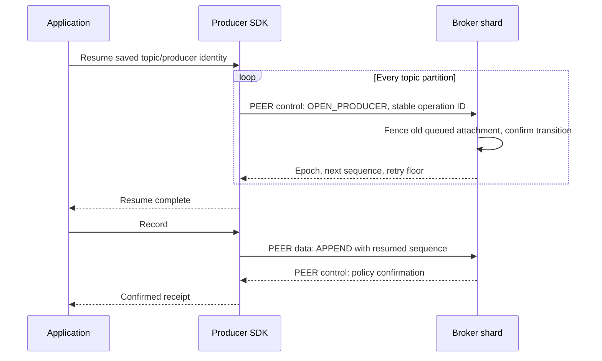
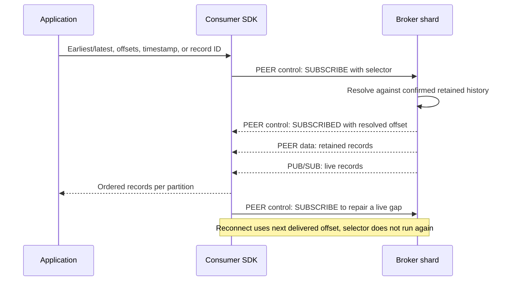

# Protocol

Ozzy commands are ordinary OMQ messages. PEER carries addressed control/data;
PUB/SUB carries live follower/consumer traffic. OMQ routing metadata is outside
the Ozzy envelope. Transport receipt is not record confirmation.

## Topic and routing contract

Topics bind immutable incarnation, partition count/order, XXH3-64 seed, limits,
and per-partition group/configuration/policy. Default count is 16. Keyed routing
is `XXH3-64(key, seed) % count`; keyless placement is sticky within SDK batching.
Routing precedes sequencing; retries preserve the selected partition.
One APPEND contains one producer/epoch/partition. Shard IDs are broker-local.

HELLO establishes a broker link, not exclusive partition ownership. Many
producers share partition offsets but retain independent sequences. Two SDK
PEER sockets connect every broker; partitions add no sockets. Replicated groups
have exactly three members; local durability uses explicit one-broker authority.
Wrong-leader replies are scoped hints; brokers do not forward SDK APPENDs.

Topic lookup, producer opening, route watches, and explicit recovery exist.
Online creation/expansion, discovery, membership, and consumer groups do not.
Reserved opcodes/capabilities imply no service.

## Envelope and primitive encoding

Full commands have three frames after OMQ routing metadata:
`[64-byte envelope] [metadata] [payload]`. Empty frames remain present.
All lengths are bounded before decoding/allocation. No JSON is used.

| Offset | Width | Envelope field |
| ---: | ---: | --- |
| 0 | 4 | Magic `OZY` followed by zero |
| 4 | 1 | Version, `1` |
| 5 | 1 | Opcode |
| 6 | 2 | Flags; bit 0 response, others zero |
| 8 | 16 | Request ID; zero only for uncorrelated notifications |
| 24 | 16 | Sender node ID |
| 40 | 16 | Negotiated link session ID; zero for HELLO, PREPARE_PUB, and RECORDS_PUB |
| 56 | 4 | Metadata frame length |
| 60 | 4 | Payload frame length |

Integers are unsigned big-endian. IDs are canonical 16-byte UUIDs; digests are
32 bytes. `text/blob = u32 length + bytes`; text is UTF-8.
`list<T> = u32 count + items`; `optional<T> = u8 tag (0/1) + value if present`.
Metadata fields appear in listed order without alignment. Unsupported versions,
flags, tags, overflow, malformed lengths, and trailing bytes are rejected.

Native node IDs are 16 bytes. Leading-zero IDs use OMQ routing label
`0x01 || node_id` (17 bytes); others use their unchanged 16 bytes. Only canonical
forms are accepted, including repair aliases and backpressure destinations.

Compact REPLICA_RECEIPT is one 29-byte frame:
`opcode:u8, handle:u32, revision:u64, received_op:u64, received_bytes:u64`.
Full REPLICA_STATE binds its nonzero handle to session/group/view/epoch/base.
Handles never reuse within a process and retire with the session. Unknown
history requires a full report; compact receipts never vote.

## Handshake and sessions

HELLO metadata is `instance_id:u128, hello_nonce:u128, properties`.
WELCOME echoes both IDs and selects a fresh nonzero session in its envelope.
HELLO has a nonzero request ID, absent session, clear response flag, and no
payload; WELCOME is the correlated response. Subsequent traffic uses that session.

Properties are `u8 ASCII-name length, name, u32 value length, value`, without
an outer count. Case-insensitive duplicates fail; maximum 32 properties and
64 capabilities. Unknown optional entries are ignored; unknown required
capabilities fail. Roles advertise behavior, not authorization.

| Property | Value encoding |
| --- | --- |
| `versions` | List of supported `u8` majors; WELCOME selects one |
| `capabilities` | Counted sorted unique `u16` capability IDs |
| `required-capabilities` | Same encoding; selected set must contain all |
| `max-metadata-bytes` | `u32` |
| `max-payload-bytes` | `u32` |
| `max-record-bytes` | `u32`, total payload across one record's parts |
| `max-batch-records` | `u32` |
| `max-payload-parts` | `u32` |
| `roles` | `u32` bit set: producer, consumer, owner, replica, directory |

Versions use `u32 count + u8 entries`; only major 1 is offered/selected.
Role bits 0..4 follow the table order. Metadata capacity is at least 512 bytes;
receive bounds are nonzero and directional. WELCOME advertises responder bounds
separately from initiator bounds. Outstanding-work capacity remains owner-local.

| Capability | Meaning |
| ---: | --- |
| 1 | Owner append |
| 2 | Confirmed progress |
| 3 | Durable inbox |
| 4 | Durable VSR |
| 6 | Snapshot transfer |
| 7 | Directory state |
| 8 | Groups |
| 9 | Replica receipt flow |
| 10 | Owner authority hints |
| 11 | Reader delivery/volatile progress |
| 13 | Streaming append; requires 1 |

Capabilities 5, 12, and 14 are unassigned. Shared partition APPEND requires 13;
group-aware writers also require 10. Reader-only negotiation need not require
writer capabilities. Nonstreaming low-level clients have one outstanding APPEND.
A streaming endpoint cannot silently downgrade the profile.

Link states: `Disconnected -> Negotiating -> Established -> Closing`.
Replacement invalidates request correlation, renegotiates, and reinstalls
subscriptions; retry identities survive. Identical HELLO reuses its session;
changed attempts fence old replies while admitted I/O remains charged.
Unknown/pre-handshake/stale-session packets are dropped. Established malformed
requests receive bounded typed NACK where possible.

The receive owner drains bounded lifecycle events before dequeue and admits each
body synchronously before observing another replacement/disconnect. Exact
connection IDs fence late teardown; OMQ fences queued generations and retired
sources. Dynamic client metadata can be reclaimed on exact control disconnect.
Configured peers retain their binding. Routing identity requires independent trust.

Group clients try configured voters without waiting for all, accept only matching
nonregressing authority hints, and preserve record identity/bytes/policy. Default
handshake/response deadlines are 1/2 seconds; exhausted voters back off from
50 ms to 1 second. Cancellation stops observation, not admitted server work.
`Connection::refresh_session` renegotiates independently of OMQ reconnect.

Simultaneous Node HELLO uses the lower node ID's attempt. WELCOME may carry
`superseded-hello:u128`; HELLO cannot. Monotonic observed attempts reject delayed
older HELLOs. Replacement closes old read queues/waits/subscriptions. Identical
SUBSCRIBE preserves state; changed starts require a new generation.

## Common records

| Type | Ordered fields |
| --- | --- |
| Authority | group_id:u128, config_epoch:u64, view:u64 |
| Partition | incarnation:u128 |
| AppendKey | producer_id:u128, producer_epoch:u64, first_sequence:u64 |
| Position | optional<u64> |
| OpPosition | op:u64, digest:32 bytes |

Operations start at 1; genesis is op 0 with zero digest. Partition offsets start
at 0. `u64::MAX` is not an admissible operation position. Policy IDs: 1 volatile,
2 buffered, 3 local durable, 5 disk quorum, 6 replicated-persisting; 4 rejected.
Production group configuration fixes policy; requests cannot weaken it.

`Records = count:u32 + descriptors`. Descriptor:
`message_id:u128, tagged_part_count:u32, decoded_bytes:u32 (LZ4 only), lengths:u32[]`.
Low 24 count bits select wire parts; high byte is codec 0 raw or 1 LZ4.
Payload concatenates parts exactly; empty parts remain distinct. LZ4 records have
one wire part containing original count/lengths followed by a raw LZ4 block.
Consumers restore exactly the declared output and original multipart boundaries.

Producer APPEND uses raw descriptors plus an outer codec/decoded-length field.
Codec 0 requires matching raw size; codec 1 is a nonempty raw LZ4 block across
all parts. SDK compression starts at 2 KiB and requires a net saving. Brokers
validate syntax, complete consumption, descriptors, and decoded length without
allocating output. A fresh raw APPEND may be packed before canonical hashing;
retries and replicated canonical bodies preserve their exact encoding.

## Command allocation

| Opcodes (hex) | Commands in ascending order |
| --- | --- |
| `01..03` | HELLO, WELCOME, ERROR |
| `10..17` | APPEND, APPENDED, LOOKUP_APPEND, APPEND_STATE, OPEN_PRODUCER, PRODUCER_OPENED, ACK_RESULTS, RESULTS_ACKED |
| `20..28` | SUBSCRIBE, SUBSCRIBED, RECORDS, ACK, PROGRESS_COMMIT, PROGRESS_COMMITTED, unassigned, UNSUBSCRIBE, UNSUBSCRIBED |
| `30..3f` | REPLICA_OPEN, REPLICA_STATE, PREPARE, PREPARE_OK, COMMIT, START_VIEW_CHANGE, DO_VIEW_CHANGE, START_VIEW, RECOVERY, RECOVERY_STATE, FETCH_OPS, OPS, SNAPSHOT_BEGIN, SNAPSHOT_CHUNK, SNAPSHOT_END, SNAPSHOT_INSTALLED |
| `40..43` | STATE_SNAPSHOT_REQUEST, STATE_SNAPSHOT, STATE_UPDATE, STATE_RESYNC |
| `50..53` | EXIT_VIEW, PREPARE_FLOW, PREPARE_PUB, RECORDS_PUB |
| `7f` | NACK |

`0x55` is HISTORY_RETIRED. Only negotiated command families are usable; unknown
opcodes fail. Wire major 1 is the sole decoder.

## Topic lookup

STATE_SNAPSHOT_REQUEST/STATE_SNAPSHOT tag 0 carries topic pages on control PEER.
Request fields: name length:u8, ASCII name, first partition:u32, maximum entries:u16.
Response fields in order:

1. Topic ID:16, name, algorithm:u8=1, seed:u64, total/first partition:u32 each,
   policy:u8, broker count:u8.
2. Broker entries: node ID:16, three u16-length UTF-8 endpoints (control PEER,
   reader PUB, optional follower PUB; zero length absent).
3. Entry count:u16; contiguous entries: number:u32, group ID:16, config epoch:u64,
   incarnation:16, member count:u8, ordered member IDs:16 each.

Payload is empty. Pages shrink to negotiated control/metadata bounds; clients
advance by returned count and compare repeated topic fields. Data PEER endpoints
come separately from `BrokerLinksConfig`; shard placement is never advertised.

## Routing interests

Watch tag 1 carries session-scoped leader hints, never authority. Snapshot capture
and registration occur in one dispatcher turn. Views compare only within matching
group/incarnation/configuration/membership. Equal-view conflicting leaders fail;
a previously unknown leader may become known. Replacement drops interests.

| Command | Metadata after tag `u8=1` | Envelope request ID |
| --- | --- | --- |
| `STATE_SNAPSHOT_REQUEST` | watch ID `16`, group count `u16`, group IDs `16` each | required request |
| `STATE_SNAPSHOT` | watch ID `16`, route count `u16`, route entries | required response |
| `STATE_UPDATE` | watch ID `16`, one route entry | absent notification |
| `STATE_RESYNC` | watch ID `16` | absent notification |

Route entry: group ID:16, config epoch:u64, incarnation:16, member count:u8,
ordered member IDs:16 each, view:u64, leader ID:16 (zero unknown). Config epoch
is nonzero. Codec member counts 1/3/6 are bounded; six defines no quorum policy.
Payload is empty. Updates coalesce; overflow emits STATE_RESYNC. Lost notices,
timeouts, or wrong-leader replies trigger a fresh snapshot.

## Producer exchange

- `OPEN_PRODUCER`: group tag `u8=1`, authority (group ID, configuration epoch,
  view), partition incarnation, producer ID, mode `u8` (`0` resume,
  `1` fence, `2` create), expected epoch `u64` (zero means absent), operation ID `16`.
  Resume without an expected epoch returns the current session, or creates epoch
  one for an unused partition. Create rejects existing identities. Fence requires
  an expected epoch and advances it. Retries keep the operation ID; the latest
  transition identity survives checkpoints and history retirement.
- `PRODUCER_OPENED`: same tag, authority, partition and producer, confirmed
  epoch, next sequence, retained retry floor, configured policy. A new epoch
  is committed before reply.
- `APPEND` group form: tag `u8=1`, authority, partition, expected owner epoch
  `u64`, append key, policy, payload codec, decoded payload bytes, records.
  Payload carries raw packed bytes or one group LZ4 block.
- `APPEND` local form: tag `u8=0`, stream:text, topic:text, local partition:u32,
  owner epoch:u64, append key, policy, payload codec, decoded payload bytes,
  records. Only local policies are valid.
- `APPENDED` without capability 13: tag `u8=1`, authority, partition, owner epoch, append
  key, first offset `u64`, count `u32`, achieved policy, op position, list of
  message IDs. Capability 13 selects the range layout below instead.
- `LOOKUP_APPEND`: authority, partition, append key, count, request digest.
- `APPEND_STATE`: status `u8`, followed by APPENDED fields for committed,
  op position for pending, or bounded typed NACK detail for expired/fenced.
- `ACK_RESULTS`: authority, partition, producer ID/epoch, expected and new
  exclusive result sequence floors, operation UUID.
- `RESULTS_ACKED`: authority, partition, producer epoch, committed exclusive
  result floor, operation position.

APPEND count is nonzero. Group metadata is 99 fixed bytes plus
`20 + 4*part_count` per descriptor. Nonstreaming APPENDED has 146 fixed bytes
plus 16/message ID; both counts agree. These sizes exclude envelope/routing.
Each record has at least one part. Sequence/offset exclusive ends must fit.
Nonempty receipts cannot name genesis or zero digest. Encoders fail atomically
on insufficient capacity; borrowed decoders expose only validated lengths.

ACK_RESULTS commits an idempotent exclusive retry floor. Only confirmed floors
permit expiry; newer producer epochs fence old queries. Retry matches include
IDs, multipart boundaries, and bytes; accepted-only matches await confirmation,
confirmed matches return original offsets, expired/conflicting matches fail.

### Streaming writer profile

Capability 13 selects consecutive record-based APPEND and range confirmation.
SDK cap is 2,048 records; negotiated metadata/payload/part/record bounds still
apply. Routing precedes batching; packet/group boundaries imply no transaction.

Group APPENDED has 106 metadata bytes and empty payload:

| Offset | Width | Field |
| ---: | ---: | --- |
| 0 | 1 | Group tag, 1 |
| 1 | 88 | Authority, partition, owner epoch, append key |
| 89 | 8 | Exclusive confirmed sequence end |
| 97 | 8 | First confirmed partition offset |
| 105 | 1 | Achieved policy |

Local streaming form replaces group scope with tag 0, stream:text, topic:text,
local partition:u32; remaining fields are unchanged. Each nonempty range binds
one producer/epoch/partition/owner/policy. It can partially confirm a request or
span requests and overlap an already confirmed prefix, never skip records.
The request ID names a live APPEND; sender/session/authority/sent bounds and
stable sequence-to-offset mapping validate before completion. Interleaved writers
can require several ranges for a retry.

DQ replies follow applied synchronized history; RP replies follow applied
leader-plus-follower retained history. Reconnect discards correlation and retries
unresolved records unchanged. Request slots remain until their last record is
confirmed; receipts retain exact offsets independently.

### Writer transport

| Socket | Messages |
| --- | --- |
| Data PEER | APPEND to brokers; RECORDS replay to consumer SDKs |
| Control PEER | HELLO/WELCOME, topic lookup, producer opening, APPENDED/NACK, subscription control and ACK |

Sockets share broker identity/session, with independent capacity. Full reliable
intake pauses its exact source; no wire credit/grant exists. Dequeue releases a
slot, final backing release returns bytes. SDK/broker admission bounds are
independent. Flush observes its captured confirmed end, not transport ordering.
[Runtime](RUNTIME.md#sdk-protocol-batching) owns collection defaults and scheduling.

## Reader exchange

Capability 11 provides confirmed record delivery and volatile progress, without
durable inbox/processing offsets or consumer groups.
Subscription is `(id:u128, generation:u128)`, both fresh/nonzero. Every delivery
checks session, generation, and source.

Target tag 0: stream:text, topic:text, local partition:u32.
Target/source tag 1: Authority, incarnation:u128, owner_epoch:u64.
Local source tag 0: producer_id:u128, local partition:u32; topic is subscription-bound.

| Command | Metadata fields |
| --- | --- |
| SUBSCRIBE | Subscription, Target, Start |
| SUBSCRIBED | Subscription, Source, resolved offset:u64 |
| RECORDS | Subscription, Source, first offset:u64, payload codec:u8, decoded payload bytes:u32, Records |
| ACK | Subscription, Source, received:optional<u64>, processed:optional<u64> |
| UNSUBSCRIBE / UNSUBSCRIBED | Subscription, Source, resolved offset:u64 |

Names are nonempty UTF-8, at most 255 bytes. Start selectors:

| Tag | Selector/result |
| ---: | --- |
| 0 | Earliest retained offset |
| 1 | Current confirmed end |
| 2 | Exact offset:u64 |
| 3 | Unix append time:u64 milliseconds; lowest qualifying confirmed retained offset, else end |
| 4 | Record ID:16, duplicate policy:u8 (0 unique, 1 first retained, 2 last retained) |

Selectors resolve once. Reconnect/repair uses the next undelivered offset, never
reruns the selector. Repeated identical SUBSCRIBE preserves state; changed
parameters require a fresh generation. RECORDS uses APPEND's outer raw/LZ4 codec;
whole stored blocks pass through, partial/packet-limited reads send raw records.

Native RECORDS is an uncorrelated notification of whole contiguous nonempty
records through applied confirmation. SUBSCRIBE starts persistent pushed replay;
there is no READ/FETCH command. The indexed cursor parks at the end. Full inboxes
retain original backing and pause data sources; control capacity is separate.
Missing/reordered replay opens a fresh generation. Retention/oversize errors are
explicit; records are never split or silently skipped.

ACK positions are inclusive, processed <= received, and volatile. Native
notifications are uncorrelated; shared SDK processing ACK uses a correlated echo.
Legacy Node may accept correlated record receipts. Neither grants capacity,
confirms writes, nor persists application progress. Reserved PROGRESS_COMMIT,
PROGRESS_COMMITTED, capability 12, and opcode 0x26 provide no service.

### Live reader publication

| Frame | Contents |
| --- | --- |
| 0 | Topic: group ID (16 bytes), then partition incarnation (16 bytes) |
| 1 | `RECORDS_PUB` (`0x53`) envelope, no link session or request ID |
| 2 | Source, first offset:u64, payload codec:u8, decoded payload bytes:u32, record descriptors |
| 3 | Packed raw payload or one exact producer LZ4 block |

RECORDS_PUB is RECORDS without Subscription. Only group sources publish, including
single-broker durable; tag-0 local sources do not. PUB owns separately reserved
encoded backing and sends confirmed applied records once in offset order.
Endpoint readers can observe every published partition; partition isolation
requires leaving it unbound.

| State | Delivers | Replay subscription |
| --- | --- | --- |
| Replay | SUBSCRIBE at the next offset, bounded replay | Open |
| Live | Publications only | Canceled with UNSUBSCRIBE |

A publication covering the next offset ends replay and drops overlap. A later
publication is held while PEER repairs the gap. Quiet loss returns to replay;
newer sources discard held state and reopen, older sources are dropped. Every
source is validated against SUBSCRIBED. Expired repair returns explicit NACK 14.

## Replica exchange

PEER replica metadata starts with 80 bytes: Authority, voter ID:u128,
configuration digest:32. Independently authenticated peer, envelope sender,
embedded voter, session, and configuration must match. Decoding grants no trust.

| Command | Fields after common replica prefix |
| --- | --- |
| REPLICA_OPEN | Outstanding tail `OpPosition`, available operation `u64`; nonzero request ID in envelope |
| REPLICA_STATE | Receive epoch `u128`, revision `u64`, base/received `OpPosition`, received body bytes `u64`, repair limit `u64`, compact handle `u32` |
| PREPARE | First op, predecessor digest, commit position, list of canonical operation descriptors |
| PREPARE_FLOW | Receive epoch `u128`, then the same fields as PREPARE |
| OPS | Source descriptor, predecessor op position, list of canonical operation descriptors |
| PREPARE_OK | Contiguous op position, evidence `u8` (2 durable, 3 retained RAM with background persistence; 1 is unassigned) |
| COMMIT | Committed op position |
| EXIT_VIEW | View to leave in Authority: the sender's current view, or an older view it left, answering a peer's request; volatile timeout suspicion, no additional fields |
| START_VIEW_CHANGE | Proposed view in Authority; no additional fields |
| DO_VIEW_CHANGE | Frozen writer generation `u128`, last normal view `u64`, accepted end, commit floor |
| START_VIEW | Installed writer generation `u128`, selected accepted end, commit floor |
| RECOVERY | Fresh recovery-attempt nonce `u128`; correlated request ID in envelope |
| RECOVERY_STATE | Echoed nonce `u128`, primary tag `u8`; if primary: writer generation `u128`, accepted and commit `OpPosition` |
| FETCH_OPS | Source descriptor, predecessor op position, maximum operations `u32`, maximum canonical body bytes `u32` |

PREPARE/OPS payload concatenates canonical bodies. Descriptor:
`op:u64, original_view:u64, kind:u16, canonical_body_bytes:u32, body_digest:32, op_digest:32`.
Numbers/chain are consecutive; original views survive new-view forwarding.
Wire shares canonical schema with disk, not physical padding or file groups.
Decode hashes once and returns borrowed operations; application/authority checks
remain mandatory. Maximum PREPARE count is 64 operations, independent of records.

PREPARE/PREPARE_OK/COMMIT/EXIT_VIEW/election commands are uncorrelated.
PREPARE_OK is cumulative and policy-checked; retained-RAM votes cannot count in DQ.

| Command | Metadata bytes | Payload |
| --- | ---: | --- |
| PREPARE | 164 + 86*N | Canonical bodies |
| PREPARE_OK | 121 | Empty |
| COMMIT | 120 | Empty |
| EXIT_VIEW / START_VIEW_CHANGE | 80 | Empty |
| DO_VIEW_CHANGE | 184 | Empty |
| START_VIEW | 176 | Empty |
| FETCH_OPS | 200 | Empty |
| OPS | 196 + 86*N | Canonical bodies |

Election generations are nonzero u128 incarnations, not disk offsets. Reports
pin generation/tail; proposed views exceed last normal view and commits cannot
exceed accepted history or conflict at equal positions. EXIT_VIEW is volatile
current/previous-view suspicion, never a durable vote. [Replication](REPLICATION.md)
owns activation and protected-prefix rules.

### Live replica publication

| Frame | Contents |
| --- | --- |
| 0 | Group ID (16 bytes), the common SUB topic |
| 1 | `PREPARE_PUB` (`0x52`) envelope, no link session or request ID |
| 2 | PREPARE metadata, including leader view and configuration digest |
| 3 | Shared canonical operation bodies |

One PUB publication reaches both followers without recipient masks/credits.
Bound publisher/leader/view/group/configuration checks precede hashing.
Only contiguous capacity-bounded suffixes are admitted. Full queues/gaps drop;
a busy actor holds one bounded contiguous frame. Receipts never vote.

Targeted repair uses per-destination-shard data connections with bound aliases
and the independent control session. Aliases cannot negotiate control sessions.
Full shard queues pause only the repair source.

### Receipt and repair flow

Capability 9 is independent of confirmation evidence. REPLICA_OPEN is correlated,
empty-payload: accepted tail at byte 80, available op at 120. The latter is only
a scheduling hint. Probes detect quiet final loss.

REPLICA_STATE has 204 metadata bytes: receive epoch at 80, revision at 96,
base/received OpPosition at 104/144, cumulative body bytes at 184, repair ceiling
at 192, compact handle at 200. Epoch/revision/handle are nonzero; ceiling
u64::MAX means absent. Correlated replies echo the probe; same-epoch unsolicited
reports are uncorrelated. New epochs require the live probe and verified history;
same-epoch counters cannot retract/wrap. Ceiling grants no capacity/history.

PREPARE_FLOW has `180 + 86*N` metadata bytes, adding receive epoch after common
scope, and PREPARE's payload. It is uncorrelated. The binding verifies its locally
issued epoch before body hashing; epoch-bound adapters reject legacy PREPARE.

History source is `voter_id:u128, writer_generation:u128, accepted:OpPosition`.
FETCH_OPS is a correlated request; OPS echoes request ID with response flag and
must come from that source. Nonzero count/byte limits are ceilings; donor applies
its own work/packet bounds. Empty responses and requests at/beyond tail fail.
Responses match scope, session, source, request, predecessor, and limits. Chunks
validate the lineage only upon reaching the exact advertised tail digest;
verified transfer is neither installation nor commit.

### Lost-state recovery

RECOVERY has 96 metadata bytes: common scope plus fresh attempt nonce:u128.
View is a hint. RECOVERY_STATE echoes request/nonce under responder's normal view.
Only active normal voters answer; payloads are empty.

| RECOVERY_STATE field | Offset / size |
| --- | --- |
| Nonce | 80 / 16 |
| Primary tag | 96 / 1 (0 backup, 1 primary) |
| Primary generation | 97 / 16 |
| Accepted / commit positions | 113 / 40; 153 / 40 |
| Checkpoint presence | 193 / 1 |
| Optional checkpoint | Predecessor/position 40 each, schema/state digests 32 each, length 8, chunk bound 4 |

Backup metadata ends at 97; primary at 194 or 350 with checkpoint. Fresh evidence
from both other voters, including highest-view primary, scopes one frozen
accepted tail. Nonce survives reconnect while request/session fences change.
Captured accepted-only operations remain necessary for delayed pre-crash votes.
Retries reuse the immutable source, never a moving tail. Canonical validation,
crash-safe publication, and fenced election are separate gates.

### Checkpoint state transfer

SNAPSHOT_BEGIN/SNAPSHOT_CHUNK use 180 metadata bytes: common scope, nonce, exact
source, offset, byte bound. Correlated requests use control PEER; chunks use data
PEER. Session/request/source/nonce/next offset all match. State stays private until
schema/digest/original anchor validate; FETCH_OPS/OPS supplies retained history
and accepted suffix.

HISTORY_RETIRED (0x55) has 137 metadata bytes, empty payload: common scope, fence
tag, receive epoch or fetch ID:16, retained predecessor:40. Expired live receivers
withdraw into recovery. Election lookup may restart at the boundary but must
verify the advertised tail; missing protected ancestry remains unverified.
A candidate withdraws only if its own history expired. Boundary equal to source
tail needs no FETCH_OPS. This hint grants no installation or voting authority.

## Directory exchange and errors

General directory revision/update services remain reserved. Typed NACK metadata:
`code:u16, retry_class:u8, detail:blob, diagnostic:text`, 11 fixed bytes, no payload.
Retry classes 1..5: permanent, backoff, reconnect, authority refresh, unknown outcome.
Diagnostics never determine behavior; unknown codes preserve raw typed detail.

| Code | Meaning | Retry class |
| ---: | --- | --- |
| 1 | Malformed or oversized command | permanent |
| 2 | Unsupported command or policy | permanent |
| 3 | Source/producer identity not authorized | permanent |
| 5 | Stale/foreign group, configuration, or view | after-authority-refresh |
| 6 | Unknown partition or fenced owner/producer | permanent |
| 7 | Sequence gap | permanent |
| 8 | Retry identity conflicts with retained records | permanent |
| 9 | Retry history expired | permanent |
| 10 | Capacity unavailable or earlier writer sequences missing | after-backoff |
| 11 | Storage/validation uncertainty | unknown-outcome |
| 12 | Writer not admitted by current primary, or reader broker unavailable | after-authority-refresh |
| 13 | Authority changed after admission | unknown-outcome |
| 14 | Reader offset/retention gap | permanent |
| 15 | Unknown or replaced subscription generation | permanent |
| 16 | Requested offset beyond local confirmed end | permanent |
| 17 | Next indivisible record exceeds read bounds | permanent |
| 18 | Unknown topic, metadata partition, or routing-watch group | permanent |
| 19 | Record ID missing | permanent |
| 20 | Record ID ambiguous | permanent |

Code 4 reserves stale-session rejection; native stale traffic is dropped.
With capability 10, codes 5/12/13 require exactly 48 detail bytes:
`group_id:u128, config_epoch:u64, observed_view:u64, primary_id:u128`.
IDs/config epoch are nonzero; view 0 is valid and may name unfinished election.
Clients validate scope and configured primary selection; hints grant no activation.

| Code | Native detail |
| ---: | --- |
| 14 / 19 | Earliest retained offset:u64 |
| 16 | Confirmed end:u64 |
| 17 | Payload bytes:u64, parts:u64 |
| 20 | First/last matching offsets:u64 each |

Other implemented details are empty; legacy Node errors may lack positions.
Timeout/cancellation leaves outcome unknown, including an earlier successful
attempt of the same record. Streaming record/byte bounds remain per writer.

## Limits

`DataLimits::default`: 64 KiB metadata, 16 MiB payload, 1 MiB/record,
1,000 records/APPEND, 4,000 parts. Negotiation/configuration may lower these;
SDK cap remains 2,048. Default shared writer target is 64 KiB and one APPEND.
Every atomic record/operation must fit all required replica limits, including
metadata. Decode/decompression and scheduling have independent count/byte budgets.
[Runtime](RUNTIME.md#backpressure-isolation) owns progress isolation.

## Producer resume

## Consumer history selection

