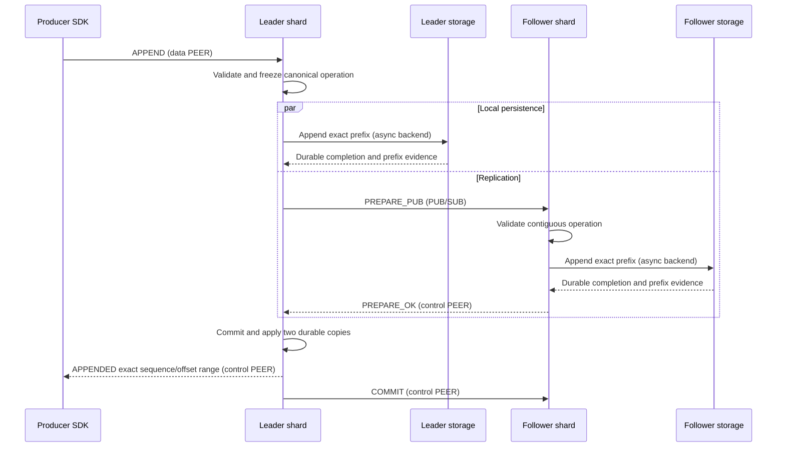
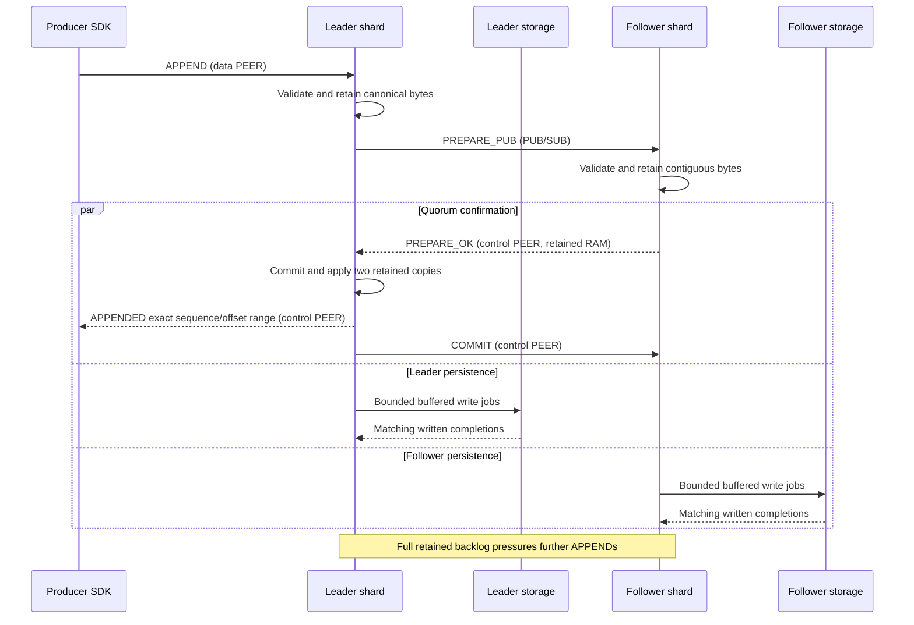
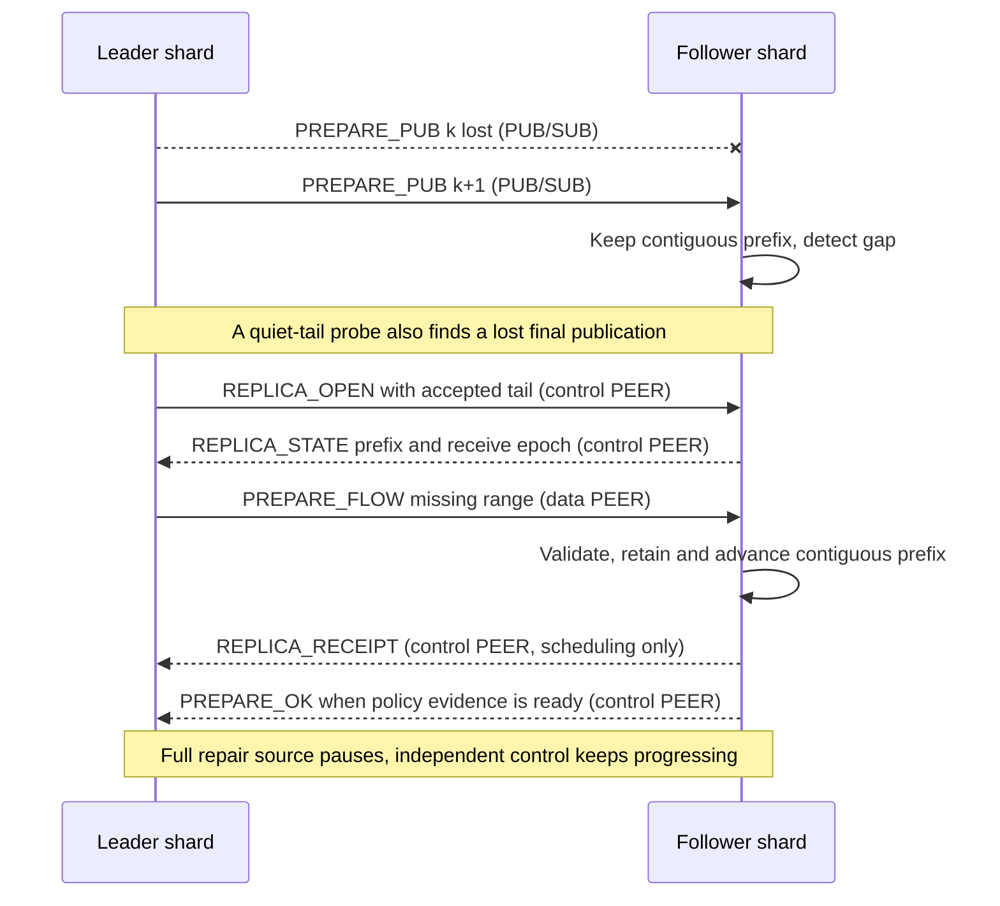
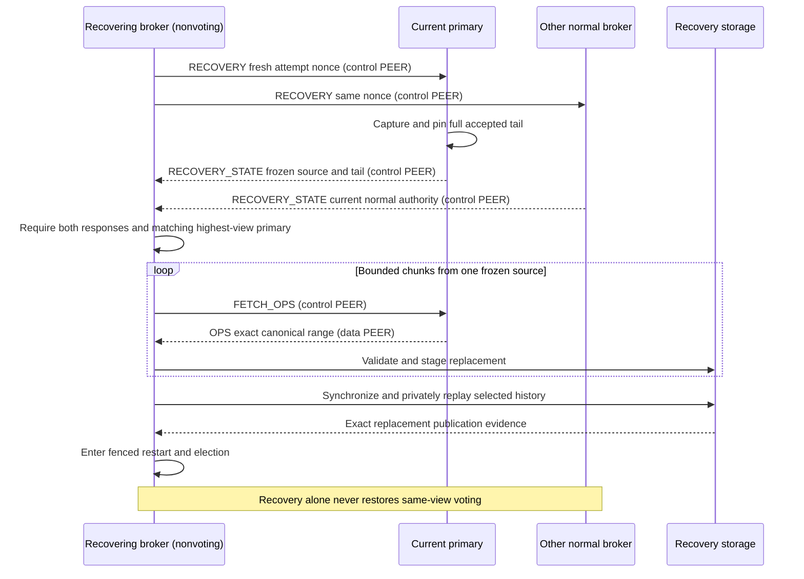
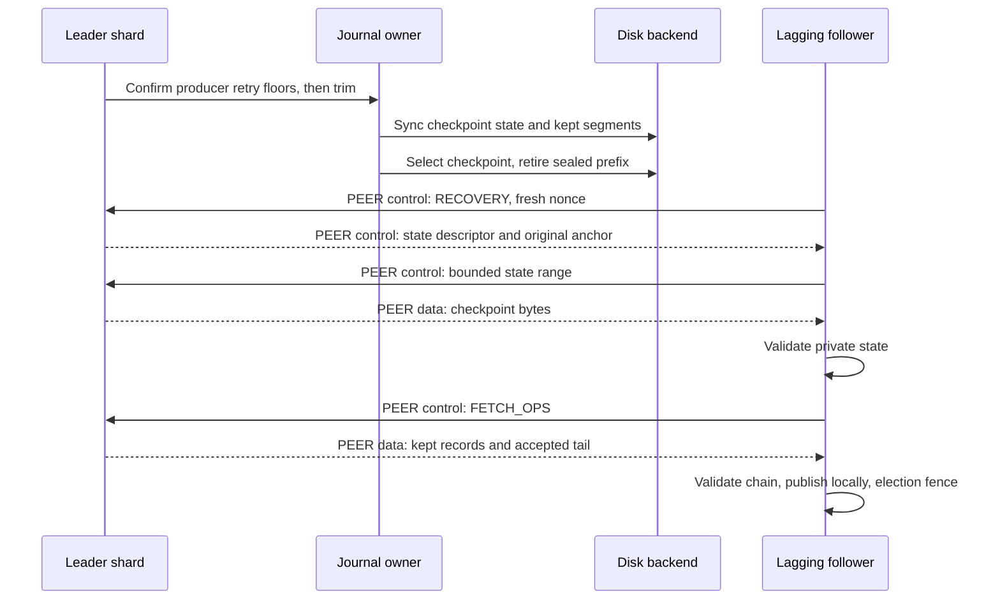

# Replication and recovery

Each replicated partition uses Viewstamped Replication with three fixed brokers.
Two eligible copies are required. Single-broker durable uses explicit local
authority, without elections or failover. All modes share the journal pipeline.

## Configuration and authority

| Scope | Binding |
| --- | --- |
| Partition | Independent group, journal, operations, view, and policy |
| Group | Ordered broker IDs/principals, configuration epoch/digest |
| Leader | `brokers[view % 3]`, activated through election |
| Async work | Configuration, view, session, receive epoch, writer incarnation |

All three brokers store every partition. Initial persisted membership order
spreads leaders; shard placement is local. Hints, endpoint changes, and shard IDs
grant no authority. Routing IDs require an independently trusted peer binding.

Replicated/local `CONFIGURATION` is 256/128 bytes. Both bind identity, policy,
protocol/schema, and integrity profile; cross-mode decoding fails. Formatting
synchronizes configuration under the store lock. Missing or invalid configuration
fails closed; roll, retention, and suffix replacement cannot change membership.

## Single-broker authority

`local::Driver` tracks accepted, written, durable, and applied prefixes separately.
Only a matching barrier and durable-prefix evidence permit confirmation; applied
history permits reply/replay. Restart validates the exact store and fences old
journal work. A failed replicated group never becomes local authority.

## Normal operation and confirmation

Both followers receive normal PUB traffic. Diagrams show the leader and one
follower, the pair needed for confirmation.

### Disk quorum

### Replicated-persisting

1. Validate against committed/pending state; reserve capacity and freeze offsets,
   canonical bytes, and digest before asynchronous work.
2. Followers verify authority, predecessor/chain, schema, application transition,
   and bounds. Authenticated live PREPARE reuses the leader's LZ4 syntax proof;
   body hashing and descriptor checks remain local. Recovery validates locally.
3. DQ requires synchronized exact prefixes on leader and one follower. RP requires
   validated retained bytes on both; writes continue independently.
4. Commit/apply in order, reply from applied state, and announce COMMIT. Follower
   application also requires its policy's local evidence.

New accepted/applied state or authority invalidates a validation plan. Mere
confirmation on the unchanged history does not. Cumulative votes cannot skip
predecessors or change digests. Receipts, queued I/O, and page-cache completion
are not disk votes. One remaining broker cannot confirm.

A leader can reply before announcing COMMIT. Elections preserve that quorum-held
history and reconstruct retry results from canonical records, including when
no survivor recorded the client-success flag.

## Receipt and repair

Receipt reports a contiguous retained prefix and cumulative canonical bytes;
it grants no vote, capacity, or durability. Receive epochs are fresh and nonzero.
Reset/view/restart fences old repairs; reconnect alone preserves retained work.
Opening an epoch requires a correlated probe and independently verified history.
Same-epoch counters/revisions cannot retract or wrap.

Probes capture the accepted tail, including unconfirmed work and an idle final
PUB loss. Retries keep that correlation/tail. Only an answered probe starts
payload repair. Sender ledgers and receiver capacity are independently bounded.
A receipt releases sender metadata, never required receiver bodies.

Recent replay caches are bounded by operations/bytes and do not wait for slow
followers. Older repair uses indexed journal reads from a captured generation
and prefix. Capacity exhaustion preserves the cursor and required size; scope,
source, and predecessor fences remain valid while waiting.

RP retains backing through application and completed writes; a full backlog
backpressures producers. Interrupted/short writes retry/resume. Other
write/writeback/sync errors fence the journal, including while idle.

| Event | Required behavior |
| --- | --- |
| Storage progress | RP deadline resets on written progress; DQ on durable progress |
| Stalled leader | Stop heartbeats and request leader change |
| New RP view promise | Flush accepted history first |
| Graceful RP shutdown | Close admission, drain writes, publish exact `MEMORY_VOTING` evidence |
| Unclean RP startup | Quarantine; recover from both other normal brokers |

An old disk prefix cannot exclude later RAM votes. Losing every volatile copy
can lose the unpersisted tail; an entirely unclean cluster remains fenced.

## Live fan-out

One PUB group publication reaches both followers; one SUB per remote broker
preserves publisher identity. There are no recipient masks or follower credits.
Local handoff keeps one frame/actor within existing output reservations.
Follower and reader publications have separate slots/backing.

The dispatcher offers follower PUB frames without waiting. Bounded shard queues
hold up to 128 frames; drains process up to 16/class. Full queues or gaps drop
publications. A busy actor keeps one contiguous pending frame; probes defer
repair while it waits for capacity. Other gaps use bounded PEER repair.

Repair uses one data connection per destination shard, with alias-bound sender,
receiver, and shard plus the independent control session and receive epoch.
A full shard returns the frame to its exact OMQ source. Control and healthy
copies continue; if both followers stall, the unconfirmed window fills.
Blocked repair wakes only on storage, capacity, control, or timer progress.

## Leader change

| Step | Required gate |
| --- | --- |
| Suspicion | Two current-view EXIT_VIEW requests authorize departure; one timeout cannot ratchet views |
| Promise | Stop old-view admission/replies; settle accepted writes and persist the new promise |
| Reports | Distinct scoped START_VIEW_CHANGE and complete DO_VIEW_CHANGE evidence |
| Selection | Highest installed normal view, then longest accepted prefix, preserving protected commit floors |
| Installation | Fetch/validate the complete selected lineage; install history/view and distribute START_VIEW |
| Activation | Reestablish a matching new-view follower vote through the selected tail, then apply/serve |

EXIT_VIEW is volatile suspicion, never an election vote. A departed broker can
answer a request while its durable promise is pending, only to the requester and
once per retransmission interval. Higher durable promises immediately fence old
authority. Equal-ranked conflicting digests halt selection; missing ancestry is
not an empty suffix. Original operation views/digests survive forwarding.
No force promotion, lower quorum, or confirmed-history discard is supported.

## Restart and recovery

Intact reopen validates configuration, history, durable promises, and installed
lineage, then enters fenced election with a fresh incarnation. A promise without
installation grants no authority. Bootstrap creates a new group explicitly.

Lost, rolled-back, or ambiguous stores stay nonvoting. Fresh nonce-scoped replies
from both other normal brokers, including the highest-view primary, authorize
one frozen source. Tickets bind configuration, view, generation, accepted tail,
and committed anchor. Accepted-only operations remain necessary because delayed
pre-crash votes can still confirm them.

The donor freezes its response when source pinning starts, after pending writes
and maintenance settle. Before that point an unpublished candidate may refresh.
Pinned and published responses remain immutable for their nonce.

CONFIGURATION stays nonvoting until selected bytes/view metadata are synchronized
and privately replayed. Atomic publication plus a matching live recovery core
permit fenced restart; a marker or checksum alone cannot restore voting.
New authority invalidates transfers; admitted physical jobs still settle.

Sealed-file repair uses the same two-broker authority and frozen donor. Validated
local operations may be reused; original manifest boundaries and full private
replay remain mandatory. Repair preserves protected history and higher promises,
then enters ordinary election. Active damage requires full recovery.

## Read authority

Readers expose confirmed applied records. Leader-following subscriptions validate
configuration/view/partition/owner/session; explicit normal followers serve only
their local confirmed prefix. A follower cannot answer producer retries as leader
or claim latest-state authority. Retention gaps are explicit; readers pin no
logical retention. PUB source/offset checks and PEER repair remain mandatory.

## Retained history and restart

A retained-topic restart briefly probes normal copies for their retained boundary.
Two matching replies can show its local prefix expired; it persists a nonvoting
marker and recovers. These replies grant no authority. A bounded unanswered probe
falls through to ordinary election.

An older report below the selected source's retained boundary requires an
overlapping frozen donor. Verify the older prefix against that donor's exact
tail, then verify the same tail within the selected lineage. Only this complete
proof permits ancestry lookup and reuse of a compatible local installation
prefix. Missing or divergent overlap stays unverified; it grants no authority.
A requester withdraws only if its own history has expired.

Checkpoint recovery verifies private state, required retained operations, and the
accepted suffix. The original committed anchor stays distinct. A destination
publishes its own store-bound checkpoint/segments before fenced election. A
retained predecessor equal to the accepted tail needs no empty OPS request.

## Limits

The protocol covers crash failures, not Byzantine peers or arbitrary distributed
corruption reconstruction. Recovery requires both other normal brokers. Online
membership, larger groups, partition movement, and latest-state read optimizations
are not implemented. [Storage](STORAGE.md#supported-failure-model) defines physical
failure assumptions.
