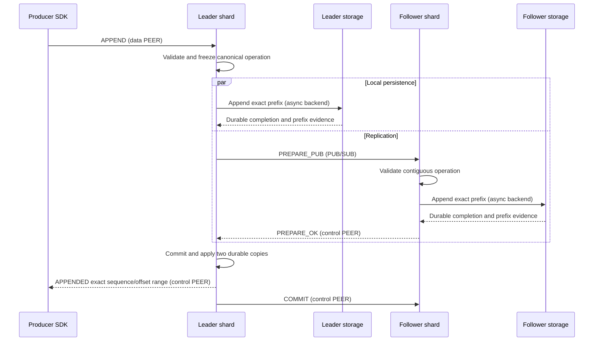
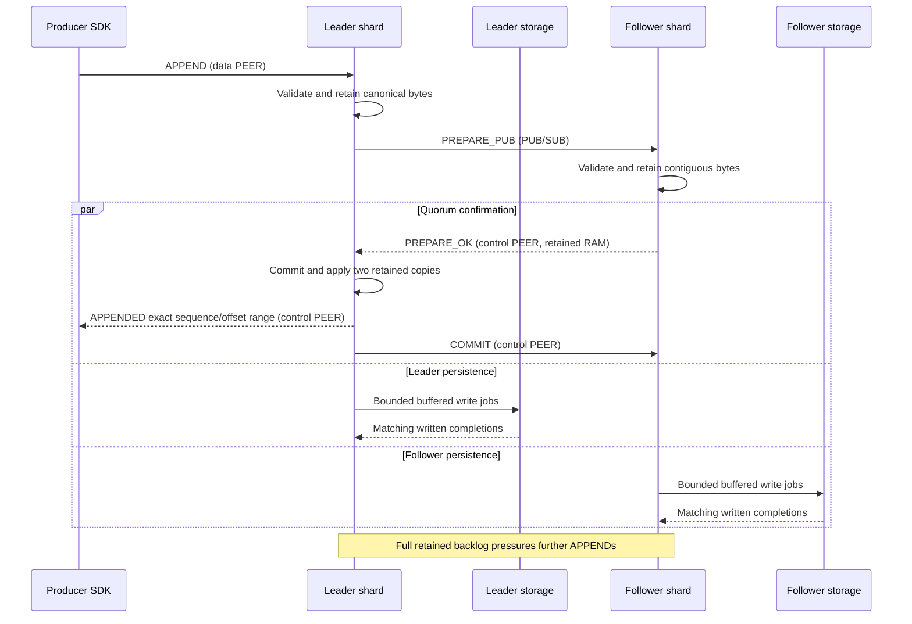
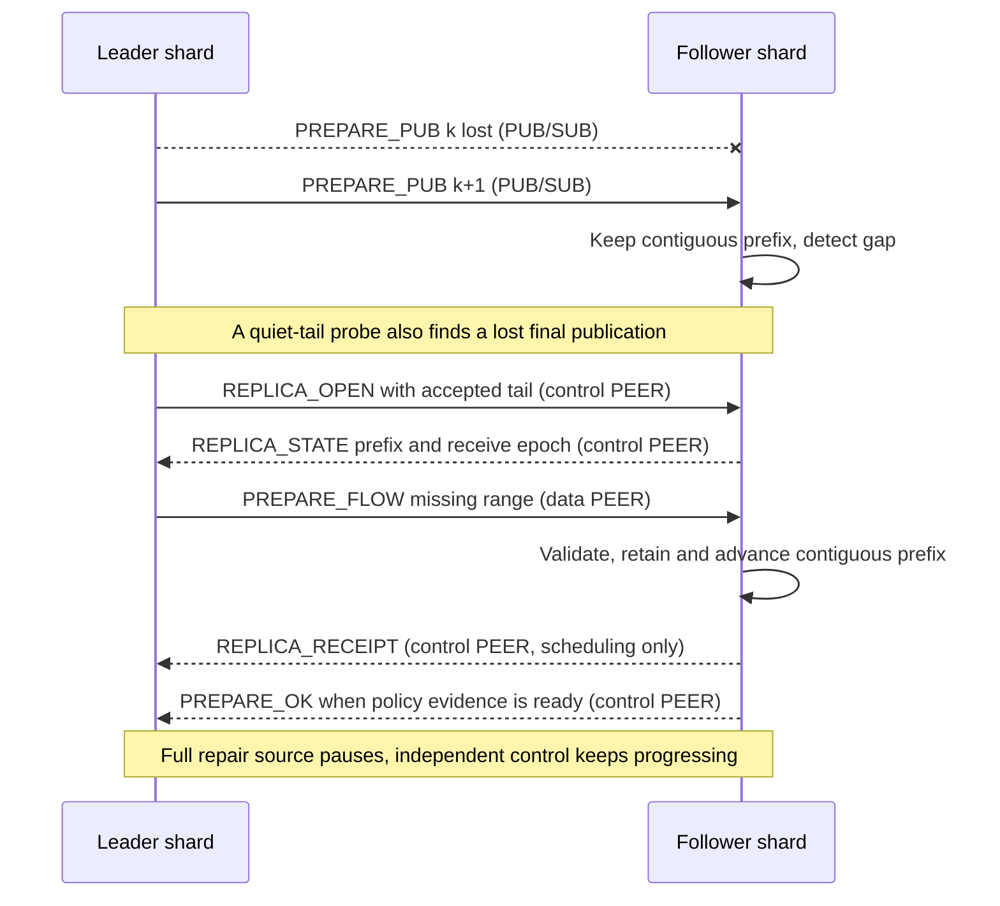
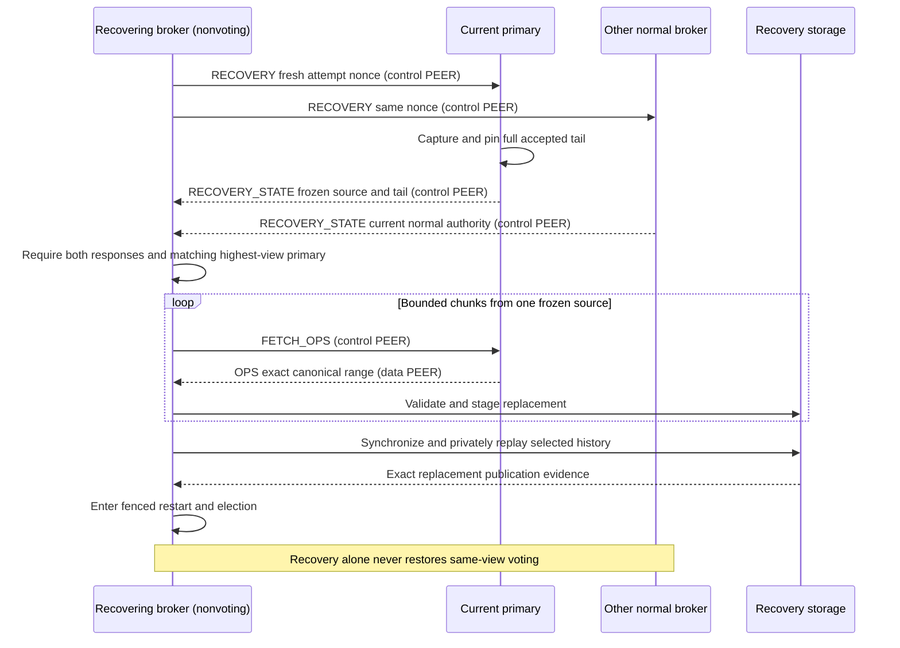

# Replication and recovery

The current replication core follows Viewstamped Replication (VSR) with exactly
three fixed brokers.
The code calls them voters/replicas and calls the leader primary. One leader
orders operations for one partition; two followers retain copies.
This is a crash-failure protocol, not Byzantine consensus or arbitrary disk
corruption repair. [Protocol](PROTOCOL.md) owns wire schemas;
[storage](STORAGE.md) owns durable publication.

The implemented core is fixed at three members. The selected single-broker
deployment uses an explicit one-broker configuration using the same native
protocol and segment path. Its confirmation is local durability, not a
three-broker quorum. Both configurations run through the selected broker
frontend, partition actors, and asynchronous storage backends.

## Configuration and authority

Replicated placement: exactly one group per partition. Every partition uses the
same three broker processes, all storing every group. Lag does not change
placement. Topic metadata binds each partition to its own group identity,
configuration, and policy. A group cannot span partitions. Partition actors on
one shard can have different leaders and views, including within one topic.

Choose immutable broker order at partition creation to distribute initial leaders:
`[A,B,C]`, `[B,C,A]`, or `[C,A,B]`. The existing selection rule is
`brokers[view % 3]`; all members persist the same ordered configuration.
Each partition elects independently. Neither a routing hint nor reordering a stored
configuration may bypass election. Ongoing load balancing is not implemented.

Group ID, configuration epoch/digest, ordered broker identities, policy, and
view scope every vote and transfer. Membership order determines leader rotation.
Endpoints, timeouts, and thread counts are deployment settings, not votes.
Routing IDs and configured principal fingerprints do not authenticate peers;
the adapter must supply the trusted/authenticated binding.

Disk `ConfigurationRecord` is a fixed 256-byte, network-order record binding
exactly three distinct identities/principal fingerprints, confirmation policy, protocol
version 1, and canonical schema 1. Its version-2 checksum uses the integrity
profile in [Storage](STORAGE.md#integrity-and-formats). Exact bytes
and reserved fields are enforced by its codec and fixed-byte tests.

Format writes/synchronizes immutable `CONFIGURATION` under the group lock.
Open requires its exact bytes before journal recovery or voting. Missing,
changed, truncated, oversized, or non-regular files fail closed. Generic journal
open cannot grant replica authority. Relocation preserves the exact binding;
ordinary roll, checkpoint, and suffix replacement do not edit membership.

Each broker owns one mutable replication state machine and separate journal per
partition group. The selected actor owns both on one application shard. File
operations use async storage backends, without moving authority to I/O workers.
The dedicated journal-owner runtimes have been removed. Shard counts and
group placement are broker-local and may differ. Multiple groups share threads, never logs, views,
or confirmations. One partition's repair cannot truncate another's files.
Each actor runs one group; shards host multiple actors. View changes fence old actions;
async work also binds a fresh local writer/memory incarnation. Distinct
configuration, view, link session, receive epoch, and writer incarnation are
not interchangeable generations.

## Future six-broker groups

Not implemented. Larger groups need authoritative membership plus separately
qualified confirmation, election, and recovery thresholds. Keep today's fixed
three-member codecs and two-of-three rules. Single-broker mode stays explicit;
a failed cluster never becomes a local broker.

## Single-broker authority

`local::Driver` admits a bounded contiguous canonical suffix and tracks local
write, durability, and application separately. It uses the same validation fences
and journal completion tickets as replicated partitions. Only an observed data
barrier plus durable-prefix evidence advances confirmation. Applying that prefix
releases live capacity and permits replies. There are no votes or elections.

Its immutable 128-byte `local::Configuration` binds one broker, principal,
partition group, configuration epoch, protocol/schema, and integrity profile.
The codec checks all fields and its domain-specific checksum. Local and
fixed-three records reject each other's encoding. Exact store recovery supplies
the restart prefix and a fresh journal generation before local admission resumes.

## Normal operation and confirmation

Both followers receive the same normal PUB traffic. These sequences show the
leader and one follower: their eligible copies suffice for confirmation. The
other follower can repair independently. Control and bulk data use separate PEER
endpoints.

### Disk quorum



### Replicated-persisting



[Runtime](RUNTIME.md#replicated-confirmation-with-background-persistence) owns
thread and queue placement. The shared operation pipeline is:

1. Validate the request against committed plus pending state. Reserve count,
   byte, and result capacity; assign offsets and freeze canonical bytes.
2. Register the operation/digest before starting asynchronous work. Leader
   journal append and follower PREPARE transmission may overlap.
3. Followers validate scope, leader/view, predecessor/digest, schema, application
   transition, and limits before accepting the complete operation. For a live
   PREPARE from the authenticated leader, followers reuse its whole-payload LZ4
   syntax check. They still hash the received bytes and check APPEND descriptors,
   decoded lengths, and limits. Recovery reads validate payloads locally.
4. For disk quorum, a follower votes only after its exact contiguous prefix is
   synchronized. The leader requires its own durable completion and one distinct
   matching follower vote. For replicated-persisting, both must retain
   validated bytes; persistence continues in the background.
5. Commit/apply eligible operations in order, then complete writer requests from
   confirmed applied state. Announce the commit prefix through piggyback or idle
   COMMIT; followers apply only when their required local evidence exists.

Worker validation binds the exact broker, authority, writer incarnation, accepted
history, and applied image. A newer confirmation on that unchanged history does
not invalidate the plan: it changes neither application image until applied.
Changed accepted/applied state or authority still requires fresh validation.

TCP delivery, queued I/O, page-cache writes, and flow receipts are not disk
votes. Retained-RAM votes must never satisfy disk-quorum requests. A cumulative vote
cannot skip a predecessor or claim a different digest. The slow follower need
not block a healthy pair, but one remaining broker cannot confirm alone.

A leader may die after replying but before announcing COMMIT. The next leader
must preserve that quorum-held history even if no survivor marked it committed.
Local client-success flags are not the distributed proof. Don't add a mandatory
second sync for every reply merely to persist that flag; reconstruct results
from the selected canonical history. Exact retained retries return that result.

## Receipt and repair

Normal replication stays on PUB/SUB. A gap or quiet tail starts bounded repair:



The journal-backed core also supports votes from retained RAM while buffered
writes proceed. Its live window is reclaimed after application and completed
writes. Written and durable positions stay separate.

Before promising a new view, brokers flush all accepted history. A disk prefix
cannot prove that no later RAM vote existed, so unclean intact-disk restart is
refused. Drained restart requires verified shutdown or fresh recovery evidence
and still fences the old view.

`JournalConfig::write_pipeline` bounds accepted canonical bytes in RAM. The
partition actor compresses chunks while the device writer is busy, collecting at
most one segment within the backlog. Ready chunks enter buffered vectored
writes without waiting for a full segment.

Ordered completions install written progress, never stable-storage evidence.
Confirmation and application advance independently. Application and writing
release local retained capacity; a full backlog backpressures writers.
All partition allocations share the shard owner budget.

Interrupted writes retry; short writes resume at the unwritten offset. Other
write, writeback, or sync errors fence the journal, including when idle.
Failed batches claim no success
even if bytes reached disk. Restart evidence remains unproven; the embedding
application owns process restart. See [pipeline bounds](RUNTIME.md#replicated-confirmation-with-background-persistence).

Graceful shutdown closes admission, drains accepted work, then publishes exact
`MEMORY_VOTING` evidence. Unclean startup refuses normal voting and requires
`RecoveringJournal::quarantine` plus fresh recovery from both other brokers.
Recovery replaces the complete selected history; stale local history is not
selectively reused in this policy. Ordinary opening records running state before
returning any voting authority. Missing or damaged evidence never authorizes
voting from an older disk prefix.

Losing every volatile copy can lose the unpersisted tail. Automatic restart of
an entirely unclean cluster is not implemented: without healthy recovery peers,
the runtime stays fenced. This mode does not promise disk durability at writer
confirmation or recovery after losing more than one broker's state.

Flow receipt describes contiguous bytes retained by one receiver. It grants no
group vote or durable position and does not release required history.

The commit-progress deadline is separate. Written progress resets the local
storage deadline in replicated mode; durable progress resets it in disk quorum.
RAM confirmations and transport probes cannot hide a stalled disk. A stalled
leader stops heartbeats and requests a leader change; the healthy pair can proceed.

Each receiver owns a fresh nonzero receive epoch. Resetting staged state,
changing view, or restarting fences old PEER payloads and reports. Reconnection
alone preserves retained work. Reports carry the exact retained prefix and
cumulative canonical bytes, with no operation or byte allowances. Releasing
applied and physically written bodies changes local capacity only.

The receiver bounds queued, validating, and accepted bodies together. The shard
allocator bounds all partition actors together. The sender separately bounds
outstanding PEER repair metadata and bytes. Receipt can release sender metadata
without releasing receiver bodies. Neither event proves confirmation.

Opening a receive epoch requires a correlated probe and independently verified
base and receipt history. Same-epoch updates cannot retract history or counters.
Revisions and cumulative counters never wrap. A PUB receipt beyond the PEER
send ledger also requires exact local-history verification.

Probes capture the leader's accepted tail, including unconfirmed work. This
repairs a lost final publication when no subsequent write arrives. Retrying a
probe preserves its correlation and captured tail. Only an answered probe
starts repair; timers alone never retransmit payloads.

Packet limits and total live capacity are separate. Repair reuses its original
retry metadata. A slow third broker catches up from the bounded recent cache or
journal without indefinitely pinning writer arenas. Missing history or capacity
is explicit, never silent truncation of confirmed work.

`ActorConfig::replay_cache` independently bounds applied packets retained in RAM
by operation count and body bytes. It covers at least one live window; matching
flow metadata covers both windows. Eviction never waits for a slow follower.
Older history falls back to journal reads.

Cold catch-up runs on the existing shard reader. One bounded chunk can be pending
independently of normal appends. The reader reuses its verified segment/index;
background writes may extend beyond its captured completed prefix. The actor
checks leader scope, journal generation, and follower cursor before sending.
Shutdown joins the read; leader changes discard stale replies.
See the [catch-up data flow](RUNTIME.md#follower-catch-up).

If local repair capacity cannot fit the next retained operation, the journal
returns its verified required size without advancing the replay cursor. The
actor waits for local space rather than failing the journal or repeatedly
reading the same bytes. That wait is bound to the broker channel, scope, writer
generation, and exact predecessor; replacement history cannot reuse it.

## Live fan-out

Journal-backed actors publish each live group once on a common group topic.
One SUB per configured remote broker preserves publisher identity. No recipient
masks or follower credit checks restrict fan-out.
Continuously ready publishers share receive turns. Cancelling a receive to
serve control preserves the remaining publishers' readiness.
Local publication handoff retains one prepared frame per actor until the shared
dispatcher slot returns. Only PUB socket or receive-queue pressure causes loss.
Follower and reader PUB sockets have independent local publication slots. Each
shard reserves both inside its original outgoing data budget.

The dispatcher offers PUB frames to the bounded shard follower queue without
waiting. Up to 128 queue slots absorb short storage-completion bursts within
the existing retained-byte reservation. Shards drain batches of up to 16 frames
per data class. A full queue or missing predecessor drops the publication. A busy actor
holds one contiguous frame in the shard's existing bounded pending slot.
Probes suppress repair while that frame waits for local capacity. Otherwise,
the initial probe delay bounds silence before repairing a missing final frame.
Later PUB frames remain subject to the same contiguous-history checks. A gap
cannot skip canonical operations or change confirmation evidence.

PEER carries confirmations, elections, status, and bounded repair. Repair uses
one independently identified connection per destination shard at the separately bound
broker data endpoint. Its alias binds sender, receiver, and destination shard. Every
repair also carries the current independently established broker session and
receive epoch. Repair connections never establish or replace control sessions.

The dispatcher returns a repair frame to its exact OMQ receive source when the
shard queue is full. The shard holds at most one dequeued repair when its actor
needs space. Pressure pauses that source, while control and other shards keep
progressing. One slow follower cannot gate confirmation by the healthy pair.
If both followers stall, the leader's unconfirmed window fills and writer intake
backpressures. Replicated-persisting additionally retains its physical write
backlog until application and completed writes release it.

Live receipt suppresses speculative repair while publications advance. A dropped
publication supplies a repair bound immediately. After receipt stops advancing,
correlated probes repair the accepted tail, including an idle final loss.
Duplicates do not extend the wait. `ozzy-core::live::LiveProgress` owns this rule.
Blocked PEER repair waits for storage, memory, control, or timer progress. It
cannot repeatedly wake its shard without changing state.
Scope, generation, session, and receive-epoch checks fence stale repair work.

## Leader change

A lone timeout sends volatile EXIT_VIEW suspicion. Two current-view requests
authorize departure; a lone deaf broker cannot ratchet the view. A newer durable
promise fences old authority immediately. EXIT_VIEW is not a durable election
vote and cannot substitute for START_VIEW_CHANGE/DO_VIEW_CHANGE evidence.
A broker that already left a view answers a request to leave it with its own
EXIT_VIEW for that view. Otherwise a peer whose request completed the other
broker's quorum waits for that broker's durable promise, which may be stalled
behind its disk. The answer goes only to the requester, only while the
answering broker's own promise is pending, and at most once per retransmission
interval for each requester. A broker that also left the view cannot tell an
answer from a request, so an unlimited answer never stops.

Stop old-view normal acceptance and replies before collecting a new view.
For disk groups, settle admitted writes and persist the promise before sending
view-change votes. Reports include everything that may already have been voted
for; pending I/O is not permission to report a shorter history.

Collect distinct, scope-matching START_VIEW_CHANGE participants and complete
DO_VIEW_CHANGE reports. Select highest last-installed-normal-view, then longest
operation prefix, preserving every protected committed floor. Equal-ranked
conflicting digests halt selection. Never merge independently selected partition
tails or treat missing chunks as an empty suffix.

Fetch missing bytes from a matching immutable source. Verify the entire selected
lineage, install history/view metadata, and distribute START_VIEW. Disk brokers
durably install before voting. The leader reestablishes a new-view follower vote
through the selected tail, even when that tail was already known committed,
then applies and activates. Stale completion callbacks cannot restore authority.

Failure to finish advances the ordinary bounded election protocol; there is no
force-promote, lower-quorum, or discard-confirmed-history shortcut. Last normal
view describes installed history, not the largest view attached to any entry.
Forwarding an old operation into a new view preserves its original digest.

## Restart and recovery

Intact disk reopen validates configuration, canonical history, durable promises,
and installed normal-view lineage, then uses a fresh writer incarnation and a
fenced election. Never reuse an old leader `(view, op)` for different content.
A promised but uninstalled view does not grant normal authority. Bootstrap is
explicit creation of a new group, not a restart or missing-store fallback.

A lost/rolled-back/ambiguously corrupt store stays nonvoting. Recovery obtains
fresh nonce-scoped authority from the existing group, not an old local snapshot.
The recovering identity does not count toward that authority. Tickets bind
configuration, view, source incarnation/generation, full accepted tail, and
committed anchor. Capture all accepted operations: a delayed pre-crash vote
can still confirm work beyond the announced commit floor.

Full replacement uses genesis or a validated checkpoint anchor, followed by
bounded correlated FETCH_OPS/OPS chunks. Verify request, donor, predecessor, count/bytes, canonical hashes/schema,
and application state before exposing anything. Freeze one exact snapshot per
attempt; don't combine
chunks from changing source generations. New authority supersedes the attempt,
settles its admitted I/O, and starts a fresh exchange.

Disk replacement is persistently fenced by a recovery marker in CONFIGURATION.
Ordinary configured open rejects it. Synchronize selected WAL/view metadata,
privately validate application history, then atomically publish/synchronize the
real configuration. Only a live matching recovery core may hand off through
fenced intact restart. Local marker bytes never authorize voting by themselves.



Physical sealed-file repair uses the same fresh two-broker authority and pinned
donor, but requests only missing canonical ranges. Intact local operations may
be reused after independent checksum validation; exact original manifest boundary
digests and full private semantic replay remain mandatory. Repair preserves local
accepted/committed history and last-normal view, and retains any higher durable
promise. It does not pretend to install the donor's full current history. Its
completion enters fenced intact restart; the normal leader-change protocol then
resolves any accepted-only suffix. See [storage repair](STORAGE.md#recovery-and-suffix-installation).

This requires two other normal brokers. Combining disjoint damage across several
nonvoting brokers needs additional distributed recovery logic. Checksums alone
cannot decide which incomplete history the group previously confirmed.

## Read authority and future extensions

Committed replay exposes applied records, not speculative intake. A stale
follower cannot answer writer retries as leader. Strong latest-state reads need
current authority/quorum confirmation, not just a locally cached leader label.
Lease/read-index-like optimizations require their own timing and safety proof.

Native subscriptions push bounded confirmed history from groups.
Group-aware readers follow leaders; explicit normal-follower reads remain possible.
Both check group/configuration, view, partition, owner, and link-session fences.
Reaching an applied end parks the cursor until more confirmed history arrives.
Committed retention floors return an explicit earliest-offset gap;
readers neither expose accepted-only records nor pin history against expiration.
Physical reclamation remains separate from these logical read floors.

A disk-group leader can also publish confirmed, applied records once for all
live readers of a partition. A publication is no vote, no confirmation, and no
proof of its sender's authority: readers accept only the source that their own
subscription confirmed, and repair every gap by replay. See
[RUNTIME.md](RUNTIME.md#live-reader-publication).

Online membership, partition movement, arbitrary corruption repair, and legacy
`Node` replicated integration are separate work. The selected `Broker` runs both
cluster modes, including checkpoint recovery after retention.
Movement must fence the source before destination
activation; a directory update alone cannot transfer ownership.

Use [Validation](VALIDATION.md) for production-core schedules, process faults,
and cross-host checks. Passing a finite simulation or happy-path test does not
prove complete consensus safety, power-loss behavior, or arbitrary host-loss
availability.

### Retained history and restart

A restarting retained topic briefly asks existing normal copies for their
retained boundary before sending election reports. Two matching normal replies
can show that its local accepted prefix has expired. It then persists a
nonvoting marker and follows ordinary checkpoint recovery. The replies grant
no authority. Without replies, the bounded probe ends and ordinary election
continues.

During a full-cluster restart, an ancient replica can report a protected prefix
below another replica's retained boundary. Missing ancestry stays missing; it
neither faults that intact donor nor withdraws a requester whose own accepted
history still reaches the boundary. The ordinary election deadline advances
without selecting that unverified history. When the ancient replica requests
the newer lineage, its expired local tail withdraws into nonvoting recovery.
Quorum membership and all protected-prefix checks remain unchanged.

Checkpoint recovery verifies private state first, then every required retained
operation and the complete accepted suffix. The original committed anchor
stays distinct from that suffix. The destination publishes its own store-bound
checkpoint and segments before rejoining through a fresh election fence.
If the retained predecessor already equals the source's accepted tail, verified
checkpoint state completes the transfer without requesting an empty OPS chunk.

```mermaid
sequenceDiagram
    participant L as Leader shard
    participant J as Journal owner
    participant D as Disk backend
    participant F as Lagging follower
    L->>J: Confirm producer retry floors, then trim
    J->>D: Sync checkpoint state and kept segments
    J->>D: Select checkpoint; retire sealed prefix
    F->>L: PEER control: RECOVERY, fresh nonce
    L-->>F: PEER control: state descriptor and original anchor
    F->>L: PEER control: bounded state range
    L-->>F: PEER data: checkpoint bytes
    F->>F: Validate private state
    F->>L: PEER data: FETCH_OPS
    L-->>F: PEER data: kept records and accepted tail
    F->>F: Validate chain; publish locally; election fence
```
