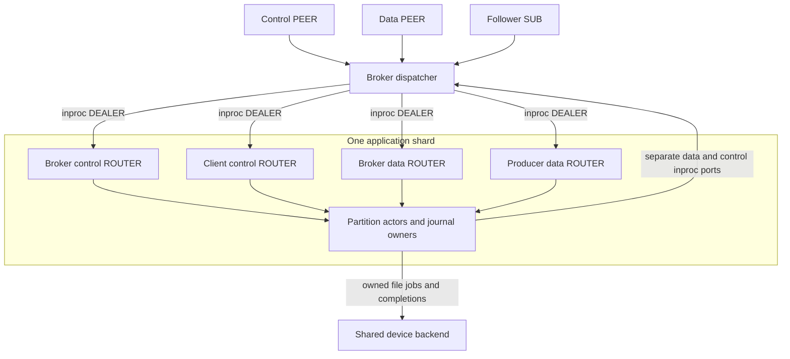
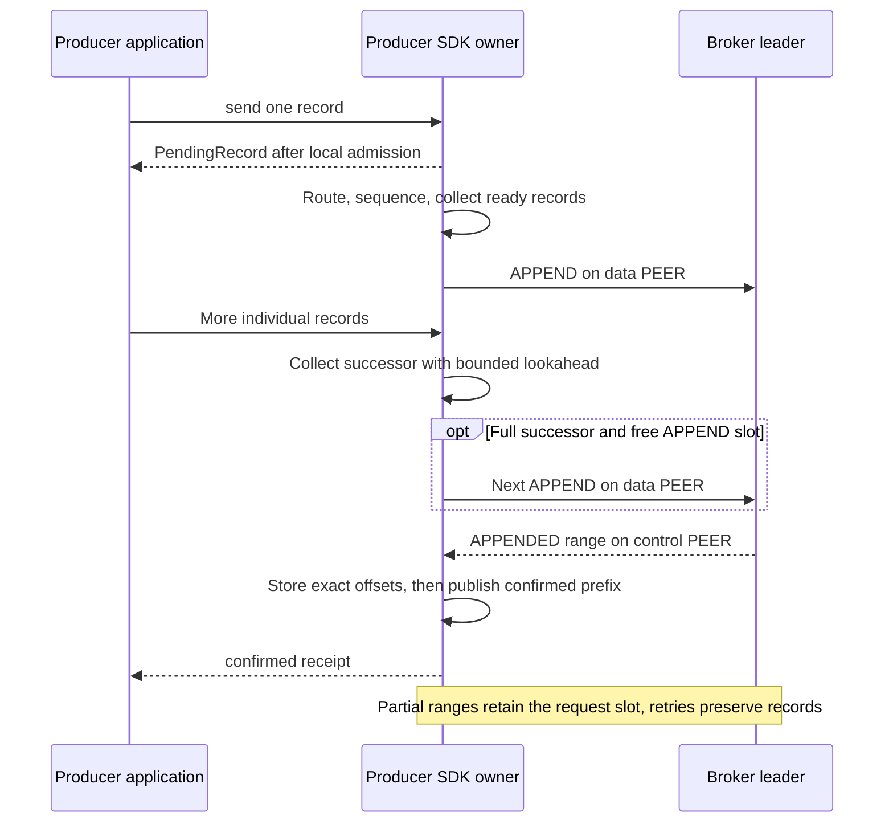
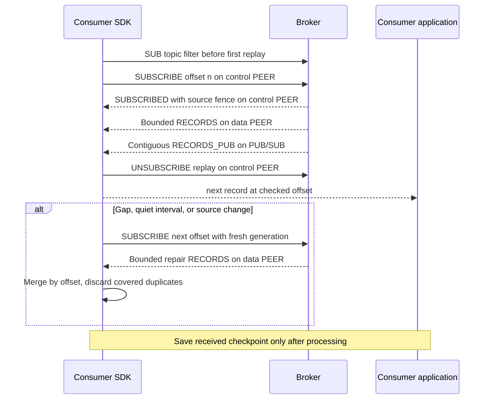

# Runtime

Ozzy owns record identity, retry, confirmation, and storage state. OMQ owns
routing, framing, reconnects, fairness, queues, and transport pressure.
[Overview](OVERVIEW.md) defines terms; [protocol](PROTOCOL.md) defines messages.

## Deployment configuration

TOML fixes broker identity, topic partitions, membership, shard placement,
storage roots, device backends, and distinct public endpoints. Each broker binds
control PEER, data PEER, reader PUB, and optional follower PUB once. Replicated
groups contain exactly three brokers; single-broker durability is explicit.

Each partition has one actor and journal per broker. Shard placement is local:
counts and numbering need not match. One shard may lead some partitions and
follow others. SDKs route to broker identities, never remote shard numbers.

## OMQ ownership and scheduling

| Owner | Execution / work |
| --- | --- |
| OMQ I/O workers | Separate network runtime; framing, connection I/O, socket queues |
| Broker dispatcher | Separate thread; sessions, routing, source pause/resume, shared sockets |
| Application shard | One OS thread/current-thread runtime; partition actors, journals, readers |
| Producer SDK owner | Current-thread runtime; sequence order, batching, packing, retries, receipts |
| Consumer SDK role | Subscription generations, offsets, live/replay merge, processing observations |
| AIO device owner | One thread per configured device; direct-write submit/reap |
| Device helpers / pool workers | Fixed threads for blocking file operations and reserved progress work |

The broker defaults to one dispatcher and one OMQ I/O worker. Actors are tasks,
not threads. Shard 0 has no extra duties. Partition actors call their journal
owner directly; there is no same-thread journal command queue or journal runtime.

Producer and consumer state is separate. `BrokerLinks` reuses sessions and
transport for both roles. Its two PEER sockets connect every configured broker;
three brokers mean six TCP connections, not six PEER sockets. Live readers use
one additional SUB per broker, shared across topics.

Topic discovery attempts each configured broker under one request deadline and
the existing per-broker control reservations. The first complete, validated
catalog supplies metadata; pages from different brokers are never combined.
Each attempt is bounded by `maximum_partitions`. Completing discovery cancels
the other observers, and the transport owner reclaims their slots after noticing
cancellation. Late responses retain their original request and session fences.
Session replacement restarts that broker's catalog at page zero with fresh
request IDs and the original deadline.

The four input queues and two output ports are distinct bounded lanes. Input
routing metadata and output command headers precede unchanged native frames.
Completion IDs remain in a bounded shard-owned table. Poll port progress beside
command observers; dropping an observer does not cancel accepted work.

## Confirmation boundaries

| Mode | Producer confirmation requires |
| --- | --- |
| Single-broker durable | Local durable evidence and application |
| Disk quorum | Two eligible durable copies and application |
| Replicated-persisting | Two eligible retained copies and application |

DQ/RP share replica, journal, transport, and reader algorithms. Their policy
changes voting/persistence evidence. Local authority uses its own driver with
the same concrete journal owner. Socket acceptance and physical job submission
are never confirmations. [Replication](REPLICATION.md#normal-operation-and-confirmation)
shows DQ/RP sequences.

### Replicated confirmation with background persistence

RP keeps canonical backing until application and physical writing permit release.
Count/byte bounds include that backlog. A full backlog stops admission and
propagates pressure to producers. Canceling a wait frees neither the running
job's buffers nor its handles. Unclean restart follows nonvoting recovery;
RAM-confirmed history is not a durable prefix.

Recovery donors reserve a journal drain turn before pinning authoritative history.
Outstanding writes and an independent sync barrier must settle and be observed
before pin admission. The request remains queued during that wait; a busy journal
does not terminate a healthy donor or supply recovery or quorum evidence.
An admitted pin retains its exact response separately from the latest request.
Nonce replacement, link loss, and a view change invalidate the request without
canceling physical work. A matching late completion retains its exact source;
obsolete sources are released through the bounded journal schedule before new
pinning or view installation. They never overwrite the latest response. Repeated
requests for the same nonce reuse the admitted snapshot while it remains pinned.
After link loss releases that source, the nonce retains only its snapshot
identity; retransmission waits for the requester's fresh attempt rather than
recapturing a newer tail under the old nonce.
Late fetch and checkpoint completions send nothing after request replacement.

Addressed history reads also check journal admission before submitting work.
An independent reader or lookup can hold the owner while the replica has no
pending action. The requester retains and retries `FETCH_OPS` during that wait;
the donor creates no extra queue and keeps the existing source and scope checks.

### Local durable pipeline

Local authority validates retries and assigns offsets. The journal prepares
physical groups, installs ordered completions, publishes durable evidence, and
applies confirmed records. Suspended storage leaves other partitions runnable.
A validated batch blocked by physical backing stays in its existing ready slot;
install it before later validation/election work when capacity returns.

## Writer API

Applications submit individual records. `send` observes local admission;
`confirmed` and `flush` observe the broker's configured confirmation boundary.
Retry identity is producer/epoch/sequence within one partition. Request IDs,
connection sessions, and batch boundaries may change; identity and bytes do not.

History invariant failures retain a typed cause and source check. The replicated
partition scheduler captures local identity, scope, journal generation, applied
prefixes, active transfer, and donor response/pin evidence on that cold path.
Donor completion failures also retain the exact completed pin, including its
nonce and immutable source. Reporting an error still stops the partition and
closes intake; diagnostics never grant recovery or confirmation authority.

Route lookup filters obsolete physical sessions before comparing cached views.
The dispatcher purges stale watches in bounded turns. A route hint grants no
authority. Retryable NACKs use bounded backoff; reconnect and leader refresh
remain independent of transport receipt.

### SDK protocol batching

| Bound | Current contract |
| --- | --- |
| Records per APPEND | Minimum of negotiated limit and SDK cap of 2,048 |
| Payload collection target | `SharedTopicWriterConfig::new`: 64 KiB, capped by packet capacity |
| Outstanding APPENDs | Default one per partition writer; configurable |
| Intentional delay | None; collect only ready records without a timer |
| Sparse / loaded traffic | Send a ready partial batch when idle; pipeline full batches or flushes |
| Intake bytes | Payloads plus multipart length tables, including empty parts |
| Lookahead | One permitted next record and part table beyond the collection target |

The byte target is not a record-size limit: a permitted larger record goes alone.
Payload, metadata, record, and part bounds still apply. A partial successor collects
while previous APPENDs await confirmation. Lookahead marks it ready when the next
record would exceed its target. Partial replies keep the request slot occupied.
Benchmarks' 2 MiB target and three outstanding APPENDs are not SDK defaults.

Payloads up to 128 bytes stay inline through caller intake and grouped packing.
Pending receipts use pages of 16 identity/offset cells, with a caller-owned cursor.
Cells initialize once; pages retain no payload. The SDK stores offsets before
publishing the confirmed prefix; callers acquire that prefix before reading.
A receipt retaining its whole page fits the per-record metadata reservation.

Packing returns caller inbox slots. Confirmation releases retry state; final
transport aliases release backing. Reservations cover unused lanes, packing
slots, metadata, replies, and outstanding requests. Multipart-table reservation
scales with requests/intake, not records multiplied by maximum parts per request.

Producer resume and takeover resolve every partition before admitting records.
Their stable transition identity survives response retries. Each attempt uses
the producer retry timeout, so a dead leader cannot stall attachment for a longer
shared-link request timeout. Topic routes and OMQ links handle reconnection.

Recovery copies a correlated checkpoint chunk into bounded owner memory before
queueing it. The charge survives cooperative validation and journal completion.
Allocation pressure preserves the outstanding request for transport retry.

## Readers

A reader subscribes with a selector and fresh generation. The broker resolves
the selector once, returns its offset, then seeks
an indexed cursor and parks at the applied end. Confirmed appends, source changes,
and buffer releases wake it. Capture checks applied metadata on the partition
owner; only record retrieval creates an asynchronous file job/payload lease.
Readers do not extend retention; expired offsets return an explicit gap.

PEER RECORDS uses the data socket; SUBSCRIBE, SUBSCRIBED, ACK, cancellation,
and NACK use control. A full SDK inbox retains the original frame and pauses
its exact data source. Application release resumes it. Readers sharing one
broker connection share pressure; another SDK connection remains independent.

The SDK transport owner decodes SUBSCRIBED and UNSUBSCRIBED into fixed-size
cursor completions before returning control-frame admission. An idle reader
retains only its completion, covered by the subscription's metadata reservation;
it cannot pin the raw control reply and block producer attachment. Request,
session, source, subscription generation, and resolved-offset checks precede
completion. Raw directory, producer, and ACK replies retain their frame charges
until their observers release the backing.

Reader cancellation carries its original link session through detached cleanup,
control-slot admission, and the transport owner's send turn. A disconnected or
replaced session completes that cleanup locally, even while another caller holds
all control slots. Old cancellation never waits for reconnect or uses a new link
session. A missing cancellation reply on the original live session still returns
a timeout; source and response validation remain mandatory.

An offset gap on PEER starts a fresh subscription generation at the next
undelivered offset. Old-generation frames are discarded. Data readiness may
lag control readiness; records and retention errors still undergo full checks.

### Live reader publication

Only confirmed, applied records enter reader PUB. The consumer's SUB verifies
source and contiguous offsets, discards duplicates, and merges replay/live data.
PUB drops on pressure; `xpub_nodrop` is not enabled. Consumer speed never gates
producer confirmation.

A quiet interval repairs a lost final publication even without another append.
ACK/processing observations are volatile and grant no capacity. Consumer
checkpoints need application persistence; broker-stored offsets are not implemented.

Reader PUB copies final encoded bytes into its reserved transport buffer, so a
slow SUB alias cannot pin writer admission backing. Producer LZ4 blocks stay
byte-exact. PEER replay keeps its separately bounded shared-payload path.

## Follower catch-up

Normal operations use broker PUB/SUB. Followers report retained prefixes and
policy-specific votes over control PEER. Gaps and idle final loss use correlated
probes and bounded PEER data repair. Repair identities are per destination shard;
control sessions remain independent. [Replication](REPLICATION.md#receipt-and-repair)
owns prefix, epoch, digest, and activation checks.

## Placement and transport bounds

### Backpressure isolation

Shards visit broker control, client control, broker data, then producer data.
Each turn has count/byte bounds, so control priority does not starve data.
OMQ supplies connection fairness inside sockets; Ozzy bounds work between classes.
Each input retains at most one separately charged deferred frame.

A full PEER destination returns the original frame to its exact OMQ source and
pauses that connection. The dispatcher never awaits that queue. Full PUB intake
drops the attempt. Paused-source retries allow at most 16 receive attempts or
2 MiB per turn; one indivisible frame may exceed the byte target. Remaining ready
sources reschedule; only a full destination waits for capacity.

Queue dequeue returns slots; final payload release returns retained bytes.
Dynamic SDK metadata slots bound concurrent retained clients. An exact current
control disconnect reclaims the slot only after transport generation fencing;
late disconnects cannot remove a replacement connection or session. The receive
owner rechecks each receipt's OMQ source immediately before admission, including
HELLO, so deleting disconnected client tombstones cannot revive queued old input.
Producer retry identity remains in the broker-owned partition journal.

Producer, follower, and control memory budgets span all partitions on a shard;
adding I/O workers does not multiply them. Publication slots and output data/
control queues also remain separately reserved and bounded.

## Disk workers

### Async storage

Serving and recovery preflight submit owned file jobs. The backend owns handles
and execution; the actor owns journal state. Install results in submission order
and only for the matching generation. Completion observers must notice the owner
returning from suspended work without requiring another message or timer.
Externally supplied backends accept explicit partition recovery selections through
the same startup path. All selected stores pass backend preflight before any
partition can publish replacement authority.

One AIO thread per device submits/reaps direct writes. Fixed helpers handle
open/read/sync/rename/close and reserved progress work. Pool backends use the same
contract. Device-wide admission counts queued, running, and canceled-but-unsettled
work. Frontend and application owners share one shutdown request, with separate
completion and error state. Either owner observes a request before the other can
close its lanes. Shutdown then drains journals, frontend/shards, and backend
workers. A shard queue closing after that shared request is expected drainage;
the same closure during service is fatal.

Write handles stay open until roll/shutdown. A four-entry LRU holds read handles
for exact path/source identities. Eviction drops only its lease; running reads
retain theirs. Handles never bypass validation or deletion protection.
[Storage](STORAGE.md#append-synchronization-and-roll) shows physical job order.

### Remaining local ring exceptions

SDK caller lanes and backend jobs/completions still use typed owned rings and
local signals. They carry Rust records, handles, buffers, and cancellation state.
Broker/shard messages and outgoing commands use OMQ inproc. No unbounded token
registry is added to disguise owned values as a byte protocol.

The backend handle registry is shared by its fixed workers. Blocking segment
APIs remain for offline work and independent OS/fault fixtures, not serving.

Recent-read caches charge whole canonical backing, not compressed slice lengths.
Broker read allowances divide at most one third of shard memory across journals;
up to 2 MiB per journal covers compact sealed indexes. The follower replay cache
uses a separate one-eighth share, at least one append pipeline, and bypasses
oversized packets. Cache misses use indexed repair. Caches must leave capacity
for intake, persistence, and reads.
