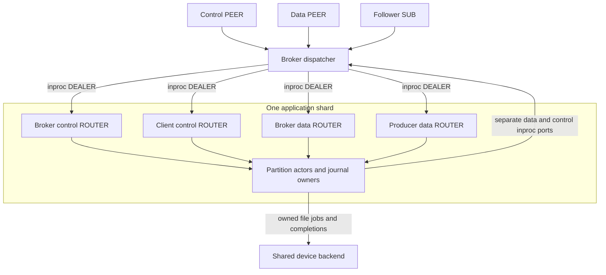
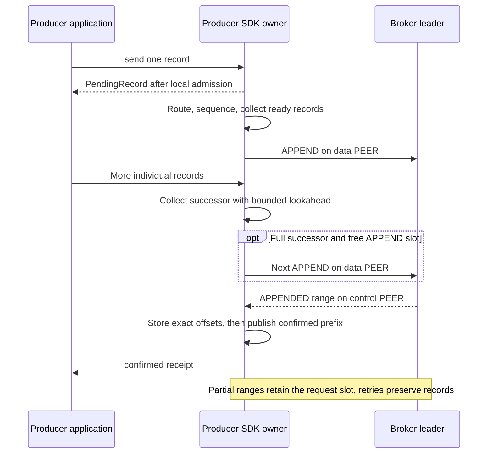
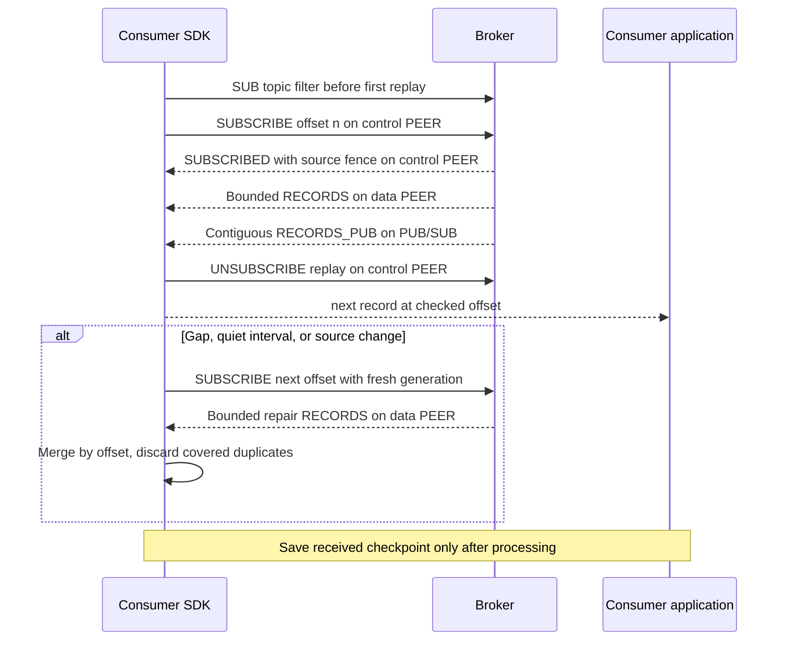

# Runtime

Each owner keeps mutable state on its own thread. OMQ carries broker/shard
messages through inproc and public traffic through PEER or PUB/SUB.
[Protocol](PROTOCOL.md) owns wire layouts; [storage](STORAGE.md) owns file order.

## Deployment configuration

TOML binds broker identities, immutable topic partitions/membership, local shard
placement, device roots/backends, and public endpoints. Each broker binds one
control PEER, data PEER, reader PUB, and optional follower PUB.

## OMQ ownership and scheduling

| Owner | Execution and state |
| --- | --- |
| Dispatcher | Separate thread; sockets, sessions, routing, source pause/resume |
| Application shard | OS thread/current-thread runtime; partition actors, journals, readers |
| Producer SDK owner | Current-thread runtime; sequence order, packing, retry, receipts |
| Consumer SDK role | Separate subscriptions, offsets, replay/live merge, processing observations |
| OMQ I/O worker | Network runtime; framing, connections, socket queues |
| AIO device owner | One thread/device; direct-write submission/completion |
| Device helpers / pool | Fixed blocking workers; file operations and reserved progress |

Actors are tasks, not threads. Shard 0 has no special duties; actors call journals
directly. The broker defaults to one dispatcher and one OMQ I/O worker.

Four input lanes and separate data/control output ports have count/byte bounds.
Completion IDs remain in a bounded owner table. Dropping observers does not
cancel admitted work.

`BrokerLinks` shares session/transport code between SDK roles. Two PEER sockets
connect every configured broker; live readers add one SUB/broker. Discovery
tries brokers under one deadline and returns the first complete validated
catalog. Pages never mix donors. Replacement sessions restart paging at zero;
late replies retain their request/session fences.

Ordinary deadlines use monotonic time; append/retention timestamps use Unix time.
Injected simulation clocks control both independently of storage execution and
completion delivery.

## Confirmation boundaries

| Mode | Required evidence before apply/reply |
| --- | --- |
| Single-broker durable | Local durable prefix |
| Disk quorum | Matching durable history on leader and one follower |
| Replicated-persisting | Matching validated retained bytes on leader and one follower |

### Replicated confirmation with background persistence

RP retains canonical backing until application and physical writing permit
release. A full backlog backpressures admission. Unclean restart is nonvoting
until recovery; RAM confirmation supplies no durable-prefix evidence.

Donor pinning waits for captured writes and its independent barrier, then freezes
one source per recovery nonce. Repeated requests reuse that snapshot. Link loss,
nonce replacement, or view change invalidates the exchange; late completions
cannot overwrite a newer response or recapture a moving tail under an old nonce.
Busy history reads keep the original correlated request available for retry.

### Local durable pipeline

Validation assigns offsets and freezes canonical operations. The journal
prepares groups, installs ordered writes, publishes durable evidence, and applies
confirmed records. A storage wait leaves other partitions runnable. A ready
batch blocked on backing is installed before later work once capacity returns.

## Writer API

`send` observes local admission; `confirmed` and `flush` observe broker policy.
Flush captures a sequence end. Request/session IDs may change on retry; record
identity, multipart boundaries, destination, and bytes remain fixed.
Resume/takeover resolves every partition before admission and keeps a stable
transition ID across response retries. Route hints never grant authority.

### SDK protocol batching

| Bound | Contract |
| --- | --- |
| Records/APPEND | Negotiated limit, capped at 2,048 |
| Default payload target | 64 KiB; a permitted larger record goes alone |
| Default outstanding APPENDs | One per partition writer; configurable |
| Collection delay | None; collect ready work |
| Intake reservation | Payload/part tables, including empty parts, plus one lookahead record |

A full successor pipelines behind outstanding APPENDs; partial replies retain
the request slot. Payload, metadata, record, and part limits remain independent.

Payloads up to 128 bytes remain inline during intake/packing. Receipts use
16-cell pages containing identities/offsets, no payloads. Offset stores precede
confirmed-prefix release publication; callers acquire the prefix before reading.
Packing returns inbox slots, confirmation releases retry state, and final
transport aliases release backing. All remain separately charged.

## Readers

SUBSCRIBE resolves a selector once and opens an indexed confirmed-history cursor.
At the applied end it parks until append, source change, or buffer release.
Reconnect uses the next undelivered offset. Readers do not extend retention.

RECORDS uses data PEER; subscription, cancellation, ACK, and NACK use control.
A full SDK inbox retains the frame and pauses its exact source. Readers sharing
a connection share its pressure. SUBSCRIBED/UNSUBSCRIBED become bounded cursor
completions before raw control-frame admission returns, so idle readers cannot
pin producer control capacity.

Detached cancellation keeps the original session. Disconnect/replacement settles
cleanup locally without waiting for new capacity; a lost reply on the original
session still times out. PEER gaps reopen with a fresh subscription generation.
ACK is volatile observation, not capacity or durable processing progress.

### Live reader publication

PUB contains only confirmed applied records. Consumers verify source/offsets,
merge overlaps, and repair gaps or quiet final loss over PEER. PUB drops under
pressure and owns separate encoded backing, so slow consumers cannot pin writer
arenas. Consumer checkpoints require application persistence.

## Follower catch-up

Normal replication uses PUB/SUB; votes/probes use control PEER; bounded targeted
repair uses data PEER. Repair aliases identify destination shards without
replacing control sessions. [Replication](REPLICATION.md#receipt-and-repair)
owns receipt epochs, history validation, and vote evidence.

## Backpressure isolation

Shards visit broker control, client control, broker data, then producer data in
bounded turns. Each input holds at most one separately charged deferred frame.
Full PEER destinations return the frame to its exact OMQ source and pause it;
full PUB intake drops. The dispatcher never waits for a full destination.
Paused-source retry turns allow 16 attempts or 2 MiB, with one indivisible-frame
exception. OMQ supplies connection fairness inside each socket.

Dequeue releases slots; final aliases release bytes. All partition actors share
shard budgets. Lifecycle events are drained before native dequeue; each body is
admitted synchronously before observing another disconnect/replacement. Exact
connection IDs fence late teardown; OMQ fences queued generations and retired
receive sources. Ozzy admission does not query transport liveness.

## Disk workers

### Async storage

Backends own handles, buffers, physical admission, and execution. Shards install
ordered generation-matching completions and execute no filesystem calls.
Admission includes queued, running, and canceled-but-unsettled jobs. One AIO
owner/device uses fixed helpers for open/read/sync/rename/close and reserved
progress. Pool execution uses the same contract.

Frontend/shards share one shutdown request and separate completion/error state.
Both observe shutdown before lanes close; unexpected service-time closure is
fatal. Shutdown drains journals, transport, and backend workers.

Write handles survive until roll/shutdown. A four-entry read-handle LRU drops
only cache leases; running reads keep handles and selected-file protection.

### Local ring exceptions

SDK caller lanes and backend jobs/completions use typed owned rings and local
signals. Broker/shard commands use OMQ inproc. The backend handle registry is
shared by fixed workers; blocking journal APIs serve offline work only.

Broker recent-read allowances divide at most one third of shard memory across
journals, with up to 2 MiB/journal for compact indexes. Follower replay uses a
separate one-eighth share, at least one append pipeline; oversized packets bypass
it. Whole backing allocations remain charged, including compressed aliases.
