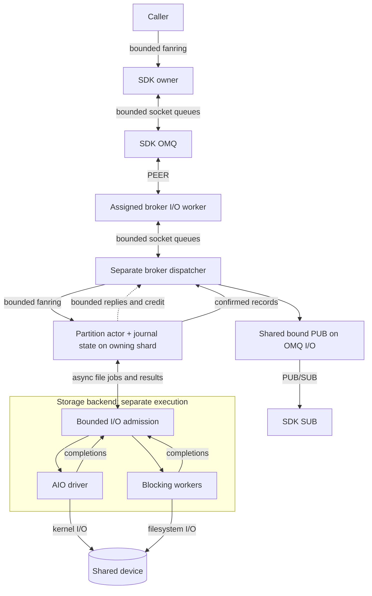
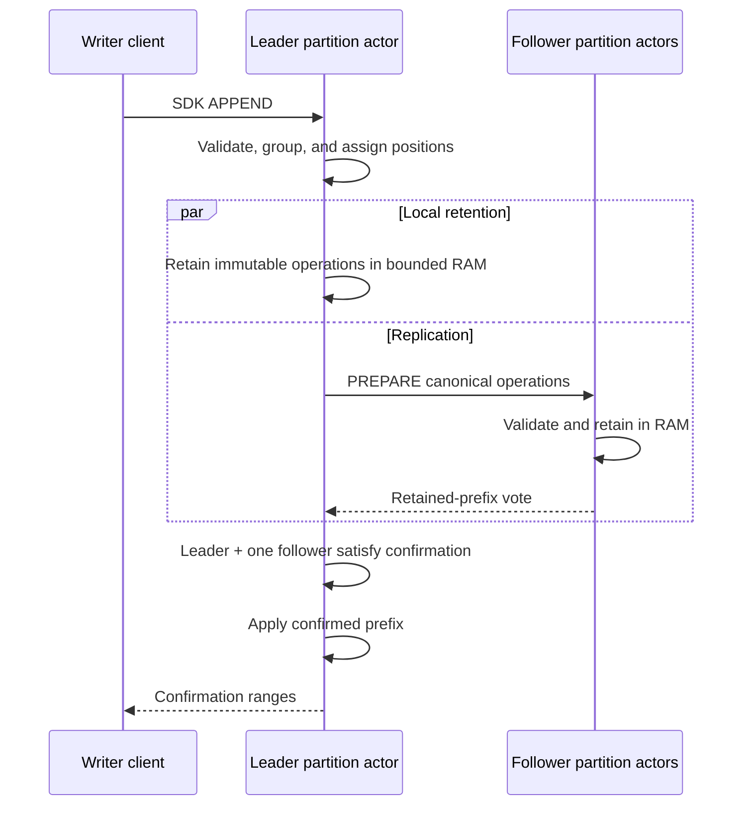
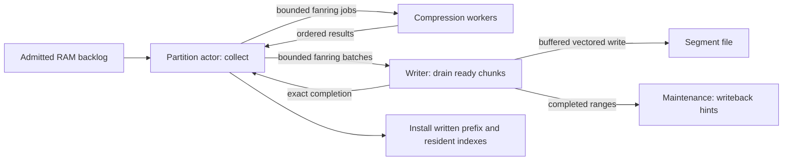
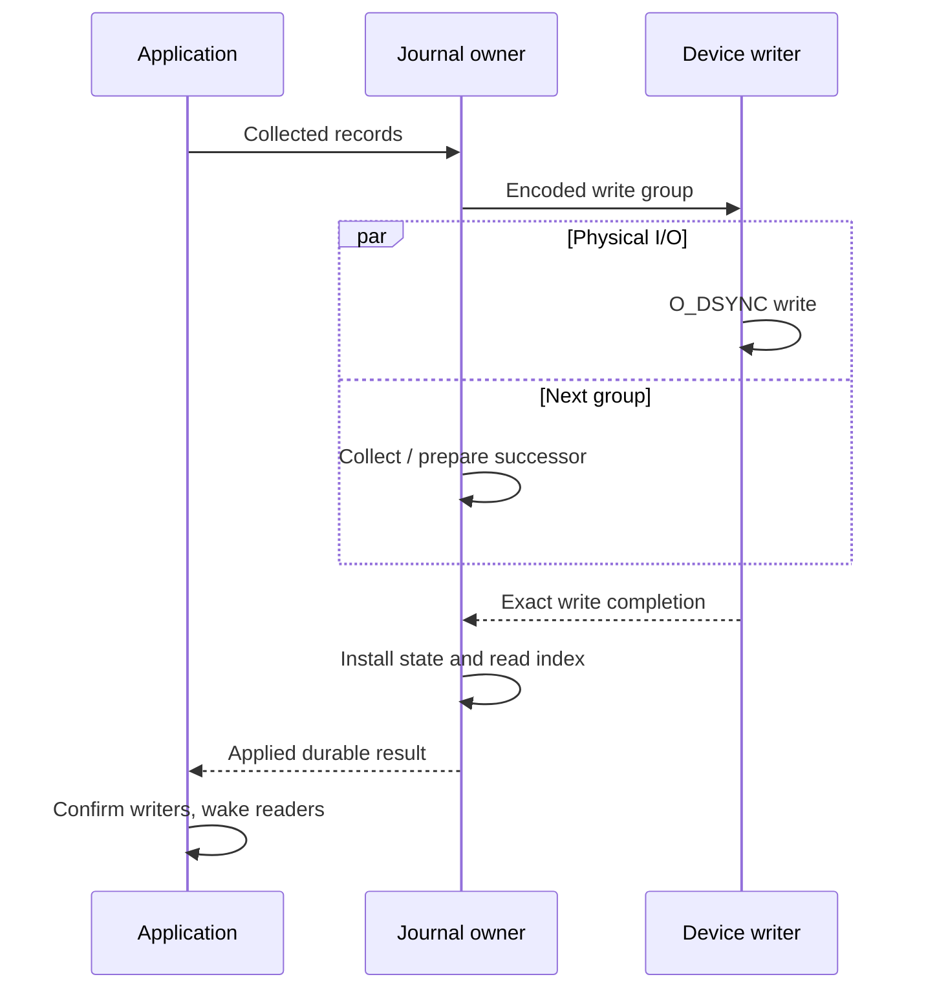
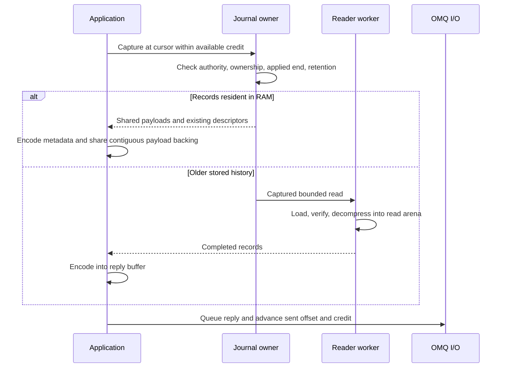
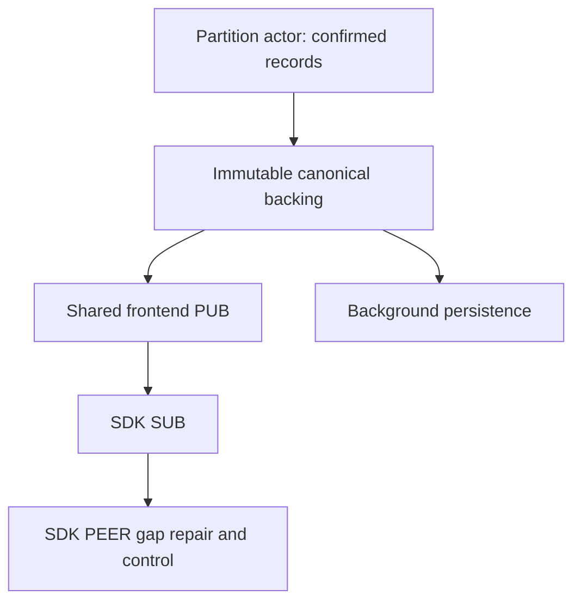
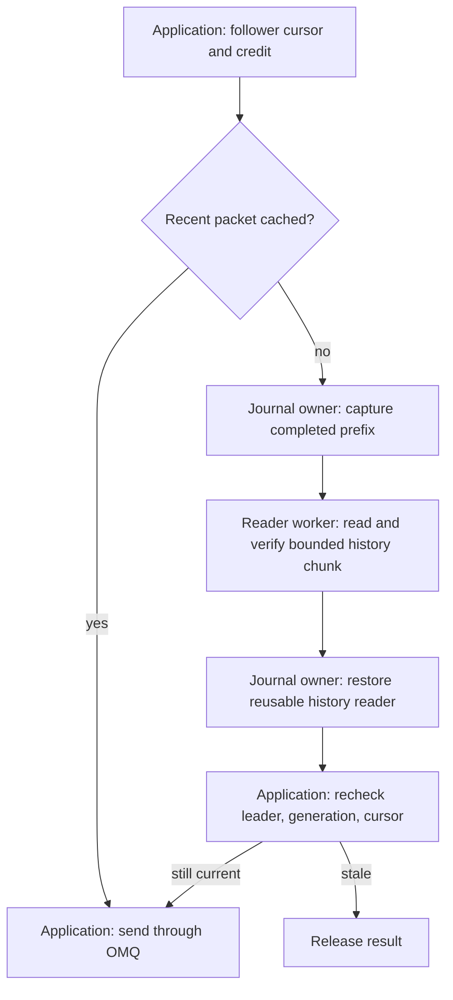

# Runtime

Thread ownership, data movement, and confirmation boundaries.
[Architecture](../DESIGN.md) | [Protocol](PROTOCOL.md) |
[Storage](STORAGE.md) | [Replication/recovery](REPLICATION.md)

## Deployment configuration

`ozzy-config` validates one shared TOML document. Each process selects its named
broker and checks placement against that process's effective CPU/memory limits.
The [minimal fixture](../ozzy-config/tests/fixtures/single.toml) uses one shard,
one OMQ I/O worker, a separate dispatcher, no affinity, and 16 topic partitions.

Explicit provisioning generates one shared identity document. Normal startup
must load and validate it, never generate replacement identities. Partition
number, XXH3-64 seed, policy and ordered membership stay fixed. Local shard IDs,
CPU assignments and worker counts do not affect partition identity. Initially
OMQ accepts worker count, not CPU/NUMA affinity settings.

Each broker also provisions a checksummed local identity record. It binds the
shared groups to expected volume/store IDs and store generations. Shard changes
preserve these bindings. Changing a partition's storage device requires explicit
relocation. Startup loads this record instead of discovering replacement IDs
from directories. Identity publication refuses existing or damaged files.

Shared identity also holds independently generated broker principal bindings.
`JournalPlan::from_trusted_deployment` uses them for an explicitly trusted
transport domain. The transport adapter establishes connection trust.

Native journal plans bind these IDs to ordered group membership and the
transport adapter's established principal fingerprints. Missing or duplicate
bindings are rejected. Opening checks the exact persisted configuration before
recovery. Local-durable mode has one authority; replicated restart still requires
election. Configuration validation checks canonical APPEND bodies, physical
framing and backend staging against segment and shared device limits before
workers start. `max_append_bytes` includes canonical descriptors and payloads.

Used devices with the same controller share one backend pool and one aggregate
budget. Each assigned application shard gets one lane and a fixed share of job,
byte and handle capacity. Partition count never changes backend thread count.
`queued_jobs` bounds all retained ordinary jobs, including running jobs and
unread results. `max_inflight` separately bounds physical execution. Progress
jobs have separate capacity and a dedicated worker. `open_handles` bounds shared
descriptor ownership. `cpus` places ordinary helpers; `progress_cpu` and
`aio_cpu` place their respective workers. Placement runs before worker-local
execution state is allocated. A configured placement failure aborts startup.

`ApplicationShards` starts one current-thread runtime and local task set per
configured shard. Its factory receives partition placement and one shared local
I/O lane on that thread. Affinity precedes runtime and actor allocation. Shard
zero follows the same startup path. Each factory publishes readiness after actor
initialization and drains on the common shutdown signal. Dropping the startup
or shutdown observer cannot cancel independent worker drain.

`Broker::start_trusted` assembles these owners from checked deployment and local
identity. Explicit formatting must precede first startup. The runtime opens
every partition on its assigned shard, binds one shared frontend, and routes
broker and SDK commands over bounded fanrings. No partition owns a socket or
device pool. Shards poll a rotating set of actors, including partitions beyond
one turn's work limit. Failed startup drains partial owners. Shutdown drains
journals and sockets before shared devices; canceling an observer preserves drain.
A separate drain thread joins the shard, dispatcher, and device worker threads.
Broker shutdown completes after those threads have exited. No shard or caller
blocks on a join.

`ScheduledReplica` runs partition authority without owning broker sockets. The
shard supplies monotonic timer observations and routed peer messages, then
polls each actor's storage/intake wait independently. Sends use a nonblocking
callback that returns the original message when full. Cancellation retains
admitted file work. Legacy socket-owning client/publication services cannot be
attached to this scheduler; shared broker services own those paths.
An independently established replacement link uses a compare-and-replace session
update. It fences old queued transmissions and probe/history correlations while
preserving journal tickets, proposals, and spent receive credit. Cached canonical
packets keep their payloads and encode the current session when retransmitted.
The broker adapter must fence its own old grants and queued replies first.
An unavailable broker stays explicitly unbound. Startup and election do not wait
for every link. Disconnect fences that peer's input and queued output without
changing membership or releasing spent receive credit. A surviving pair can
confirm under the configured policy. Canonical templates initially contain no
wire header; transmission binds the current session and receiver-issued epoch.

`PartitionActors` keeps a fixed actor set on one application shard. A poll visits
a bounded number of actors and polls each storage future without waiting for
it. Partial scans yield and resume at the next actor. Idle scans sleep until
storage, intake, transport readiness, or an injected timer observation wakes
them. Transport callbacks return owning frames when full. Shutdown polls all
partition drains concurrently. A terminal actor error ends this scheduler and
requires its caller to drain the shard.

With `PartitionActors::with_timer_interval` a poll visits only partitions that
received input, were woken by their own storage or proposal work, made
progress, or had a send refused. Timers carry no wakeup, so every partition is
also visited once per interval. The interval bounds how late a timer or a
missed wakeup is observed. The production shard uses 2 ms. Without an interval
every poll visits every partition.

`OpenedPartition::into_actor` constructs local or replicated authority from the
checked journal plan on that shard. It returns the native proposal lane and
buffer for broker services. Packet operation limits use the deployment's smallest
shard allowance, capped at 64, so asymmetric placement cannot select incompatible
wire bounds. Local pipelines remain independently sized. Session IDs come from
established broker links; absent entries stay unbound. The factory performs no
handshake or socket work.

`StartedPartition::prepare_partition` prepares the configured declaration in its
empty proposal lease. The canonical address uses the persisted cluster UUID as
its internal stream namespace, topic name, and numeric partition. Initial owner
epoch is one. Submission still requires normal local or elected leader authority.
A matching applied declaration resolves without another operation. An accepted
declaration waits for confirmation and application. Conflicting identity fails
closed; retrying initialization leaves later retention changes intact.

`ShardContext::memory` exposes separate data and control payload owners. Each
NUMA domain reserves every owner's full byte allowance, including unused space.
Unplaced shards use a separate domain sized to their aggregate reservations.
Owners allocate after thread placement and share a local cache across partitions.
Immutable payload aliases retain the full backing allocation. Final release
returns through a bounded fanring; cache eviction runs on the owner. Outstanding
storage or transport references remain charged even after the owner shuts down.
`OpenedPartition::into_actor` binds canonical APPEND/history arenas to the shard's
data owner before leasing. Empty leases allocate no payload. Preparation reserves
the complete encoded size before mutation; exhaustion returns without changing
existing body bytes. Canonical transport, writeback, and rejected-group slices
retain that allocation's full charge. Recovery restart and adoption keep the
same owner. Allocation remains on its original shard, even though retained bytes
can cross threads. Other journal scratch, indexes, and pre-admission OMQ
allocations retain separate bounds; this is not a bound on total process memory.
OMQ buffer locality is separate.

`OpenedPartition::into_reserved_actor` uses a shard-issued allocation allowance.
Unused bytes and buffer slots count against the same owner limits as physical
allocations. Allocation converts that allowance into a backing-buffer charge;
clones share one allowance. Releasing unused capacity cannot release live bytes,
and buffer release never refills the allowance automatically. Recovery retries
and handoff preserve the allocation source. Protocol and dispatch grants must
still be issued separately after their corresponding resources are reserved.

`dispatch::Owner::bind_memory` joins receive credit to these same data/control
owners before client registration. Unused credit reserves full backing bytes
and four allocation slots per normalized message. Dispatch admission converts
that reservation into foreign backing charges without changing the combined
claim. Dequeue releases queue capacity separately. Retained aliases, canceled
observers, and replaced sessions preserve the backing charge until final release.
Credit extension reserves newly available memory on the owning shard. Revocation
releases only unused capacity. Data cannot consume the control owner's budget.

`frontend::ShardIntake` pairs destination allocation with receive grants before
submitting installation through the shard port. SDK and broker destinations have
separate allowances on the same physical owners. Writer-open arenas cap backing
at 65 bytes and use reserved control memory. APPEND arenas use data memory.
Dispatcher token retirement returns unused destination allowance exactly once.
SDK APPEND allowances cover two canonical bodies within the conservative wire
backing promise, capped by the destination's maximum. Growing a wire promise
reserves additional canonical capacity first. Failed growth returns only that
additional allowance. SDK requests settle after their own proposal work ends.
Writer grants keep their allocation class while installed, so a later APPEND
can use more metadata than an earlier one. Completed APPENDs return their backed
count and byte slots to the same grant without reinstalling it. Reserved
allocations reuse only matching-size backing so cache entries cannot consume
the allowance for a replacement body. Disconnect releases only unused
allowance; retained payloads keep their physical backing charged.
Capacity waits cover data, control, and lane accounting independently. Reclaiming
unused follower capacity fences its protocol epoch before releasing allowance.
The leader's next-packet byte hint sizes canonical reservations independently
of conservative transport backing. Growing one does not extend the other.
Normal follower packet turnover replenishes the same dispatch token after actor
work settles. It restores spent allocation allowance first and keeps the receive
epoch and unused protocol credit backed. Memory exhaustion waits for capacity.
Independent writers retain separate promises against the same destination.
Settling one writer cannot release another writer's unused allowance. Demand
inspection captures its observed backing size atomically. Reclaiming idle data
capacity never evicts control promises, and reclaiming control leaves data intact.
Selected-history replies reserve their own correlated destination allowance
before normal follower intake is ready. Epoch or history-source changes fence
obsolete unused promises; pending installation keeps consumed capacity charged.
Replica dispatch tokens include the actor-selected receive epoch or exact
selected-history request. The dispatcher rejects mismatched metadata before
spending fresh queue or backing credit. Installation completion retains that
same fence; changed actor demand requires a new backed installation. Payload
hashing and replication authority remain with the actor.
Recycled history arenas restore the journal allocation source before donor reads.

`ozzy-broker`'s `ShardAdmission` owns the grant lifecycle across these resources.
It completes installations and fences obsolete promises before input delivery,
then settles work and renews writer credit afterward. Its actor adapter supplies
current authority, demand, capacity, and work observations. Replication authority
stays in the partition actors. Tests run this owner with the real bounded
dispatcher, queues, and memory accounting plus controlled actor progress, without
sockets or filesystem access.

Native canonical body hashing yields after each 64 KiB across a proposal arena.
Chunk boundaries preserve checksum identity. Cancellation before hashing finishes
installs no prepared result. A retried mutable proposal is hashed again after
offset assignment; verified immutable wire bodies reuse their checked digest.

Strict scans used by asynchronous journal replay, sealed-segment checks, index
building, reads, and retention yield after 64 scan steps or 256 KiB of work.
Both encoded and decoded bytes count. Zero-filled tails advance in 64 KiB
chunks. One physical group remains indivisible under its decoder limits, so
these allowances are cooperative bounds rather than a wall-clock deadline.
Active-segment recovery yields during canonical checks and damaged-tail
inspection before authorizing any repair. Canonical validation and replay yield
between operations even when visitors complete immediately. Both protected
history positions must match before recovery can return a writer. Cancellation
during these checks leaves file bytes unchanged.
Asynchronous index opening checks its whole-file checksum in 64 KiB chunks
and validates table entries with the same cooperative allowance. Source binding,
strict key order, offset references, and physical locations all validate before
the immutable index becomes usable.
Native index construction yields between derivation, sorting, validation, and
merge steps. In-place sorting uses constant scratch space. Active-prefix indexes
and compact read indexes stay private until construction completes. Canceling
an on-disk build preserves authoritative segments and fences the journal until
reopen, as with canceled file operations.
Checkpoint state encoding and decoding use caller-scheduled hash chunks,
writer entries, retry ranges, and metadata checks. Core codecs perform no I/O or clock reads.
Overlap detection sorts ranges in place through the same bounded work callback.
The complete decoded state stays private until checksum, limits, references,
and checkpoint position all validate.
Encoding also yields during key ordering and output initialization. Canceling
state encoding leaves the journal usable and the source state unchanged.

The config library performs no filesystem operations. The offline
[`ozy_broker` commands](../ozzy-broker/README.md) validate effective Linux host
restrictions and initialize/check a checksummed shared identity file. Creation
synchronizes file and directory and refuses overwrite, including damaged files.
Explicit formatting initializes absent segment journals through the same shard
and backend owners. Serving opens established stores and rejects missing history,
symlink aliases, and mismatched partition roots.

## OMQ ownership and scheduling

The assembled broker keeps each partition's journal state on its application
shard. Actors are polled independently; each pending file operation leaves other
partitions runnable. All file I/O uses futures backed by separate storage
execution. The journal worker is gone; the shared device backend owns file
work and returns completions to partition actors.

| Execution context | Tasks |
| --- | --- |
| Caller threads / any executor | Submit individual records, observe confirmation |
| SDK owner thread (Tokio CT) | Drain fanring, order and batch records, compress, retry, apply confirmations |
| SDK OMQ I/O thread(s) | Connections, framing, socket reads/writes, transport coalescing |
| Broker OMQ control (multi-I/O context) | Bind/accept once per endpoint; assign connections to I/O workers |
| Broker OMQ I/O worker (selected frontend) | Network I/O. Default one per broker; OMQ NUMA placement is deferred. |
| Broker dispatcher (Tokio CT) | Ordinary PEER receive, bounded session/metadata routing, replies and publications. One separate thread per broker. |
| Broker application shard | Partition actors: replication, journal state, validation, offsets, retries, grouping, segment administration, confirmations, reader delivery |
| Storage backend execution | File handles, AIO submission/reaping, reads/writes and exact I/O completions, shared per-device admission |
| Backend blocking workers | Filesystem operations not handled asynchronously, including metadata, allocation, synchronization, and deletion |

`ShardedNode` creates one OS thread with a Tokio `current_thread` runtime per
application shard. Replicated benchmarks also use `current_thread`.
`ScheduledReplica` accepts dispatcher-delivered messages and emits bounded
outbound frames; it creates no OMQ sockets. `WriterRuntime` owns one SDK thread
and an OMQ context with at least one I/O thread. Keep that runtime alive for
embedded inproc endpoints.

Partition journal state runs on its application shard. File jobs run on shared
backend workers; tasks on one current-thread runtime do not run in parallel.

Current broker contexts default to one I/O thread without affinity. The selected
frontend uses one separate dispatcher thread and configurable I/O worker count.
OMQ NUMA placement and per-worker dispatch are future work. Each PEER/PUB endpoint
is bound once across that context. Application shards do not run transport
tasks; shard 0 has no extra role. PEER carries SDK APPENDs/control/confirmations;
live readers retain PUB/SUB. See [integration gaps](#current-implementation).

### Thread and queue map

Selected frontend and storage ownership, not the current executor wiring:

Broker-to-broker traffic crosses separate OMQ I/O threads. SDK compression may
delay its own request preparation, allowing intake to collect a larger group; it
cannot delay OMQ socket polling. Network I/O is nonblocking. The
[NUMA composition diagram](OVERVIEW.md#inside-one-broker) shows multiple workers
sharing one listening endpoint. Thread placement and memory allocation must
agree; a NUMA label alone does not establish locality.

## Confirmation boundaries

The product exposes a single-broker local-durable deployment and two replicated
policies.

| Mode | Writer confirmation requires | Physical append path |
| --- | --- | --- |
| Local durable | Local O_DSYNC write completes | Device writer |
| Replicated with background persistence | Leader plus one follower retain validated records | Device writer, independent of confirmation |
| Disk quorum | Leader plus one follower complete durability/evidence boundary | Device writer, including `DURABLE` |

Policy belongs to the log/group. Socket delivery proves none of these boundaries.
Confirmation never waits for readers.

Both group policies share one write pipeline: the core admits, the partition
actor installs and queues the group, the device writer writes it, and the
partition actor installs ordered completions. They differ in write mode and
vote timing:

| Group policy | Segment writes | A broker's vote covers |
| --- | --- | --- |
| Replicated-persisting | Buffered | Admitted groups, before their writes |
| Disk quorum | `O_DSYNC` | Written groups whose `DURABLE` evidence is published |

A disk-quorum barrier captures the installed written prefix. The device writer
pool publishes its evidence while later groups keep writing; one barrier runs
at a time and later writes join the next one. A roll waits for a running barrier; a
barrier requested during a roll starts when the roll installs.

## Replicated confirmation with background persistence

Normal append on an established leader. Network arrows pass through OMQ;
each follower owns its partition actor and journal state.

Background writing starts from admitted operations; it may finish before or after
the client confirmation. Each broker runs its own pipeline:

- `WritePipelineConfig` defaults to a 128 MiB / 4,096-operation backlog and a
  4 MiB uncompressed chunk target. The backlog must hold the actor's live
  window and fit the journal's accepted-transition bound. No linger and no splitting an operation.
  Backlog spans journal commands; each command remains bounded to 256 operations.
- The actor keeps one journal turn in flight. A follower may queue one more: the
  validation of a newly received suffix, behind a running turn that only installs
  admitted operations and applies a known commit prefix. The journal runs commands
  in order, and the validation ticket names the image that turn leaves
  (`begin_validation_after_apply`). The core admits the result only after it
  reaches that image. This needs three journal command slots; one stays free for
  a barrier. A staged suffix validates in the same turn as an apply.
- Streaming intake permits `StreamingConfig::proposals` pending APPENDs per
  writer within the global proposal budget. Match it to the writer's in-flight
  APPENDs, or later APPENDs wait at the leader. Queued and pending records share
  the same credit.
- The leader groups ready APPENDs of up to 8 writers into one proposal, one
  operation and one APPEND per writer, within 4 MiB or one operation's limit
  (`grouped_proposal_bytes`). It builds the next group when the journal takes
  the previous one, never waits for more input, and proposes alone a writer's
  first APPENDs in a session. A rejected group is proposed again one APPEND at a
  time, in order, so an error reaches only its writer.
- One LZ4 block per collected chunk. `compression_workers` selects up to 32 workers per
  shard; default zero keeps encoding on the owner. Raw mode uses no compression workers.
  Workers reuse encoder scratch; only the owner orders and installs results.
- While writes or rollover are busy, the owner encodes up to one successor
  segment, bounded by raw framing bytes, decoded bytes, group count, and backlog.
  Ready chunks for the same segment enter the writer queue together. The writer
  drains ready batches into vectored writes; idle writers never wait for a full
  segment. Physical reservations cover only the current segment.
  Compression jobs share the collection budget. All chunks retain their backlog charge.
- Receive capacity returns after **application and completed buffered writes**.
  A full backlog backpressures intake. Kernel dirty-page throttling propagates
  through the writer; dirty page-cache bytes are additional to this backlog.
- Roll waits for reserved writes. The device writer allocates the successor,
  synchronizes the predecessor, and publishes metadata. Meanwhile the owner
  serves the old readable image, admits RAM work, and encodes successor chunks.
  Leaders and followers use the same collection policy. Promotion drains accepted
  chunks before synchronizing old-view history and installing new authority. Failed writes
  or rolls publish no success. Election promises and clean shutdown synchronize
  accepted history; ordinary background chunks have no durability barrier. Unclean restart requires fresh recovery; see
  [replication](REPLICATION.md#receipt-credit-and-repair).

## Local durable pipeline

LZ4 successors below 4 KiB remain open until the preceding write completes;
no timer or minimum batch size. Durable intake permits two ordered groups per
writer; buffered/volatile intake permits one. Only matching completions publish
state. Roll reuses prepared bytes. There is no separate payload fdatasync job.

## Readers

`TopicReader::open` looks up a topic through `BrokerLinks` and merges individual
records from its partitions. One SUB socket per broker shares live delivery
across topic readers. Replay uses the same broker PEER connections as writers.
Writer-only SDK owners create no SUB sockets. Partition order is preserved.
Checkpoints contain the next individual offset returned to the caller, so
canceling `next` does not skip a record.
An optional numeric partition filter narrows delivery without changing routing.

The shared broker keeps bounded subscription slots and cumulative count/byte
credit. SDK PEER inbox overflow resumes replay from delivered progress. Full SUB
inboxes drop new publications and repair missing offsets over PEER. Reservations
cover queued frames, held gaps, decoding, and application-retained frame aliases.
An alias returns its reservation only when its last owner drops. Exhausted frame
backing parks replay until an alias release wakes it, without repeated opening.
CREDIT retries repeat the same totals because socket admission alone does not
prove delivery to the shard. Source changes fence accepted and unanswered
subscriptions. Canceled control observers wake the SDK driver to reclaim their
request slots while physical frames retain their own backing. Closing a reader
requests bounded cleanup immediately. Canceling the close observer leaves
cleanup running and admission charged until it settles.
Blocked failure replies preserve later subscriptions until reply capacity returns.

A partition that waits for a leader subscribes as soon as a route names one. A
subscription refused for credit is sent again after the link's request retry
interval. Other retryable failures wait for the reader's refresh interval.

`TopicReader` subscribes at an exact offset per selected partition and follows
leader changes. Each partition cursor has bounded delivery and repair work.

### Live and historical reads

Journal-backed groups use the following path **after confirmation and application**:

- Live delivery still needs an owner capture per reply. It is not an automatic
  broadcast attached to every append completion.
- Background backlog, active segment, and sealed predecessor supply shared RAM
  records. General batches copy their encoded descriptor span and share contiguous
  payloads. Output validates every descriptor and the remaining reader credit.
  Tiny records and partial-credit boundaries use record encoding; replies spanning
  different allocations copy into the reserved buffer.
- Producer LZ4 batches are forwarded as stored, one batch per reply. A batch
  waits for enough credit instead of being split. Only replies that start inside
  a batch, or windows smaller than one batch, decompress; that reply owns the
  decompressed bytes. Shared subscriptions use the largest count/byte balance
  actually granted by that subscription as its full window. Packet limits alone
  cannot prove that a compressed batch will eventually fit.
- Recent operations stay in RAM up to the resident byte budget. Reads of older,
  evicted operations run on the reader worker and load the segment file.
- Captures retain selected operations across rolls. Each subscriber permits one
  outstanding transport payload, including shared replies. A shared reply can
  retain one canonical allocation no larger than its reserved reply buffer.
  Unknown or larger backing allocations use the copy path. Replies carry no
  file deletion protection.
  Transport must release it before the next reply can use that slot.
- Reading past current applied end parks the cursor. Retention gaps, future
  offsets, and oversized records are explicit results; never silently skip.
- Returned SDK records borrow response frames. Reconnect resumes receive progress
  under a new subscription generation. Old completions cannot alter its cursor.

Local journal readers still use their worker to assemble captured replies.
Reader credit never gates writer confirmation or policy expiration.

### Live reader publication

The broker binds its configured reader PUB endpoint once on the owned OMQ worker.
Partition actors send applied records through bounded shard ports. Only active
leaders publish. The dispatcher rechecks the group, partition, and current view
before socket admission. `TopicReader` installs partition prefixes on the shared
SUB socket for each broker. Wire format and reader states are in
[PROTOCOL.md](PROTOCOL.md#live-reader-publication).

| Work | Subscription over PEER | Publication |
| --- | --- | --- |
| Journal capture and encode | Per reader and reply | Per partition and batch |
| Broker state | Cursor, credit, bounded read and reply buffers | One cursor and arena per partition |
| Flow control | Count and byte credit | None; bounded queue, newest lost |
| Bytes on a TCP connection | Per reader | Per reader |

- The broker reads through the same journal path as a subscription, with a
  cursor opened at the applied end. It never publishes history. An error, a
  record beyond its limits, or a changed scope reopens it at the then applied
  end; readers repair what was skipped.
- Each shard reserves publication capacity inside its outgoing budget. A held
  PUB payload cannot consume reply or control capacity. Full socket admission
  drops a publication. Payloads share canonical backing when contiguous.
- `ozzy_core::live::LiveCursor` decides delivery in the SDK without I/O. The
  partition cursor holds at most one gap publication and pauses consumption from
  its bounded SUB inbox while replay repairs the missing prefix. Overlapping
  replay trims already-delivered offsets before releasing the held suffix.
- Only PEER proves a source. Publications must match that source and broker.
  Physical session replacement or a changed routing view resets only the affected
  partition cursor to its individual checkpoint. Foreign publications cannot
  promote authority or replace a shared physical session.
- A reader in live delivery holds no broker cursor, credit, or arena.
  `TopicReader::acknowledge` validates the caller's progress but sends no broker
  observation then. Checkpoints remain application-owned receive positions.

## Live reader fan-out

The selected frontend owns the broker's configured reader PUB socket once.
Partition actors give it immutable confirmed records through bounded shard
queues. SDK readers receive live records through SUB and repair gaps through
their existing PEER connection. Follower replication stays on PEER.

Payloads freeze once; reader publication, repair, and background writing share backing.
Frozen blocks shrink to used size. Clearing a shared buffer releases a reference,
never bytes held by transport or storage. Retry mutation uses copy-on-write;
unique returned allocations can be reused.

Ready records may share one publication within record and byte limits.
Canonical descriptors remain separate; only publication metadata and payload
frames join. Journal completions yield one confirmation range per writer.

One pending PUB slot bounds fan-out. A reader holds at most one publication
while SUB pauses for PEER repair or admission space. OMQ queues have finite
capacity and message size. Controls continue; duplicates cannot cross a gap.
Publication success is never writer confirmation. The per-peer byte cap follows
the actor's data-queue budget.

## Follower catch-up

Leader-side work for a lagging follower, distinct from client subscriptions:

One catch-up job may be pending independently of appends. Owner capture releases
command admission; background writes can continue beyond the captured prefix.
The reader reuses verified history/index state across chunks. If the requested
operation is not persisted yet, catch-up waits for that prefix, not every newer write.

`ActorConfig::replay_cache` bounds recent packets by operations and body bytes,
independently of the live window. Cache eviction never waits for a follower.
Shutdown joins detached reads; leader changes cannot send stale results.

## Writer API

| Call | Meaning |
| --- | --- |
| `SharedTopicWriter::send(record, key)` | Choose a partition, assign a sequence, return a pending record |
| `SharedTopicPendingRecord::confirmed()` / `try_confirmed()` | Wait for / inspect configured confirmation |
| `SharedTopicWriter::flush()` | Confirm the prefix captured when called |
| `SharedTopicWriter::close()` | Seal admission, confirm the captured prefix, stop the driver |
| `SharedTopicWriter::try_clone()` | Clone a bounded producer handle |

Move one writer handle into each producing task. Dropping a
pending handle stops observation, not delivery. Last writer drop stops the driver;
unresolved outcomes remain unknown. There is no durable client outbox.

`SharedTopicWriter` reserves bounded partition-local admission at startup.
XXH3-64 over key bytes with the configured seed, modulo partition count,
selects from numeric partition order. Keyless records stay on one partition
until its APPEND group forms, then rotate. Each partition has its own group,
leader, sequence, retry state, and credit. All partitions reuse the SDK's
bounded connection pool per broker; partition count creates no sockets.

`SharedTopicWriter::open` looks up a named topic over `BrokerLinks`. Callers
submit individual records with an optional key. The SDK uses the persisted seed
and numeric partition order before assigning a sequence. One producer ID spans
the topic. Each partition keeps its own epoch, sequence, and retry state.
Partition owners reserve unused queues within the broker-link owner's aggregate
budget and create no sockets. First use opens the producer and registers routing
interest. Sparse unused partitions send neither request. Cloned caller handles
share sequences and remain bounded. `SharedTopicReceipt` includes the persistent
topic ID, numeric partition, and exact record confirmation. Flush captures every
admitted partition prefix; close also drains unused owners.
Per-partition request statistics count successful OMQ APPEND admissions,
including retries and unconfirmed transmissions. Clones share these counters;
statistics never establish confirmation evidence.

`BrokerLinks` owns one SDK PEER socket per configured broker on the shared
`WriterRuntime`. Topic lookups and independent producer opening reuse each
negotiated link. Startup does not await every broker. Control slots and encoding
storage have aggregate bounds, with reserved capacity per broker. Outgoing and
unread reply aliases retain their slot until actual release. A request timeout
does not reset other writers' sessions. `SdkClock` supplies monotonic production
time or shared injected observations for tests.

SDK configuration can be checked before creating sockets.
`BrokerLinksConfig::control_reservation_bytes` covers all declared control slots.
`SharedTopicWriterConfig::link_reservation` separates idle partition storage
from correlated request backing. `ReaderLinkLimits::reservation_bytes` covers
all declared subscription frames and decode buffers. Routing storage uses
`TopicRoutes::reservation_bytes`. These declarations grant no broker credit.

`Writer::connect_shared` reuses these sockets for an already opened partition
writer. One socket receiver routes correlated confirmations into bounded
logical-writer lanes. APPEND batching, compression, and canonical confirmation
checks use the existing writer driver. Aggregate request, record, and byte
windows include unused writer capacity and frame aliases after confirmation or
session replacement. Idle writer admission preserves space for the largest
declared APPEND and its replies. Local retry removes only that writer's IDs;
physical reconnect fences all writers on that broker. Routing watches choose
the destination, never establish confirmation. Each confirmation must fit the
sequence range sent under its request ID; a mismatched range is rejected.

A shared writer waits its exponential backoff after a failed attempt. Only
another view or leader for its partition ends the wait early. Refresh answers
and other writers on the same links do not. After an `AfterCredit` refusal
the writer asks the same broker again at the initial interval, without
doubling it.

An `AfterCredit` refusal preserves the physical session. The driver drains
earlier confirmations, then retries the unconfirmed prefix with one outstanding
APPEND. After 64 fully confirmed APPENDs following replay, it restores half
the prior in-flight window, rounded up. Each further 64 clean confirmations
adds one slot. Another refusal returns it to one outstanding request. Record
identities and retained-buffer charges survive this retry.

A broker can hold records from an earlier attempt whose confirmation never
arrived. It can then refuse the resent request for those records and confirm
the next one. The driver does not apply a confirmation that starts after its
confirmed prefix, because only a range's own confirmation carries its offsets.
It resends the unconfirmed prefix after the initial backoff.

`Writer::open_shared` reserves the same bounded owner storage, then opens its
fresh producer lazily after first admission. Records receive epoch one and
sequences starting at zero. No APPEND precedes the confirmed producer opening.
One operation ID survives reply loss, reconnect, and leader changes. Canceling
an opening observer cannot cancel accepted broker work. Idle writers create
neither an opening request nor routing interest.

Shard-side `NativeAccess::Clients` authorizes trusted or authenticated physical
clients to choose fresh producer IDs. Logical assignments and proposal arenas
have fixed startup bounds. A separate rejection slot per client remains usable
when writer capacity is full. Session replacement cannot reclaim an arena while
old I/O still owns it. Settled assignments from obsolete sessions are reusable;
durable producer state remains in the journal. Data dispatch grants still require
destination-backed reservations before the opening reply is sent.

Dynamic writer assignments also reuse fully settled arenas within a live
session. Reassignment waits for every proposal and reply slot to settle. It
retains no canonical authority and cannot erase durable retry history. Revoked
dispatcher tokens release their metadata slots while admitted backing bytes
remain charged until their final reference is released.
Ready APPEND confirmations leave in sequence order within each writer, even
when rotating arena scans observe later completions first. Other writers keep
independent reply progress.

`Service::with_trusted_clients` explicitly admits client identities from a
trusted transport domain. A HELLO cannot grant broker membership. Unknown
broker-role claims and incompatible profiles consume no client slot. Link
metadata stays bounded across disconnects and preserves old HELLO fences;
the configured limit covers distinct SDK node IDs during a broker lifetime.
`NativeAccess::TrustedClients` accepts those established client links with
separate client, writer, and rejection bounds. It does not interpret node IDs
as credentials.

Each shard can reserve a bounded `GrantRequests` metadata table on the frontend.
An otherwise valid uncredited attempt coalesces a session-scoped capacity request.
The dispatcher drops its payload and sends a retryable client rejection. Data
and control requests have separate tables, with per-client limits. The shard
reserves destination and lane capacity before installing credit. Installation
clears the request. Reconnect clears old requests and requires fresh credit,
including for producers already present in the journal. These observations
grant neither writer validity nor replication authority.

The production shard replenishes a writer's installed grant as soon as that
writer's request has settled. Writers on one partition settle independently.
The native adapter releases a request in the turn that queues its last reply,
so count and byte credit return before that reply. A writer is refused at first
contact and when capacity is short, not once for every request. Writer credit
covers every frame of the refused frame's allocation class, because a resent
request can carry more records than the refused one.
This writer grant is broker-local; no grant packet is sent to the SDK. Small
APPENDs can hold up to three backed slots per writer. Large bodies and tighter
shard budgets use one slot. After a credit refusal,
the SDK temporarily limits that writer to one outstanding request while it
replays the unconfirmed prefix, then increases its window on clean confirmations.

`TopicRoutes` caches immutable topic identity once within aggregate partition
and byte bounds. First-use interests register a partition on the existing
broker links. Each broker has one outstanding snapshot and two leased frame
slots; control requests keep separate capacity. Snapshots and notices feed the
same session-fenced `RouteCache`. Newer hints received before a snapshot survive
its arrival. A lost snapshot retries on `SdkClock` without growing registrations.
Reconnect creates fresh watch identities. Idle cached topics and interests stay
within their configured bounds until the SDK owner closes. Public change
generations only wake observers; partition election views determine hint order.

Admission may stay immediately ready. Continuous producer loops must yield on
the caller executor so other application tasks can run.

### Producer queues

One shared admission bound covers typed fanring lanes and reordered records.
Each producer reserves one ready request in records and bytes:
`max(1024, limits.max_records)` records and
`max(batch_target_bytes, limits.max_record_bytes)` bytes, each multiplied by
`max_producers`. Requests awaiting confirmation have separate APPEND slots.
Increasing `inflight_appends` does not enlarge the unprepared record queue.

Reserve before assigning a sequence. Capacity returns when the driver prepares
a request; an APPEND slot stays occupied through confirmation. A free slot sends
a full request under load. An empty inbox admits any permitted record. Large
records cannot queue beyond the slots' send capacity; a delayed publisher
cannot bypass the aggregate bound.

Sealing and sequence assignment share one atomic. A flush captured after a seal
covers every assigned sequence, at most `MAX_SEQUENCE` (2^63 - 2). The driver
waits for intake only when it can prepare another request. A full window leaves
admitted records queued without waking the SDK thread per record.

APPEND compression is on or off. `WriterConfig::compress_payloads` and the
journal's `pack_producer_payloads` turn it off for writers behind a compressing
transport such as `lz4+tcp://`; payloads then stay plain on the wire, in
replication, and on disk.

When enabled, the SDK attempts one LZ4 block over selected record parts at
2 KiB. It keeps raw if block plus codec metadata is not smaller. The leader
applies the same choice to a fresh raw APPEND after retry reconciliation and
before canonical hashing. Exact retries do no codec work.

The broker validates clear descriptors and LZ4 without materializing output.
Producer-packed blocks remain byte-exact through replication and disk storage.
Full-group replay and live publication forward them unchanged; partial reads
decode lazily into bounded storage. There is no dictionary or level control.

`RecordInput::copy_from_slice` keeps up to 128 B inline. `single` accepts `Bytes`;
`shared` explicitly retains immutable backing so repeated payloads cross intake
without a byte copy. `multipart` preserves empty parts. Two part handles/lengths
fit inline. Producers share no payload or batching mutex with the SDK owner.

## SDK protocol batching

SDK writers collect ready records into APPEND requests over PEER. Callers submit
individual records. With zero linger, sparse traffic sends immediately as
one-record APPENDs. No separate unbatched SDK mode exists.

SDK requests, broker operations, and OMQ transport coalescing are independent;
none defines a transaction or retry identity.

- `inflight_appends` bounds requests; partial confirmations hold the slot
  until its last record. `limits.max_records` independently bounds each request,
  with a hard SDK ceiling of 2,048 records.
- Collection has no intentional delay by default. Optional `linger` starts
  at the oldest record; full batch or flush sends sooner. Arrivals do not reset it.
- SDK, broker storage-group, and canonical-operation byte targets are independent,
  normally 4 MiB. A larger permitted record stays intact and alone.
- Default hard record limit: 1 MiB across all parts. Default packet limit: 16 MiB.
  Startup checks consistency with transport, reader, decoder, and segment bounds.
- Confirmation ranges are per writer; no all-partition barrier. `Writer::stats()`
  counts socket-admitted requests including retries, not confirmations.

## Payload ownership

Bound slots, bytes, descriptors, history, and transport references independently.
Charge backing allocation capacity, not merely the selected slice length.

| Path | Allocation / copy boundary |
| --- | --- |
| SDK APPEND packing | Reusable raw and LZ4 buffers per request slot/contacted broker; singleton shares payload |
| Tiny local intake | Single-part records up to 255 B share ID/length/payload arrays |
| Larger local intake | Retains OMQ backing; no payload copy at intake |
| Replicated APPEND intake | Retains whole received frames with one record-position table |
| Canonical packing | Copies contiguous received spans; other inputs borrow record parts |
| Background read index | Shares canonical backing and prepared descriptors |
| Buffered raw persistence | Vectored writes share canonical bodies; framing stays separate |
| Live group reply | Shares contiguous canonical payload; mixed backings use reserved buffer |

Retries retain original records. Buffer reuse waits for final transport ownership.
The group write pipeline retains each immutable body with its computed digest;
write preparation reuses it. Reads independently verify stored bytes.
Raw writes, buffered or `O_DSYNC`, keep those bodies until physical completion. The writer
gathers ready groups into bounded vectors; short writes resume the exact suffix.
Four local intake slabs have bounded reuse; exact-size fallback preserves progress
when all remain held. Control/frame/completion caches also have bounded fallback
allocation. Arbitrary input is not guaranteed allocation-free.

## Disk workers

### Async storage target

The partition actor owns journal state on its application shard. The segment
engine prepares file operations and installs their results through a backend-neutral
async file-I/O contract. Keep canonical state and replication sans-I/O.

| Layer | Owns |
| --- | --- |
| Partition actor and segment engine | Ordering, retries, checksums/LZ4 validation, segment layout, durability requirements, generation checks |
| Async file-I/O contract | Owned jobs/buffers, opaque file handles, bounded admission, exact completion/error and cancellation semantics |
| Backend crate | Physical file operations, handle lifetime, execution threads, kernel submission/completions, safe blocking helpers |

- Keep Linux AIO in its backend crate. Keep an explicit bounded pool
  implementation and allow a future opt-in io_uring crate under the same contract.
  Backend selection does not change formats, confirmation rules, or recovery.
  AIO may use pool helpers for operations it does not support.
- All file access goes through futures: open/create, allocation, reads, writes,
  file/directory synchronization, metadata lookup/publication, listing, rename,
  deletion, and close. Include startup, retries, recovery, repair, and shutdown.
  Memory-only journal work remains local. Do not wrap synchronous I/O in an
  `async fn` and execute it on a shard.
- Backends own execution separately from application and OMQ threads, including
  AIO submission and eventfd handling. They own handles and in-flight buffers,
  not partition authority. Exact worker counts remain deployment settings.
- Pending I/O must leave other actors and timers runnable. Do not await one
  partition's I/O inline in a shard-wide dispatch loop. Within that partition,
  continue independent work when its ordering and durability rules permit it.
  Budget CPU validation, hashing, and replay between yields too.
- Bound queued/in-flight operations and resident bytes per shard and device.
  Reserve progress capacity for barriers and recovery. Partition count must not
  multiply thread pools or independently exhaust device-wide AIO capacity.
- Write completion is not automatically durability. Preserve explicit data and
  metadata ordering, exact durable-prefix evidence, and fail-closed errors.
  Only the actor installs results matching its current operation and generation.
- Canceling an observer does not undo an admitted write. Backend ownership keeps
  buffers and handles alive until the kernel settles work. Drain/close/shutdown
  are asynchronous. Dropping a shard-side future or handle must not block on I/O.

### Async I/O interface

`ozzy-io` defines owned operations and opaque handles. `ozzy-io-pool` executes
them on fixed device workers plus up to two reserved progress workers. Device
count/byte budgets and open-handle limits are divided across shards.
Partitions share those budgets. Idle shares are not lent to other shards.
Admission rejects without performing I/O when capacity is unavailable.

`max_inflight` separately caps ordinary physical jobs across blocking helpers
and direct-write handoff. Progress jobs use reserved execution capacity. Worker
initialization runs before file execution or kernel setup. Startup observes
initializer failures, including failed CPU placement, before returning clients.

`ozzy-io-aio` adds one direct-write execution worker to that same pool. It owns
kernel submission, completion readiness and context destruction. Helpers perform
buffered and metadata operations. Aggregate AIO data depth is 1 to 64, with one
additional slot reserved for progress writes. Both classes retain the pool's
existing count/byte charges and physical-descriptor limits across handoff.
No per-partition worker or independent admission budget is created.

Results retain admission charges until released, including short reads and
unobserved completions. Dropping a wait does not cancel physical work. Last-handle
drop only signals worker-side reclamation. Explicit shutdown fences admission,
drains work and closes files without waiting for application-held results.
Protected jobs retain additional handles, including group locks, until physical
completion. Canceling publication cannot unlock a directory while its pending
job can still modify files. A shard-local submission lane can be shared by
partition tasks without holding a mutable backend borrow across awaits.

Segment metadata publication shares its ordering algorithm with existing
dedicated workers. The asynchronous segment writer shares encoding, position
installation and recovery validation with the existing writer. Creation,
allocation, appends, barriers, tail repair, zeroing and close use backend jobs.
Failed or canceled mutation fences its owner. Recovery images and transfer
scratch are bounded; prepared append bytes must fit the backend's data share.
Established-store metadata loading creates no missing lock and selects only
CURRENT's exact generation. The DURABLE descriptor is reused until replacement
or deletion invalidates it. Validated metadata alone is not recovered history.

The asynchronous journal supports explicit format, strict open, progress and
hard-state publication, replay, and durable segment rolls. Open validates the
selected checkpoint and sealed history before repairing the active tail. Append
admission respects the journal's recovery limits. Rolls never overwrite leftover
successor files and install state only after CURRENT publication completes.

Checkpoint builds write and sync bounded chunks, publish the immutable directory,
then select it separately after verifying its committed source generation.
Builds exclusively borrow their journal; other partition actors remain independent.
Build results and captured readers protect checkpoint files and source manifests.
Typed checkpoint helpers verify canonical schema and exact state revision.
Replicated-persisting running/drained markers use the same asynchronous metadata
publication. Missing or stale drained evidence never permits intact restart.

Bounded retention scans validate checkpoint coverage and committed trim floors,
then publish the reduced segment list. Separate cleanup synchronizes derived
index deletion before removing payload files. Captured sealed-file sets keep
temporary deletion protection and group ownership until their readers release them.
Checkpoint and metadata cleanup have per-pass bounds, revalidate authority, and
preserve selected artifacts and captured sources. Unexpected nested checkpoint
contents refuse deletion.
Independent bounded cleanup also removes orphaned indexes without payload files.
Selected segment IDs and captured readers still protect their indexes.

Async sealed-index builds retain bounded sort buffers, staging runs and merge
fan-in. They share entry codecs and source checks with the existing builder.
Repair validates authoritative segment bytes before replacing a corrupt index.
Captured sealed-file sets support indexed record reads through backend jobs,
with checksum and selector validation before returning exact payload copies.

Async read snapshots protect exact file generations and freeze the active prefix.
Cold catalog lookups use file jobs without holding cache borrows across awaits.
Cloned catalogs share at most four index images and 64 offset hints. Range reads
decode each enclosing APPEND once and return only requested payload bytes.
Actor integration must retain incremental live indexes and bounded resident
payload caches. A full active snapshot is not a per-request replacement for them.

Control-identity lookups resolve asynchronously into a bounded key set before
entering the synchronous state core. Unresolved keys fail closed, never appear
absent. New claims use a separate bounded overlay. Persistent-index handoff
checks exact lineage and every overlay claim, then discards resolved negatives.

Canonical recovery replays through asynchronous visitors, resolving at most one
control identity per operation. Committed and accepted views share bounded index
images but enforce separate visibility. Selected-tail candidates retain private
state, not historical transition plans. Activation requires the exact tail's
published commit floor and unchanged writer, configuration and view.

Frozen history transfer shares its bounded segment cache, physical anchors and
canonical checks with the existing worker path. Async reads never include later
appends. Exact earlier prefixes still validate their entire captured physical
group. Fresh storage validation uses bounded read/processing steps; a canceled
or failed step fences that cursor. Restarting validation rereads authority and
file bytes rather than trusting a previous cache.
Explicit journal close adds no durability or clean-restart evidence. Captured
readers retain the group lock; device shutdown drains deferred handle cleanup.

Metadata-only recovery validates authority and checkpoints without reading damaged
segments. Quarantine durably replaces configuration with a nonvoting marker.
Fresh private generations never overwrite damaged files or leftover successors.
Restoring configuration requires exact externally authorized stable history and
private canonical replay. It does not confirm an accepted-only tail.

Sealed-file repair uses shared fragment salvage and exact donor-range checks.
Replacement file generations are bounded, synchronized and selected together.
Originals stay untouched. Configuration returns only after private replay, without
changing the last-normal view. A canceled repair requires a fresh attempt.

Selected-history installation preserves the protected prefix and stages bounded
chunks across replacement segments. It shares authority and chunk validation
with existing workers. Chunks split only between canonical operations; encoded
capacity and decoded recovery limits both constrain rolls. Final publication
selects exact accepted/committed anchors and hard state together. Abort deletes
only that attempt's unpublished files. Nonvoting recovery keeps its marker until
separate private replay and configuration publication.

Async write pipelines reserve bounded consecutive offsets without file work.
Owned encoding and shared raw extents reuse existing codecs. Backend jobs keep
buffers alive after cancellation; callers charge full shared backing allocations.
Coalescing respects physical byte limits and device admission. Only ordered,
owner-matched completions advance the installed prefix. Buffered completion
does not imply durability. Restart evidence excludes later reservations.

Successor allocation and zeroing use detached backend jobs while appends continue.
Roll publication freezes mutation but preserves reads of the old image and CPU
preparation of following groups. Only the exact completion selects the new owner
state. Interrupted or stale preparations remain unselected and are cleaned later.
The shard-local adapter polls the journal command contract inside the partition actor.

`OwnedJournal` keeps startup canonical state and the async journal on the calling
shard. `format_local` and `open_local` bind the explicit single-broker configuration
to local-durable segments and return a local authority driver. Exact recovery
activates synchronized canonical state without an election. The same validation,
retry, writeback, sync, read and maintenance code serves both placements. Local
confirmation requires observed data and durable-prefix evidence, followed by
application. Election promises and selected-history installation reject local
authority.

For replicated stores it returns the replica driver's bootstrap/restart evidence,
persists election promises, and stages selected history through async jobs.
Captured history keeps exact files protected during replacement. Publication
and private replay do not activate the partition: the driver's new-view agreement
and exact activation ticket remain required. Canceled mutations fence the owner.
Normal validation shares the existing canonical checks. Bounded admission retains
immutable payloads while detached write jobs split or combine physical groups.
Only ordered owner-matched completions settle whole requests. Rolls preserve
queued work and allow logical admission while publication is pending. Sync
evidence covers installed writes, never later reservations or RAM-only acceptance.
Detached data/evidence barriers allow later admission and physical writes while
one fixed-prefix publication runs. A second barrier or roll waits for its exact
completion. Dropped mutations fence the owner, including physically finished work
whose result was never installed.
Writer assignment shares offsets across writers and resolves exact retained
retries from RAM or asynchronous indexed reads. Timestamps are supplied by the
actor. SDK payload compression remains unchanged.

Producer-open proposals use the same authority, admission, and confirmation
rules. Fresh opens and fences append canonical operations. A resume returns
the current writer epoch, next sequence, and retained result floor without
appending another operation. Exact transition retries check their original
operation ID and body against pending work or an asynchronous indexed read.
A later fence rejects the old open. Session coordinates become a reply only
after the actor confirms and applies the required prefix.

Completed writes update compact reader indexes without rescanning history.
Reads capture only confirmed ranges and execute independently, retaining files
across rolls. Owner-matched completion rejects stale results and fences observed
storage corruption. Native delivery shares whole resident SDK payloads, including
their original LZ4 bytes, within captured record/part/byte bounds. Cold reads use
the bounded copy path. A resident selection releases file-work admission but
retains its subscriber output lease until delivery finishes.
Normal follower catch-up has one detached history-read slot,
separate from election history; later writes cannot enlarge a captured response.
Recovery donations retain exact file metadata independently of transfer caches.
Each recovering broker has one detached read slot; cancellation releases the
slot, not the promised source. Late results cannot revive a released donation.
`OwnedRecoveringJournal` exposes only marker-backed recovery. Full transfer and
copy-on-write sealed repair use the same file backend. Publication requires
private replay; adoption checks the live recovery attempt before reopening for
election. Generation IDs are supplied by the actor or simulator. Interrupted
mutations fence the owner. No task or worker is spawned.

Storage validation captures one read/CPU-budgeted step, then checks bytes beside
normal writes. Canceled scans discard their cursor; observed corruption fences
the owner. Cleanup bounds each class separately and preserves protected files.
After all accepted operations are applied and written, identity-index refresh
moves bounded in-memory control claims into an exact persistent lookup view.
It preserves retry checks without replaying application state or claiming sync.
The shard adapter schedules refresh automatically. Admission counts control
claims and accepted operations awaiting journal installation. Exhausted capacity
pauses intake while confirmation, application, and persistence continue. Queued
follower data stays retained. Index capacity covers at least one full APPEND
arena's operation count.

`ReplicaActor<ShardJournal>` reuses the existing protocol scheduler with
actor-polled storage execution. Commands, detached reads and barriers remain
count-bounded. Physical writes can finish out of order but install in order.
Exclusive metadata mutations wait for writes; normal validation and admission
can overlap detached file work. Ready work yields after a configured step budget.
The actor supplies timestamps and backend lanes. `new_with_ids` also accepts an
explicit ID source for receive epochs, history requests and election journal
generations. Deterministic runs assign distinct namespaces to actor incarnations.
No separate journal task runs.
Shutdown closes admission, drains admitted jobs and closes the journal through
the backend. Canceling a wait retains work inside the actor.

Replica sends retain separate bounded control, history, receipt, and flow queues.
Each peer rotates its first send class after actual progress. A single available
socket slot cannot indefinitely favor repeated controls over history transfer.
Blocked polls retain the next class's turn; another stalled peer does not own it.
Exact queued control duplicates share one transmission, including in the shared
frontend. Distinct controls retain FIFO order. Already submitted controls can be
queued again: submission does not prove delivery.

`LocalActor` polls the same shard journal executor with single-broker authority.
Its bounded proposal lanes, live records, physical writes, and captured barriers
progress independently. Applied durable prefixes release confirmation replies.
Shutdown rejects queued proposals and drains admitted work. One partition's
pending file jobs do not prevent other actors on that shard from running.

`RecoveryActor<ShardRecoveringJournal>` polls nonvoting recovery on the same
shard. Retry and publication adoption retain the shared backend and injected
ID source. `ScheduledRecovery` retains close/reopen/handoff futures across
canceled observations. Session changes during those waits apply before any
subsequent traffic. Retry deadlines restart when reopening finishes. Transfer
buffers use the receive allowance; normal journal work keeps the shard owner.
Handoff grants no unbacked credit and requires election before serving clients.
Native services must be installed before the recovered actor's first normal turn.

Broker startup assembles shard-owned actors with the shared frontend.
`Broker::start_recovering_trusted` validates exact replicated-partition selections
before starting workers or mutating files. Replacement, quarantine, and marker
resume are explicit intents. Offline preflight checks every selected store's
mode and metadata before any selected mutation. Backend startup repeats its
checks under directory ownership. Other partitions open normally. Nonvoting
routes register before waiting for donors. Bounded handoff notices install writer,
reader, and bootstrap resources before the recovered actor's first normal turn.
Legacy worker placement remains until replacement qualification passes.
Async cleanup uses bounded per-class deletion and configured directory-list
bounds; it does not expose the legacy directory-scan cursor.

### Device execution

Each partition actor owns journal and replication state on its application
shard. One backend per device runs bounded file jobs for all its partitions.
Jobs retain their buffers through completion, even if an observer cancels.
Only the partition actor installs a generation-matched result. Backend pool
and Linux AIO choices share this admission and completion contract. See
[storage](STORAGE.md) for physical write and durability boundaries.

## Retries and cancellation

Freeze producer identity, epoch, sequence, record IDs, parts, and policy before
sending. Timeout means unknown outcome. Exact retained retries return the original
result; conflicting bytes are rejected. Accepted-only history cannot confirm.

Retry refreshes HELLO/WELCOME without tearing down OMQ; transport reconnect is
OMQ's job. Session generations fence replies. Regrouping preserves record identity.
`BrokerLinks` shares broker connections; partition writers follow their own authority.

Canceling a wait does not cancel owned work. Permits stay charged until release.
Shutdown stops admission, settles storage, fences callbacks, then releases resources.
Reader received/processed positions are not durable application progress. Delivery
waits capture required subscription generations at admission; later subscribers do
not extend them. Retention expiration reports a gap; replay can repeat effects.

## Placement and transport bounds

### Selected ownership

One partition group maps to one application shard on each broker. Placement and
shard count are independent between brokers. Each shard hosts several partition
actors and may lead some while following others. Journal state stays with each
partition actor on its application shard, with separate roots, state, and
evidence. Physical I/O runs behind async backends with shared device budgets.
No per-partition threads or worker pools. Online reassignment is out of scope.

One OMQ context binds the PEER endpoint and each PUB endpoint once. Its control
runtime accepts and assigns connections to I/O workers. A separate Ozzy dispatcher
consumes ordinary socket messages. Default: one I/O worker and one dispatcher per
broker, with no shard 0 special role. Accept-time assignment need not know future
partition targets. OMQ NUMA placement and colocated dispatch are deferred.

The dispatcher validates bounded routing envelopes, current session, and grant
consumption, then forwards owned frames and correlation through a fanring to
the destination shard. One receiver per shard, initially one dispatcher producer
lane. Future per-I/O dispatch adds lanes, not credit. Payloads stay encoded and intact.
Consensus, canonical validation, LZ4 validation, storage, and waiting for replies
stay on application shards. Dispatch drains bounded turns without awaiting a
blocked destination. Its measured capacity is a separate scaling limit.

Route directly to the owner even across NUMA groups, without an intermediate
application shard. Keep actor state and its allocations local. Owned network
buffers may remain allocated on the receiving worker's NUMA group; avoiding a
copy does not avoid remote-memory traffic. Bound return/reclaim queues and
retained buffers as carefully as inbound queues. Measure remote bytes, not only
queue throughput. Shared device work also follows device topology and limits.

A connection stays on one I/O worker until disconnect. Preserve ordering for
each logical partition writer; use one active link at a time unless explicit
sequence reordering is implemented. Session replacement fences queued work and
grants. Already admitted operations remain owned, but old replies cannot satisfy
a new session. Replies route to the owning worker with exact generation and
correlation, never by a reusable connection ID alone.

More workers distribute many connections, not the work of one hot connection.
Use a bounded SDK pool per broker when needed; do not require one connection per
partition. Reader/follower PUB fanout shares its respective logical socket and
must not funnel unbounded payload work through the accept/control thread.

### OMQ integration boundary

The initial frontend uses ordinary PEER receive delivery with generation-safe
reply/publication routing. OMQ need not parse Ozzy partitions. Ozzy owns its
separate dispatcher and shard fanrings. No removed receive-lane API is needed.

Future colocated dispatch requires public per-worker delivery and placement
hooks. `Context::current()` alone does not share a listener across borrowed
contexts. Do not accept unenforceable OMQ affinity settings or claim local
allocation by pinning thread names after startup. These hooks are not required
for the initial frontend.

### Optional NIC-aware assignment

Keep one I/O worker as the baseline. Raw loopback throughput is not a capacity
guarantee for framing, dispatch, replication, and reader fanout together.
Multiple workers remain available for measured CPU pressure or device locality.

A future OMQ hook could select a worker from bounded connection metadata:
transport, listener, local/remote address, available receive CPU/queue hints,
and the configured worker topology. Run the selection on accept without blocking
or parsing Ozzy commands. Keep a default policy and safe fallback when hints are
unavailable. Select once per connection, not once per APPEND.

Prefer a NIC-local worker pool over a fixed one-worker-per-NIC rule. A NIC can
have several RX queues and enough traffic to need multiple workers. Local
address alone does not reliably identify the receiving device. Linux exposes
[receive CPU/NAPI hints](https://man7.org/linux/man-pages/man7/socket.7.html), and
[RSS/CPU placement](https://docs.kernel.org/networking/scaling.html) also affects
locality. Moving a userspace connection does not move NIC interrupts or existing
buffer allocations. Treat this as an optional OMQ extension, not required Ozzy
protocol or a promise to eliminate cross-NUMA traffic.

### Backpressure isolation

Isolation lives in separate dispatcher-to-shard queues, not separate OMQ PEER
receive lanes. The dispatcher keeps receiving when a destination is full; it
never awaits that destination's queue or buffers an unbounded pending list.

The application shard owns capacity accounting shared by all its partition actors.
Leader actors issue writer grants from that budget. Dispatch workers enforce
session-scoped grant consumption; they do not independently create capacity.
Follower replication windows use separate reservations. Multiple OMQ I/O workers
must never multiply one destination's grants.
Shards drain bounded ready input between partition turns. Replica
receipt and credit reports coalesce at transport flush. Count credit refills at
half of the available operation window, capped at 64 operations. Byte credit
has its own half-window threshold and refills sooner when the next operation
would not fit. No stage waits for a batch to fill.
Deployment validation requires a shard's resident byte budget to hold four
maximum-size APPEND bodies. This covers receive backing, two canonical buffers,
and framing before the shard grants even one data message.

- Reserve count and byte capacity per destination and logical writer before
  granting credit. Bound aggregate grants, queued frames, outstanding APPENDs,
  and admitted work; do not hide overflow in dispatcher staging. Outstanding
  grants from all connections must fit the destination's budget. Account for
  APPEND queue slots as well as wire/resident bytes and decoded record/byte
  limits, including singleton APPENDs. Grants must fit the specific producer
  lane, not just aggregate shard capacity. Several clients cannot each be
  promised the whole lane. Already granted traffic retains its reservation
  while in transport or dispatch; downstream backlog also stays bounded.
- Use nonblocking enqueue. Valid unspent grants already reserve room; a full
  queue for that traffic is an accounting error, not normal backpressure. An
  uncredited APPEND gets bounded rejection before new acceptance, or the link
  is fenced if safe rejection cannot be queued. This does not prove an earlier
  retry was unconfirmed. Never silently drop admitted work. A nonreading client
  cannot stall dispatch, and a later writer sequence cannot bypass a missing one.
- Return queue-slot capacity only after fanring publishes consumption (batch
  receive or explicit release as required by its API). Return payload/admission
  credit only when those resources are actually free. Confirmation alone does
  not release every buffer. Fence and reclaim old-session reservations before
  reissuing them; reconnect cannot spend old and new grants on the same capacity.
- Reserve bounded queue space and execution turns for elections, confirmations,
  credit, and session/control traffic. Data cannot consume those reservations.
  Replica flow control remains distinct from writer overload rejection.
- A full partition stops its own grants, not unrelated partitions. A full shard
  stops its grants without stopping other shards. Drain and schedule bounded
  turns; never await disk completion in dispatch. Per-client limits
  also prevent one client from consuming every destination's budget. SDK send
  scheduling skips credit-starved writers so they cannot block other writers
  sharing the connection.

This prevents application queue blockage from stalling unrelated destinations;
it does not promise zero contention or remove head-of-line blocking inside one
TCP stream. Transport framing and OMQ fair receive still matter. Saturation,
slow-client, reconnect, and election tests must establish bounded progress before
enabling Ozzy's replacement frontend. This qualifies its implementation; it
does not require OMQ to retain an application-shard receive-lane API. OMQ-local
delivery feeds dispatch; Ozzy's per-destination queues and reservations provide
application isolation. OMQ receive fairness alone cannot do that accounting.
Shared-device saturation still affects every partition on that device.

### Current implementation

`frontend::RoutingTable` maps ordinary PEER frames through configured group and
partition identities to broker-local shards. One established connection can
target every partition. Fixed routing decoders read APPEND writer identity,
reader subscription/source, or broker scope without scanning payloads. The
caller supplies independently established peer/session bindings. Shards retain
full command validation and replication authority. Routing alone neither grants
capacity nor accepts an operation.

Busy actor input stays in its original shard reservation. Bounded rotating
turns retry it after rechecking the session and route. Deferred input keeps
its credit and backing charged until settlement. Reader controls return busy
when their reply slot is occupied, preserving the command instead of losing
its reply.

`frontend::Dispatcher` consumes these routes through exact peer/session,
partition, writer, and traffic-class grant entries. Its metadata tables are
bounded. Session replacement drops old unused tokens; queued messages keep their
old session stamp and charges. Rejected traffic returns to the caller with no
dispatcher spill queue. The socket adapter must provide conservative backing
charges, arrange bounded rejection or close, and propagate session fences to
the actors. It must also supply handshake and connection authentication policy.
Outgoing PEER replies use separate bounded control/data queues per peer. Each
flush visits the next peer and attempts at most one message per class. A full
peer retains its frames while other peers continue. Each peer rotates classes
after progress so repeated controls cannot starve data with one free socket slot.
Session replacement drops old queued replies and rejects later replies stamped
with the old session.
Queue limits count logical frame bytes; payload-owner charges outlive queue
removal and socket submission. PUB publications use a separate allowance inside
the shard budget; their buffer aliases leave control and replies runnable.

`frontend::Service` joins link negotiation, dispatch, and bounded replies on the
dispatcher. Its fixed authorization table comes from an authenticated adapter or
explicit trust configuration. HELLO role claims cannot promote a client to a
broker. Each peer has one replaceable handshake message. Handshakes and replies
share fair transport turns; one unavailable broker never gates another link.
Configured broker identities advertise receive bounds for full canonical
transfer windows. Client identities retain the native APPEND profile. These
fixed profiles apply to HELLO, WELCOME, decoding, and replies across reconnect;
they grant no additional admission capacity. Peer role claims cannot select a
larger profile.
New-session replies wait until that peer's WELCOME enters the socket queue.
Duplicate HELLO replies do not close an already established send path.
`Links` provides coalesced, read-only session observations to shards. Replacement
fences dispatcher grants and replies before publishing the new observation.
Shards recheck the current session before delivering queued input to actors.
`NativeIntake` validates full writer commands beside each partition actor. It
uses independently established shared links and explicitly authorized writer
identities. Several writers may share one peer/session. Each writer has bounded
APPEND slots and a separate producer-open slot. Proposal completion, including
exact retries, must confirm and apply the required prefix before encoding a
result. Interleaved retry spans retain their original offsets. Full replies
preserve their frames while other peers
progress. Reconnect discards old replies and keeps admitted work owned by the
actor. `PartitionActors` polls this same adapter for local-durable and replicated
partitions, with no socket or extra task on the shard.
`WatchRegistry` holds bounded partition interests on the dispatcher. Registration
captures a snapshot in the same turn that installs interest. Later leader-view
hints coalesce per partition; overflow requires a new snapshot. Session replacement
fences old interests. Group incarnation, configuration epoch, and member order
must match configured identity. A hint never grants leader authority. The service
answers watch requests on PEER through its bounded control reply queue. A shard publishes
its own partition observation through a bounded port command. Full reply queues
leave notices pending until admission succeeds.

`RoutePublisher` polls each shard's actual partition actors beside normal actor
progress. Configuration identity stays fixed. A replicated actor reports a
known leader after election and journal activation. One pending port command per
partition retains its original observation; newer views coalesce behind it.
Full control capacity registers a wakeup. It never blocks another actor's
election or storage work, and needs no separate publication task or retry timer.

`CheckedConfig::topic_catalog` builds immutable SDK metadata from the checked
deployment identity. `Service` serves bounded pages on established client links.
`TopicMetadata` validates complete, consecutive pages and uses numeric partition
order for seeded key hashing. Its `RouteCache` validates every leader hint against
that identity, configuration epoch, and ordered membership. It fences session
and watch replacement and merges updates received before a delayed snapshot.
Routing can use one reachable
broker's current observation without waiting for the others.

Each shard receives one outgoing `Port`. Its typed fanring reuses dispatch
count/byte accounting, with separate control and data capacity. Grant installation
returns a bounded completion; advertise wire credit only after installation
succeeds. Reply completion means admission to the dispatcher's peer queue,
never transport delivery or record confirmation. A full peer returns the original
message for retry. Completed but unobserved commands and socket-retained frame
aliases keep their charges. Canceling an observer does not undo a command;
unused grants remain revocable through their shard-held keys.

`ozzy_broker::Frontend` owns one dispatcher current-thread runtime and binds the
broker PEER, reader PUB, and optional follower PUB once. Its factory installs
local routing state after dispatcher affinity is applied. Owned OMQ workers
start before that placement. Inproc harnesses may inject a shared owned-I/O
context while keeping dispatcher state and broker identities independent.
Startup waits for factory readiness. Failed startup closes any bound sockets;
shutdown closes sockets before reporting dispatcher completion. Dropping the
handle requests shutdown without joining threads on the caller. Factories must
observe shutdown and drain their bounded work. `FrontendContext::serve` runs an
assembled `Service` with ordinary PEER receive, fair bounded outgoing progress,
and HELLO retries. It tracks OMQ connection IDs before dispatching queued input.
Reconnect fences old application sessions; a late disconnect cannot fence a
newer connection. Monitor loss or an accounting invariant stops the frontend.
Malformed or over-credit packets are dropped without stopping healthy peers.

`ReceiveBuffers` copies only the routing envelope and bounded metadata into
compact owners. Payload backing stays shared and conservatively charged. Plain
TCP/IPC uses the OMQ read-buffer and large-frame pool bounds plus the configured
socket message limit. Controlled inproc senders supply a payload backing bound.
The serving adapter rejects transports that differ from this allocation profile.
Transport transforms need their own qualified allocation profile.

`dispatch::channel` pairs one shard-local grant owner with a typed fanring.
Unused grants reserve queue slots, retained-message slots, and backing bytes.
Normal follower intake reserves two packets only when the partition's configured
canonical charge per packet is at most 1 MiB. Larger configurations use one
slot, and small packets fall back to one when the shard cannot back both. The
grant refills after admitted packets leave the queue and actor work settles.
Deferred packets keep their
original charge; growing the next packet's byte bound extends only unused slots.
Data and control have separate capacity and grant tables. Client limits span
reconnects. Revocation and dispatch admission serialize against the same bounded
accounting state. Revoked tokens and disconnected clients remain bounded until
their outstanding references disappear.
`GrantTarget::Control(shard)` shares one peer's control reservation across the
shard's configured partitions. Idle partitions need no separate control slots.
Routing and session checks still apply. Data always requires its own partition
and writer scope. A narrower partition control token takes precedence when set.
The shard can replenish or revoke a dispatcher token through a nonowning generation
key. Count and byte additions are independent and keep prior unused grants
reserved. A revoked token or reused table slot rejects an obsolete key.

Broker-constructed replicated actors start with zero follower receive credit.
The shard grants capacity to an exact receive epoch after reserving destination
and dispatch resources. Retained operations and unused credit share the partition
bound. Application release never refills credit automatically. A fresh receive
epoch discards unused grants while preserving charges for accepted history.
Session replacement alone preserves the existing receive window. The shard must
fence old dispatch grants before backing that window on the replacement link.
`PartitionActors::revoke_receive` supplies a fresh receive epoch to reclaim
unused wire grants. It preserves staged bodies, validation tickets, and accepted
file work. Old-epoch packets cannot spend the reclaimed capacity. Revoke the
corresponding dispatch token too; retained bytes remain charged until release.
`receive_target` exposes outstanding work from the current leader's validated
probe. Shard admission can prioritize active followers without granting every
idle partition a full window. This hint proves no history or confirmation.
Session and scope changes clear it; receiving the advertised tail consumes it.

Dequeue publishes fanring consumption before returning queue credit. Payload
credit follows a separate retention token. Attaching that token to `Bytes`
keeps the full charge through clones and slices until final release. Callers
must charge the complete backing allocation, including descriptors; copied
buffers need their own reservation. Queue admission neither validates a payload
nor confirms a record. Wire grants, session routing, and actor integration remain
necessary before this channel replaces the existing frontend.
`Received<Message>::into_retained_message` attaches the charge to every frame,
including empty frames, before handing it to an actor. Later frame clones and
slices keep the charge without a separate application-held token.

`ShardedNode` routes ordinary OMQ receive through one separate dispatcher and
bounded shard fanrings, with local `partition_hash(target) % shard_count` placement.
Data and control have independent grants. Full destinations drop retryable
attempts and send bounded after-credit refusals without queuing a dispatcher
backlog. The shard copies admitted records into its bounded native window before
volatile history retains them. History cannot retain the intake queue's credit.
Its HELLO
cannot multiplex unrelated partition owners. SDK child writers still have
separate connections, and a `ScheduledReplica` hosts one group. These are integration
gaps, not the target broker frontend. The existing disk worker allocation is
per storage shard; multi-partition hosting must preserve fixed shared worker
pools and per-partition journal roots. The assembled `Broker` instead hosts
several local or replicated partition actors per shard with shared backend pools
and destination-backed receive grants. Legacy harness removal still requires
replacement qualification. OMQ NUMA placement and local delivery hooks are
deferred, not existing guarantees.

Finite HWMs and `max_message_size` reject excessive frames before allocation.
Remote handshakes cannot raise local limits. Optional receive-table cache holds
at most 8192 four-frame tables; misses allocate normally. Reconnect replaces
transport queues; Ozzy session fencing still determines correctness.
