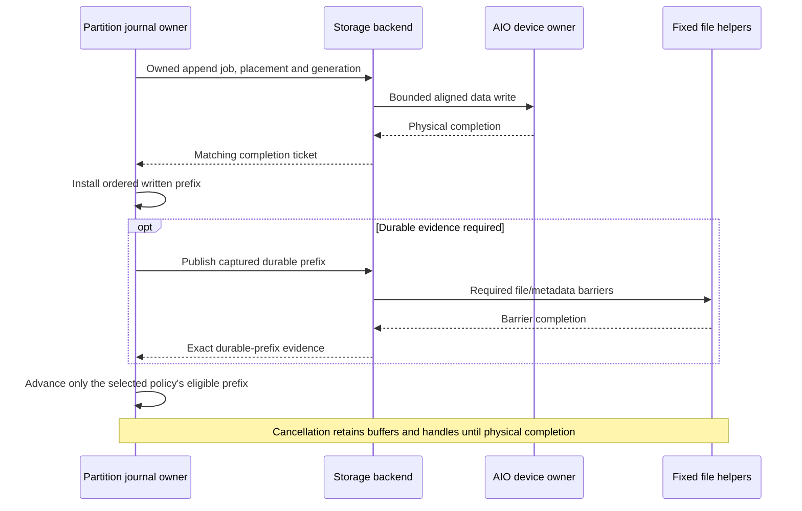

# Storage and recovery

All three confirmation modes use independent append-only segment journals per
partition. Actors own journal state; asynchronous backends own file handles,
physical jobs, and fixed device workers. No filesystem calls run on shards.

## Partition directory layout

`<broker-root>/topics/<topic>/partitions/<partition>/` contains one store.
Shard numbers and producer IDs are absent from paths/storage identity. Persisted
incarnations prevent name reuse from adopting an older partition.

| File / directory | Contract |
| --- | --- |
| Lock, identity, `CONFIGURATION` | Exclusive ownership, store/group/policy binding |
| `MANIFEST.<generation>`, `CURRENT` | Immutable selection of exact physical incarnations |
| `DURABLE` | Synchronized accepted-prefix evidence for disk groups |
| `MEMORY_VOTING` | Running/clean-stop evidence for RP |
| `segments/` | Canonical metadata operations and payloads |
| `indexes/` | Rebuildable record lookup |
| `checkpoints/` | Canonical state and original chain anchor |
| `staging/` | Unselected replacement work |

Formatting is explicit; missing/corrupt files never trigger reformatting.
Partition histories, operations, and recovery stay independent despite shared
devices. Device failure and bandwidth remain shared failure/resource domains.

## Record identity

Producers supply message IDs, multipart boundaries, and bytes. Brokers assign
partition offsets, append timestamps, canonical operation numbers, and digests.
Producer sequences/epochs are independent per partition; interleaved producers
share offsets. Exact sequence-to-offset retry ranges survive checkpoints and
leader changes. Ranges merge only when both sequences and offsets are adjacent.
Expired results fail explicitly; message ID alone is no deduplication key.

### Canonical APPEND body

All integers are big-endian. A body starts with batch count `u32`, followed by
complete batches: 76-byte header, descriptors, then payloads.

| Batch header field, in order | Bytes |
| --- | ---: |
| Partition incarnation | 16 |
| Owner epoch | 8 |
| Producer ID | 16 |
| Producer epoch | 8 |
| First sequence | 8 |
| First partition offset | 8 |
| Append timestamp, Unix milliseconds | 8 |
| Record count; high bit compact lengths, next bit encoded payload | 4 |

Raw single-part payloads of at most 255 bytes use contiguous message IDs
(`16*N` bytes), lengths (`N` bytes), then payloads. Zero length means one empty
part. General descriptors use:

| Field | Bytes |
| --- | ---: |
| Message ID | 16 |
| Tagged part count; high byte codec 0/raw or 1/LZ4 | 4 |
| LZ4 only: original payload bytes | 4 |
| Part lengths | 4/part |

Sequence/offset equals the batch's first value plus record index. Producer LZ4
batches use clear general descriptors, codec `u8`, decoded/encoded lengths
(`u32` each), and the exact producer block. They retain no decoded copy.
Partial reads/retries decode lazily; fresh suffixes are rebuilt without changing
retained identities. Stale validation returns to intact SDK retry bytes.

Validated body proofs retain record/part/decoded-byte totals. Live admission and
storage reuse those immutable proofs; recovery validates physical bytes anew.
Exact schema: [operation codec](../ozzy-journal/src/operation.rs).

## Segment layout

A 4096-byte header precedes physical write groups and unused preallocated capacity.
Each group ends with padding and a 96-byte seal; total size is a multiple of 4096.
A group can contain several canonical operations.

| Codec | Group contents before final padding/seal |
| --- | --- |
| 0 raw / 1 per-operation LZ4 | Repeated 192-byte entry header, encoded body, 8-byte alignment |
| 2 shared LZ4 | 64-byte shared header, entry headers, one compressed body block, 8-byte alignment |

Headers retain operation identity, chain/body digests, lengths, and codec and
remain uncompressed. Unknown codecs/reserved fields fail validation. Raw header,
descriptor, and padding space is reserved before collecting operations.
Exact layout: [segment codec](../ozzy-journal-segment/src/codec.rs).

### Compression

Actors prepare/compress bytes with reusable scratch while previous writes run.
Raw is default; LZ4 needs the segment `lz4` or facade/runtime `lz4-storage`
feature and `BodyEncoding::Lz4`. Compression is skipped without sufficient
saving or when it cannot reduce aligned physical size. Groups of prepared
producer blocks remain raw to avoid recompression.

APPEND, segment, and OMQ transport compression are independent. All preserve
record boundaries, retry identity, and confirmation policy. Whole producer
blocks can pass through reads; partial reads decode the selected extent.
Record/operation/segment limits must all permit an oversized record.

## Append, synchronization, and roll

1. Validate authority/retry/limits; assign offsets and freeze canonical bytes.
2. Prepare physical groups on the actor and submit owned bounded backend jobs.
3. Resume interrupted/short writes until complete; vectored calls honor slice limits.
4. Install ordered generation-matching completions and indexes; ambiguous failure
   fences the writer.
5. Publish required durable evidence, satisfy policy, then apply/reply.

| Write mode | Boundary |
| --- | --- |
| `O_DSYNC` default | Complete writes supply data-integrity barriers; disk groups still publish durable evidence |
| Buffered (RP) | Written progress only; flush, roll, promises, shutdown retain required barriers |
| Linux direct I/O | Aligned replicated data writes through `O_DIRECT`; headers/metadata/reads remain buffered |

Preallocation reserves full capacity/final EOF; appends advance a logical prefix.
`O_DSYNC` is not multi-write atomicity. AIO submission/completion alone is no
barrier. Metadata and directories require their own synchronization.

Write handles remain open through roll/shutdown. A four-entry read-handle LRU
caches exact path/source identities; jobs retain independent leases and file pins.
Cancellation releases observation, not physical buffers/handles/admission.

### Segment roll

Prepare/synchronize a new successor, then publish its manifest and `CURRENT`.
Buffered roll synchronizes the predecessor, successor header with range-limited
`RWF_DSYNC`, directory, manifest, and selection. Successor appends may overlap;
another roll, sync, or shutdown must settle publication first.

Selected files are immutable. Normal rolls use new IDs; replacement uses a fresh
`<id>.<incarnation>.log`. Manifests name exact incarnations; successor headers
bind predecessor ID/digest. Reads retain their original generation.

Optional `zero_ahead` prezeros disk-quorum successors in synchronized 4 MiB jobs.
It is off by default, doubles device writes, and can leave unselected successors.

### Operator tuning

| Bound | Tradeoff |
| --- | --- |
| Encoding chunk | Compression CPU/ratio versus preparation/cold-read latency |
| Ready physical batch | Throughput versus writer occupancy; no fill delay |
| Physical/decoded segment size | Roll frequency versus sync stalls, RAM, recovery work |
| RP backlog | Burst/stall tolerance versus RAM; no remedy for sustained disk deficit |
| Device depth | Aggregate ordinary jobs plus reserved progress capacity |

Roll frequency follows physical/encoded or decoded/canonical rate, whichever
limit arrives first. Backlog must cover write/roll stalls and already accepted
work. Transport aliases, reads, descriptors, and dirty pages require additional
RAM. [Calibration commands](../ozzy-bench/README.md#disk-calibration).

## Files and exclusive ownership

`OZZY_VOLUME` checksummed markers bind cluster, broker, and volume IDs in existing
device roots. Startup checks local identity before journal open. Missing/mismatched
volumes fail closed; initialization never creates roots or replaces markers.
A directory lock cannot fence copies elsewhere; persisted placement selects the
writable store.

Metadata is written to a new temporary file, synchronized, then published.
Interrupted temporaries select nothing; retry removes/recreates them. Existing
final names must match exactly. Offline relocation stops the owner, verifies/syncs
the copy, publishes placement, then retires the source. Online movement is absent.

## Integrity and formats

Domain-separated XXH3-128 checks physical/canonical integrity. The seed is
XXH3-64 of the domain's UTF-8 bytes; 32-byte slots contain the big-endian 16-byte
result plus 16 zeros. The zeros add no strength. Length/decoded bounds precede
allocation; framing, body digest, and chain must all validate. Checksums provide
neither authentication, authority, nor rollback protection.

### Durable recovery evidence

Disk groups publish the synchronized **accepted** prefix before voting, including
operations without a commit announcement. `DURABLE` stores two 192-byte records
64 KiB apart, each within one 512-byte sector. Publications overwrite both copies
and synchronize data without rename; sector writes are assumed atomic.

Recovery selects the newest intact in-scope publication and repairs the other
copy before writes. Two damaged copies fail startup. Evidence binds store,
group, broker, volume, configuration/metadata generation, segment, and accepted
position. A changed selected manifest fences asynchronous publication. Required
publication survives observer cancellation. Recovery never falls back to an
older manifest or temporary. Authorized new-active-ID replacement supersedes
older evidence under protected-history rules.

RP publishes running `MEMORY_VOTING` state before voting and drained state only
after closed admission and settled writes. Missing/stale/corrupt/running evidence
requires nonvoting recovery.

## Recovery and suffix installation

| Condition | Action |
| --- | --- |
| Normal open | Verify identities, authority, selected files, seals, chain, and anchors |
| Zero suffix | Unused preallocated capacity |
| Active damage after durable prefix | Discard/zero damaged group and later suffix; restore allocation |
| Damage at/before durable prefix | Refuse without changing bytes |
| Sealed/installed damage | Refuse strict open; authorized sealed repair may be possible |
| Corrupt index | Rebuild from validated segment bytes |
| Corrupt authority / lost store / unclean RP | Fail closed or remain nonvoting for recovery |

Replication authorizes suffix replacement. Protected committed fragments survive
physical regrouping. New files are staged, validated, synchronized, and selected
atomically; old selection remains authoritative until publication. Shutdown aborts
unpublished replacement without lowering durable promises. Staging/reads remain
bounded.

### Repairing sealed segments

Quarantine retains valid identity/configuration/selection/durability evidence.
Fresh authority from both other brokers permits bounded inventory and missing
range fetches from one frozen donor. Validated local operations may be reused;
replacement preserves original canonical boundaries. New physical incarnations
are synchronized, selected, and privately replayed before fenced restart/election.
Healthy files and damaged originals remain until safe cleanup. Active damage or
unavailable ranges requires full recovery or refusal.

## Indexes, checkpoints, and retention

### Finding and reading records

| Cache | Default bound |
| --- | --- |
| Active/predecessor operation backing/selectors | 512 MiB, oldest eviction |
| Cold offset indexes | 64 entries / 8 MiB |
| Cold decoded operations, reader and retry separately | 16 entries / 4 MiB; one decoder-bounded larger operation replaces others |
| Recent read handles | Four exact sources |

Recent caches retain stored encoded backing, not a permanent decoded copy.
Cold reads capture exact segment identity/range and verify indexed operations.
Capture does no file work; asynchronous readers execute through backends.
Missing derived indexes can be rebuilt from protected sources. Compact selectors
use stride/base/count for equal-size raw single-part records; other records retain
position pairs. IDs and multipart descriptors remain in immutable bodies.
Whole allocations, captured reads, cache metadata, and scratch have separate bounds.

Time seeks use APPEND-head timestamps; ID seeks search retained segments and
require explicit duplicate policy. An older durable source can be read while
later writes remain unsynchronized, without exposing those later operations or
advancing durable evidence. Captured reads/donor snapshots delay file deletion;
subscription cursors alone do not.

### Checkpoints and deletion

Configured retention changes become canonical `PartitionPolicy` operations.
Confirmation waits for application. Checkpoints contain state, producer
coordinates, retry floors, and original committed op/digest, never payloads.
Segments preserve required replay and exact retry results.

Retention confirms retry floors, then record trim; synchronizes/selects a
checkpoint before unreferencing the oldest sealed prefix. Repeated bounded passes
may reuse only the exact settled checkpoint position/digest, revalidating authority,
files, and protected floors. Surviving predecessor digests are never renumbered.
Expired readers receive explicit gaps.

Age uses maximum segment append time; backward clocks cannot prematurely expire
newer records. An aged active segment rolls first. Byte targets include active
and sealed capacities per partition/broker. Each settled turn also reclaims up
to eight unselected objects/class, even below retention limits. Cleanup changes
no record/retry floors and preserves selection/pins.

Recovery transfers checkpoint state, required retained operations, and full
accepted suffix. Schema/digest/anchor/chain and destination publication all
validate before voting. Quarantine builds fresh private state; old files remain
for inspection until normal bounded cleanup.

### Bounded maintenance

Streaming validation reads one physical group at a time and releases its bodies.
Scratch follows group/operation/read bounds, not segment capacity. Shared shard
admission reserves scratch before file jobs; pressure defers maintenance.
Canceled backend jobs retain physical ownership until completion.

| Work | Scheduling |
| --- | --- |
| Storage validation | `with_storage_validation`; 256 KiB / 2 ms cooperative steps |
| Metadata cleanup | `with_metadata_cleanup`; 32 objects/turn |
| Orphan cleanup | `with_orphan_cleanup`; bounded scan and selection/pin recheck |

Maintenance shares the device queue and alternates with settled foreground work.
Finite captured source lists fence new history; authority changes invalidate old
work, corruption fences it. Metadata cleanup deletes no payloads; orphan cleanup
advances no retention floor and excludes active staging.

## Supported failure model

Linux/Android local filesystems and process crashes are supported. Barriers rely
on filesystem/device honesty and stated atomic-sector assumptions. SIGKILL retains
OS page cache; it does not model power loss. Surviving group authority can permit
selected repairs. Valid rollback of authority metadata or an entire store is
outside the supported model.
