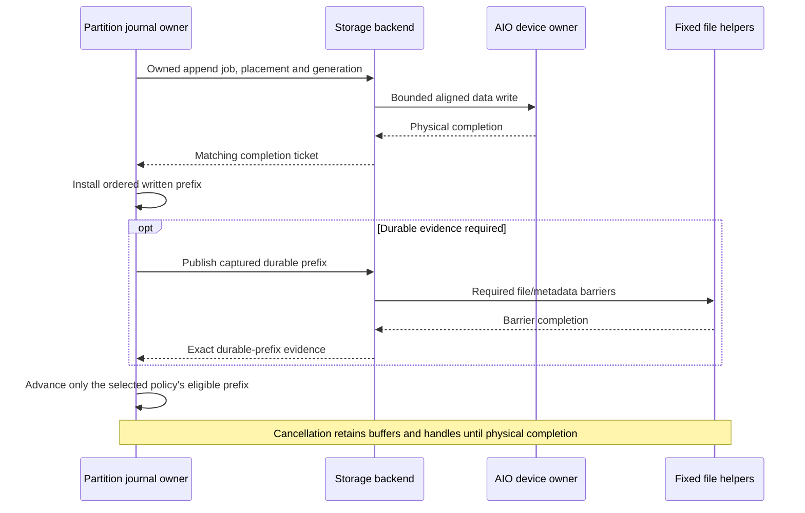

# Storage and recovery

Ozzy stores records only in append-only segment journals. Single-broker durable,
disk quorum, and replicated-persisting share this engine. Linux AIO and the
bounded worker pool are physical I/O backends, not separate storage formats.

## Selected topic and writer ownership

Each replicated partition has one independent group journal on each of the
three brokers. Its operations cover only that partition. The partition actor
owns journal state on its application shard. Journals share asynchronous storage
backends and device budgets, never operation numbers, confirmation evidence, or
recovery state. There is no interleaved topic-wide journal.

Selected I/O contract: every filesystem operation executes behind a backend-neutral
future, including metadata, reads, recovery, and shutdown. The segment engine
owns format and durability ordering. Backend crates own handles and execution:
Linux AIO and a bounded pool. No io_uring.
The async journal uses these backends without file syscalls or kernel completion
handling on its caller's shard. Partition actors own the journal state; the
dedicated journal-owner threads have been removed.
See [runtime ownership](RUNTIME.md#async-storage).

`SegmentState` holds positions, encoding scratch, and completion fences without
file ownership. Both the asynchronous writer and remaining blocking fixtures use
this state. Detached segment rolls and incremental storage validation execute
only through the asynchronous Backend path. Memory tests cover publication
failure, frozen validation tails, byte budgets, corruption, and failed barriers;
real-backend tests retain descriptor and filesystem evidence.

A partition belongs to its topic and accepts multiple writers. Keep one global
offset sequence per partition and separate bounded producer epoch, sequence,
retry-result state per `(partition, producer)`. Record retention belongs to the
partition; retry evidence has its own bounds. Opening or fencing one writer
must not fence another writer or reset partition offsets.

Interleaved writers mean producer sequence cannot imply partition offset. Retain
the original sequence-to-offset/result association for exact retry replies,
including restart and leader change. Expired retry evidence must fail explicitly,
not infer an offset or append an uncertain duplicate.

Canonical addresses contain topic and partition identity, not a writer ID.
Each partition keeps independent writer sessions and exact retry ranges.
Ranges merge only when both sequences and offsets are adjacent. Checkpoints
preserve these mappings. Aggregate writer/range limits bound memory; an explicit
result-floor operation releases retry evidence. Retention protects every writer's
remaining results.

Streaming retries return separate confirmation ranges across offset gaps. Each
SDK receipt retains its exact original offset. A mixed retry verifies retained
records and stores only the fresh suffix. Partial LZ4 retries rebuild that suffix;
fresh whole blocks remain byte-exact. Stale validation of a trimmed request returns
to the SDK's intact retry bytes, never reproposes an incomplete request.

Topic discovery and shared broker connections use the selected frontend.

## Partition directory layout

Selected deployment root: `<broker-root>/topics/<topic>/partitions/<partition>/`.
For example, `data/topics/orders/partitions/0/` contains one group directory,
including its `segments/`,
`indexes/`, `checkpoints/`, `staging/`, lock, identity, configuration, manifests,
`CURRENT`, and durability/restart evidence. The
[overview tree](OVERVIEW.md#segment-files-and-disk-reads) shows the layout.
The files below retain their single-group contracts. Explicit broker formatting
creates this topic/partition hierarchy; normal startup only opens it.

Topic components must be validated or reversibly escaped: never interpret a
topic name as an arbitrary path. Names and partition numbers aid humans; persisted
identities bind the exact topic/partition incarnation and group. Reusing a name
must not silently adopt an old partition's data. Shard numbers never appear in
the storage identity or directory hierarchy.

`DURABLE` records a synchronized prefix of this partition's selected history.
It is not a sidecar per segment and does not prove durability of neighboring
partitions. `CURRENT` selects the manifest; the manifest names exact segment
incarnations. Segment seals check integrity but are not durability evidence.
Replica restart authority remains a separate requirement.

Partition failover, suffix repair, roll, and retention change only that
partition's journal. No shared physical prefix can make one partition's tail
damage discard another's confirmed history. This does not isolate SSD failure,
filesystem errors, or device bandwidth. Schedule bounded, fair work across all
partition journals on the shared executor; do not allocate threads per partition.
Separate files still require their own barriers and evidence publication.

The cost is more active files, preallocated capacity, metadata, and durability
operations. Bound these resources and size segments accordingly. Share physical
worker pools, not histories, to reduce overhead without coupling recovery.

## Record fields: who supplies what?

**Producers supply record identity and payload. Brokers assign log positions
and build storage framing.** The disk format is not the producer wire format;
see [Protocol](PROTOCOL.md) for current messages.

| Scope | Fields | Source |
| --- | --- | --- |
| Record | Message ID, encoding, part lengths, payload bytes | Producer |
| Producer batch | Partition, owner epoch, producer ID/epoch, first sequence | Producer context, validated by broker |
| Producer batch | First partition offset, append timestamp, record count | Broker assigns positions/time and counts collected records |
| Operation | Group/configuration/view, operation number, previous digest, body digest | Broker |
| Physical entry/group | Codec, encoded lengths, checksums, padding, seal | Journal |

### Canonical APPEND body

Integers are big-endian. Each batch belongs to one producer within one partition.
Descriptors precede payloads **within each batch**.

```text
batch count: u32
repeat for each batch:
    batch header: 76 bytes
    record descriptors
    concatenated record payloads
```

| Batch header field, in order | Bytes |
| --- | ---: |
| Partition incarnation | 16 |
| Owner epoch | 8 |
| Producer ID | 16 |
| Producer epoch | 8 |
| First sequence | 8 |
| First partition offset | 8 |
| Broker append timestamp, Unix milliseconds | 8 |
| Record count; high bit selects compact lengths; next bit marks an encoded payload | 4 |

Raw single-part batches whose payloads are all at most 255 bytes use:

```text
16-byte message IDs [N] | 1-byte payload lengths [N] | concatenated payloads
```

A 16-byte record occupies **33 bytes**, plus shared batch/operation framing.
Zero length means one empty part. Other batches use general descriptors:

| General record descriptor | Bytes |
| --- | ---: |
| Message ID | 16 |
| Tagged part count: high byte codec 0/raw or 1/LZ4 | 4 |
| LZ4 only: original payload byte count | 4 |
| Length of each part | 4 per part |

Record sequence and offset derive from the batch's first values plus index.

For a producer LZ4 APPEND, clear general record descriptors are followed by codec
`u8`, decoded length `u32`, encoded length `u32`, and the exact producer block.
The canonical body contains no decoded payload copy. Brokers validate the block
without materializing it. Consensus, repair, and segment storage preserve those
canonical bytes unchanged. Full-group reader delivery forwards the same block;
partial reads decode it lazily. Segment LZ4 remains an independent option.

Multipart boundaries and exact retry IDs survive either representation.

The SDK constructs APPEND record descriptors; the broker validates them before
canonical encoding. Its body proof keeps the record, part, and decoded-byte
totals. Admission checks the journal's own limits and patched positions without
walking those descriptors or LZ4 again. Immutable admitted bodies skip the
storage encoder's duplicate schema walk; recovery still validates disk bytes.
[Writer transport](PROTOCOL.md#writer-transport) does not
change record identity or the canonical disk layout.

Exact encoding: [canonical body codec](../ozzy-journal/src/operation.rs).

## Segment layout

```text
segment header: 4096 bytes
physical write group
physical write group
...
unused preallocated capacity
```

Each physical group ends with padding and a 96-byte checksum seal, bringing its
total size to a multiple of 4096 bytes. An operation is not a physical group:
a group can contain several operations.

Local collection reserves raw header, descriptor, and padding space before
combining admitted requests. The payload target alone does not establish that
a group fits an empty segment, even when compression is enabled.

| Encoding | Group contents before final padding and seal |
| --- | --- |
| Raw / per-operation LZ4 | Repeated: 192-byte entry header, encoded body, padding to 8 bytes |
| Shared LZ4 | 64-byte shared header, all 192-byte entry headers, one compressed block of operation bodies, padding to 8 bytes |

Entry headers retain operation identity, chain/body digests, encoded/decoded
lengths and codec. Headers and seals stay uncompressed. Codec IDs are `0` raw,
`1` per-operation LZ4, `2` shared LZ4. Unknown IDs and nonzero reserved fields fail
validation. Exact layout: [segment codec](../ozzy-journal-segment/src/codec.rs).

### Compression

- Local LZ4 writes encode independent operation bodies. Background persistence
  collects whole operation bodies into shared LZ4 blocks.
- Canonical APPEND packing is earlier and independent. Producer LZ4 stays
  byte-exact; the partition actor adaptively packs a fresh raw APPEND before its
  canonical digest. When every operation in a physical group already contains
  prepared payloads, physical encoding stays raw instead of compressing blocks
  again.
- The partition actor compresses with reusable lz4rip scratch; the device writer
  receives finalized bytes. Preparation overlaps earlier writes.
- Keep raw bytes when compression misses the minimum saving. Skip compression
  when even perfect savings cannot reduce the 4096-byte physical group size.
- Raw is default. LZ4 requires `lz4` in the segment crate, or `lz4-storage` in
  runtime/facade, and `BodyEncoding::Lz4` configuration.
- Canonical APPEND, physical segment, and OMQ transport compression are
  independent. None changes retry identity, record boundaries, or confirmation
  policy.

A cold read locates the containing operation/shared block through an index,
decodes that extent, and selects the record. Recent reads retain encoded
canonical backing. Whole producer LZ4 blocks pass through unchanged; partial
reads decode only the selected extent. PUB output has its own encoded backing.
Records are never truncated or split: above the default 1 MiB record limit,
record, operation and segment limits must all permit the larger record.

## Append, synchronization, and roll

1. **Validate:** check producer authority, sequence, payload and resource limits.
   Keep accepted and confirmed state separate; an accepted retry is not success.
2. **Prepare:** encode/compress on the partition actor. The device writer receives
   owned bytes and fixed placement through bounded queues. A body the owner
   already decoded with the journal's limits is not decoded again; envelope and
   storage bounds stay checked. Followers reuse the body digests verified by
   PREPARE decoding.
3. **Write:** handle interrupted and short writes until the complete group is
   written. `pwritev` may need multiple calls at the 1024-slice limit.
4. **Publish:** install only the matching, ordered completion and read index.
   Failed or ambiguous I/O fences the writer; stale completions change nothing.
5. **Confirm:** satisfy the configured local/replicated policy. Disk quorum also
   requires the recovery evidence described below.

The async path keeps shard work separate from physical execution:



The pool backend executes the same jobs on fixed blocking workers. AIO uses one
device owner plus fixed file helpers; neither creates a thread per partition.
`O_DSYNC` data completion may itself provide the data barrier. Replication can
still require another broker's evidence after local durable publication.

### Persistent handles

| Handle | Lifetime |
| --- | --- |
| Active segment write handles | Open across appends; replaced at roll or closed at shutdown |
| Recent read handles | Four-entry journal LRU keyed by exact path and source identity |
| Running read/write job | Owns its handle lease and buffers through physical completion |

Evicting a read handle drops only the cache lease. Running jobs keep their own
leases. Reads also protect their selected physical files across roll and repair.
Handles and filesystem calls belong to the backend, never the application shard.

Segment files use `fallocate` to reserve **full capacity and final file size**
before use. Appends advance a logical valid prefix; they do not grow EOF.
Successors and replacements follow the same rule.

`fallocate` leaves unwritten extents. The first `O_DSYNC` write into each one
also commits an extent conversion. Disk-quorum groups can zero the next
segment ahead of its roll (`zero_ahead`, off by default) in synced 4 MiB jobs.
This doubles device writes and helps only when write count limits throughput.

The roll can use a partly zeroed successor; its unwritten remainder stays valid
allocated space. A successor left by shutdown is an unreferenced orphan.

| Write mode | Guarantee |
| --- | --- |
| Default `O_DSYNC` | Successful writes provide data-integrity durability; no separate data `fdatasync` per append |
| `SegmentWriteMode::Buffered` | Ordinary writes; explicit flush/shutdown still synchronizes |

Replicated-persisting selects buffered writes. Written progress permits live
replay but is never stable-storage evidence. Segment sealing, election promises,
and clean shutdown still synchronize their required prefixes.

`O_DSYNC` uses the page cache and does not make multiple writes atomic. Metadata,
initialization, recovery and directory publication retain their sync barriers.
Completion covers only its captured prefix and writer generation.

### Segment roll

- Preallocate (or take the zeroed successor) and initialize it; synchronize required files and directories
  before publishing its manifest and `CURRENT`.
- Preparation synchronizes the successor's allocation. Buffered roll
  publication synchronizes the predecessor, then the successor header by a
  range-limited `O_DSYNC` write (`RWF_DSYNC`), then the directory, manifest and
  `CURRENT`. It may overlap appends to the successor and never waits for them.
  Settle it before another roll, synchronization or shutdown.
- Never overwrite a selected file. Normal roll uses a new segment ID; repair
  keeps the ID but uses a fresh physical incarnation: `<id>.<incarnation>.log`.
- Manifests select exact incarnations. Successor headers bind predecessor ID and
  canonical digest, so repairing compression/layout need not rewrite successors.
- Pending reads retain their original bytes and generation through roll.
- Background rolls transfer physical work to the backend. The owner keeps the
  predecessor readable and fences each installation by its completion generation.
  A prepared successor can accept writes while final roll publication settles;
  the next roll, synchronization, and shutdown must settle that publication.

Thread ownership and queue bounds: [disk workers](RUNTIME.md#disk-workers),
[local pipeline](RUNTIME.md#local-durable-pipeline),
[background persistence](RUNTIME.md#replicated-confirmation-with-background-persistence).

### Operator tuning

Tune these independently on the production filesystem and storage stack:

| Control | Main tradeoff |
| --- | --- |
| Encoding chunk | Compression ratio/CPU versus preparation and cold-read latency |
| Physical write batch | Disk throughput versus time occupying the writer; may contain many chunks |
| Physical/decoded segment limits | Roll frequency versus synchronization stalls, retained memory, and recovery work |
| Background backlog | Burst/stall tolerance versus RAM; cannot fix a sustained disk deficit |

Persisted confirmation waits for disk: choose the smallest ready batch meeting
throughput requirements within the confirmation-latency budget. Background
persistence confirms from RAM: choose enough disk capacity to sustain incoming
encoded traffic with headroom, then qualify backlog peaks and follower repair.
Sum all brokers' physical traffic sharing a device, including repair and reads.
Leaders and followers may have different contention; measure both. Never wait
to fill a batch when the writer is idle.

Estimate roll interval from the smaller of physical capacity / encoded byte
rate and decoded capacity / canonical byte rate; group-count limits may roll
earlier. Backlog headroom must cover incoming canonical bytes during measured
write/roll stalls, plus accepted work already queued. Kernel dirty pages and
transport/reader references require additional RAM accounting.

`WritePipelineConfig::direct_io` (on by default on Linux) writes replicated
segment data through a second `O_DIRECT` descriptor. Disk quorum also uses
`O_DSYNC`. Groups start and end on 4 KiB boundaries and copy into aligned
staging. Headers, zeroing, recovery, and reads keep buffered I/O.

Opening fails if the file system rejects 4 KiB direct I/O. `O_DIRECT` alone
supplies no durability. These flags never remove metadata or recovery barriers
or turn RAM confirmation into disk confirmation.

`io_backend = Aio` requires `direct_io`. One backend-owned thread per device
owns the Linux AIO context, submits direct writes, and reaps completions using
its eventfd. Configured depth bounds aggregate ordinary writes across that
backend; one additional slot is reserved for progress work. Fixed blocking
helpers execute metadata, buffered reads, barriers, and descriptor operations.
Shards submit asynchronous jobs and install matching ordered results.

Physical writes can complete out of order. After power loss, recovery preserves
the prefix through recorded durable progress, then discards the first damaged
group and its suffix. Buffered writes and AIO receipt do not advance that
boundary without the required barriers and evidence.

Procedure and commands: [disk calibration](../ozzy-bench/README.md#disk-calibration).

## Files and exclusive ownership

| File / directory | Purpose |
| --- | --- |
| Lock, identity, optional `CONFIGURATION` | Exclusive ownership and store/group identity |
| `MANIFEST.<generation>`, `CURRENT` | Immutable file selection, atomically published |
| `DURABLE` | Required synchronized-history evidence for disk groups |
| `MEMORY_VOTING` | Clean-stop evidence for replicated-persisting groups |
| `segments/` | Record and metadata operations |
| `indexes/` | Rebuildable lookup files |
| `checkpoints/` | Canonical state and its original chain anchor |
| `staging/` | Unselected replacement/build work |

Metadata reaches a hidden temporary first, then its final name. An interrupted
attempt can leave that temporary empty, partial, or with other bytes. It
selects nothing. A retry removes the name and creates a new file. It never
writes into the old file. An existing final name must match exactly.

Formatting is explicit. Missing/corrupt files never authorize reformatting.
The shared deployment identity persists each partition's configuration epoch.
Initial configurations use epoch 1. Journal startup and SDK metadata use that
same checked epoch; changing it at restart fails validation.
An OS lock protects one directory, not copies elsewhere; store/volume IDs and
placement select the writable copy. A missing volume must not create a new
store on the root filesystem.

Explicit volume initialization writes a checksummed `OZZY_VOLUME` marker into
each existing device root. It binds cluster, broker and volume IDs. Startup
checks these markers against the broker-local identity before opening journals.
Missing or mismatched markers fail closed. Initializing volumes does not create
device roots or partition journals, and never replaces an existing marker.

Offline relocation stops the owner, copies/verifies history, synchronizes the
new location, publishes placement, then retires the source. Online movement is
not implemented.

## Integrity and formats

- Canonical digests identify operation history independently of compression.
  Physical checksums detect damaged headers, bodies and seals.
- Integrity uses domain-separated XXH3-128. The seed is XXH3-64 of the domain's
  UTF-8 bytes. A 32-byte digest slot stores the big-endian 16-byte result plus
  16 zeros; those zeros add no strength.
- Bound encoded and decoded sizes before allocation. Successful decompression
  is insufficient: verify framing, canonical body digest and operation chain.
- Checksums are not authentication, replication evidence or rollback detection.
- Unreleased formats evolve in place. Decoders reject unsupported fields;
  no legacy migration contract exists.

### Durable recovery evidence

Disk groups publish the exact synchronized **accepted** prefix before it can
count toward confirmation, even if no commit announcement arrives.

`DURABLE` holds two copies of a 192-byte checksummed record, 64 KiB apart.
Each has a publication sequence and fits one 512-byte sector. Format creates
the whole file; later publications overwrite both copies and sync data. Its
size and directory entry do not change, so no rename or directory sync is
needed. Sector writes are assumed atomic.
After a crash, each copy holds either the new record or the last completed
publication.

Recovery selects the newest intact copy and rewrites the other before opening
for writes. One damaged copy is tolerated; two refuse startup. The record
binds store, group, broker, volume, configuration and metadata generations,
active segment, and accepted position.

The partition actor captures `DURABLE` for an installed `O_DSYNC` prefix. The
device writer pool publishes it while later writes continue; only the owner
installs the result. A manifest selected meanwhile fences the writer.
Abandoned notifications do not remove this obligation.

Missing evidence or no intact in-scope copy refuses startup. Recovery never
falls back to a temporary or older manifest. Evidence stays binding across
metadata changes on the same active segment. An authorized roll or replacement
with a new active ID supersedes it under selected-history protection.

For replicated-persisting groups, persist `MEMORY_VOTING` running state before
voting. Publish drained state only after admission stops and all accepted writes
finish. Missing, stale, corrupt or running evidence requires nonvoting recovery.

## Recovery and suffix installation

| Condition | Action |
| --- | --- |
| Normal open | Validate identity, authority, selected files, seals, operation chains and accepted/committed anchors |
| Entirely zero-filled suffix | Treat as unused preallocated capacity |
| Damaged active group after the durable position | End the log there, zero it and all later bytes, then restore full allocation if needed |
| Damaged group at or before the durable position | Refuse recovery without changing segment bytes |
| Damaged sealed segment or installed copy | Fail strict validation; a sealed segment may undergo authorized repair, never tail discard |
| Corrupt index | Rebuild from validated segment bytes |
| Corrupt selected authority metadata | Refuse startup |
| Lost store / unclean replicated-persisting restart | Stay nonvoting until authorized recovery completes |

**Never shorten confirmed history to make recovery succeed.** Replicated
accepted history may also be needed by the next leader. Retry identity is
producer ID/epoch/sequence plus exact records, not message ID or batch grouping.

The replication core authorizes suffix replacement. Preserve the committed
fragment even inside a physical group. Stage and validate replacements privately,
sync files/directories, then publish the manifest and `CURRENT`. Until then,
old selected history remains authoritative. Staging and outstanding reads count
against storage limits; retry never overwrites conflicting temporary names.
Orderly shutdown aborts an unfinished, unpublished replacement through the async
backend. It preserves old protected history and persisted election promises.
Discarding staging files neither activates the replacement nor confirms records.

### Repairing sealed segments

1. Explicitly quarantine the damaged store as nonvoting. Identity, configuration,
   selected metadata and durability evidence must remain valid.
2. Obtain fresh authority from both other brokers. Inventory one bounded file
   at a time; reuse independently validated local operations.
3. Fetch missing operation ranges from the current leader. Header/seal-only
   damage may need no payload transfer. Ambiguous fragments require the full
   segment range; match both selected canonical boundaries.
4. Rewrite only damaged files under fresh incarnations. Sync and publish them,
   replay privately, then restore configuration and perform fenced restart.

Keep healthy files and damaged originals until safe cleanup. Repair cannot lower
an existing durable promise. Active-file damage or unavailable donor ranges
requires full recovery; invalid authority, missing data or exhausted bounds may
require refusal. Interrupted repair stays nonvoting. This does **not** remove the
`DURABLE` barrier or implement redundant header storage/checkpoint transfer.

Details: [repair implementation](../ozzy-journal-segment/src/directory/recovery/repair.rs),
[replication recovery](REPLICATION.md#restart-and-recovery).

## Indexes, checkpoints, and retention

### Finding and reading records

| Data | Storage / bound |
| --- | --- |
| Active segment + predecessor | Compact offset indexes, plus recent operations in RAM up to `IndexBuildLimits::max_resident_bytes` (default 512 MiB of stored bodies and record selectors); oldest evicted first |
| Older offset indexes | At most 64 cached indexes / 8 MiB by default; `set_cold_index_cache_bytes` adjusts bytes |
| Cold decoded operations | Separate reader/retry caches: 16 operations / 4 MiB each; one larger decoder-bounded operation replaces the others |
| Segment-metadata list | Shared immutable file descriptions; no payloads |

**Resident operations keep stored bytes only.** Producer LZ4 blocks stay
compressed; a read that needs decompressed records owns them and drops them
when it finishes. A read of an evicted operation loads it from the pinned
segment file on the reader worker. Startup loads the newest active operations
within the budget; preexisting sealed history remains cold until later rolls.

- Visibility still follows confirmation policy; having bytes in RAM is not
  permission to deliver them. Reads capture exact ranges and operation bounds.
- Captured reads survive roll and temporarily protect required files from
  deletion. Subscription cursors and cached metadata alone do not protect files.
- Background persistence shares admitted canonical bytes/record tables. A
  retained operation may keep its whole APPEND arena alive; bound reads for that.
- Older reads binary-search validated indexes and verify selected operations.
  Missing/stale indexes rebuild from exact protected sources. A cold lookup may
  search several segments. Blocking inspection APIs may build indexes
  synchronously; the shard path below uses backend futures.
- Native subscriptions resolve earliest/latest, offsets, broker append time, or
  record ID. A sparse timestamp is stored at each APPEND head. ID lookup searches
  every retained segment; duplicates require an explicit selection policy.
- Index exhaustion requests roll or backpressure; never discard retry state.

The shard-owned async path uses `AsyncJournalPartitionIndex`. Capture does no
file work. Writes extend compact indexes; bounded cold reads use file futures
and visit borrowed record spans. Missing sealed indexes derive a disposable
in-memory index from validated segment bytes; corrupt indexes are refused.
Captured-read count, compact-cache bytes/slots, and payload residency have
separate bounds. Known shared backing is charged in full, not by slice length.
Validation identifies general tables of equal-size, single-part raw records.
Their selectors retain a count, two base positions and a stride, including for
whole-APPEND compressed payloads. Other general tables retain one position pair
per record and an end checkpoint. IDs, encodings and multipart lengths stay in
the immutable body. Selection and batch totals need no additional record scan.
The broker splits its per-partition read allowance between recent payloads and
up to four compact sealed indexes. Its payload allowance follows configured APPEND
size, accounting for complete backing allocations even when compressed bodies
are small. Cold repair checks those indexes against the
captured source identity before searching files. Repeated pages reuse the selected
index; payload reads still validate each selected operation.

An addressed history fetch can select an older durable boundary while later
writes remain unsynchronized. Capture checks that boundary against the durable
watermark and verifies its exact operation digest inside the complete physical
source. Later operations remain outside the reply. This read grants no new
durability evidence; capturing the whole stable tail still requires synchronization.

### Checkpoints and deletion

On coordinated restart, a changed configured retention policy becomes a
canonical `PartitionPolicy` operation. Repeated initialization waits for that
policy to be applied before confirming it; an existing partition alone does
not confirm an accepted policy change. Other partition identity changes fail.

A checkpoint stores canonical state, producer epochs/sequences, retry floors,
and the original committed operation/digest. It contains no record payloads.
The selected segments keep every record still needed for replay or exact retries.

Retention confirms producer retry floors before confirming the record trim.
It then syncs and selects a checkpoint before unreferencing an oldest sealed
prefix. Bounded retirement may need several passes without a new operation.
Those passes reuse the selected checkpoint only when its operation number and
digest exactly match the settled confirmed image. They still revalidate selected
authority, checkpoint files, segment bodies, and committed floors; a new
checkpoint must advance its position. The surviving segment keeps its original
predecessor digest. No chain is renumbered or rehashed; XXH3 is an integrity
checksum, not cryptographic proof.
Captured reads and donor snapshots delay physical deletion. Readers below the
confirmed floor receive a retention gap.

Age uses the maximum broker append time in each segment, so a backward clock
cannot make newer records expire early. An aged active segment rolls first.
Byte targets include active and sealed capacities, independently per partition
and broker. Maintenance visits bounded prefixes between settled write batches.
Each settled retention turn also reclaims up to eight unselected objects in
each class: segments, checkpoints, indexes, and metadata. This runs while the
selected log remains below its retention limit. Selection and capture pins still
protect required files; cleanup advances no record or producer retry floor.

Recovery transfers checkpoint state, required retained operations, and the full
accepted suffix over PEER. State bytes, schema, original anchor, operation chain,
and destination-local publication all validate before voting resumes. Interrupted
publication leaves the old selection or a complete nonvoting replacement.
Full quarantine recovery starts a fresh empty private generation with no selected
checkpoint. It preserves the old checkpoint and segment files for inspection;
fresh recovery authority must supply replacement state and retained history.
After normal service resumes, enabled retention maintenance may reclaim those
unselected files under the same selection and capture-pin checks.

### Bounded maintenance

Retention summary and floor validation read one physical group at a time, then
fold append metadata and discard the encoded and decoded bodies. They check the
selected seal, canonical chain and bodies, segment identity, and physical zero
tail. Scratch depends on configured group/operation limits and the read chunk,
not segment capacity. The group footprint admits raw and beneficial LZ4 output
from product writeback; an oversized declared footprint fails before allocation.
The broker bounds per-group entries by its writeback operation count.

Runtime scans reserve this scratch in the shared shard payload owner before
issuing file jobs. Cached payloads may be evicted; live payloads retain their
charges. Temporary exhaustion defers maintenance without waiting on another
partition. Cancellation releases private scratch, while backend jobs retain their
own handles, buffers and physical admission until completion. The same reader
streams position validation, canonical replay, sealed-index
construction, and active identity snapshots. Index construction validates the
source before reusing or repairing derived files and validates the streamed
build before publication. Partial replay or staging is discarded on error.
Retirement prunes removed reader entries and keeps the installed active reader.
Index metadata and canonical checkpoint/state images retain their separate
configured limits; the group reservation accounts for encoded/decoded payload
scratch rather than those longer-lived metadata images.


| Work | API / scheduling |
| --- | --- |
| Scrub selected storage | `with_storage_validation`; default step budget 256 KiB / 2 ms |
| Delete obsolete metadata | `with_metadata_cleanup`; default 32 objects per turn |
| Remove unselected files | `with_orphan_cleanup`; bounded scans, recheck selection/protection before deletion |

Maintenance uses the existing device queue. Overdue work gets a turn after
admitted writes settle, then foreground work gets a turn. Cleanup bounds removed
objects and directory listings; each physical job yields through the backend.
Validation's CPU time budget is cooperative, not a syscall deadline. It captures a finite segment list;
new writes enter later cycles. Authority changes invalidate old work; corruption
fences the worker.

Cleanup preserves selected manifests/checkpoints, sources required by active
builds, and protected files. Metadata cleanup deletes no payloads. Orphan cleanup
advances no retention floor and excludes active staging workspaces.

## Supported failure model

The filesystem path targets Linux/Android local filesystems and process crashes.
Sync relies on filesystem/device honesty; SIGKILL does not simulate power loss.
Corruption is detected/refused or repaired under surviving authority. Valid
rollback of authority metadata or an entire store remains outside the supported
model. See [Validation](VALIDATION.md).
